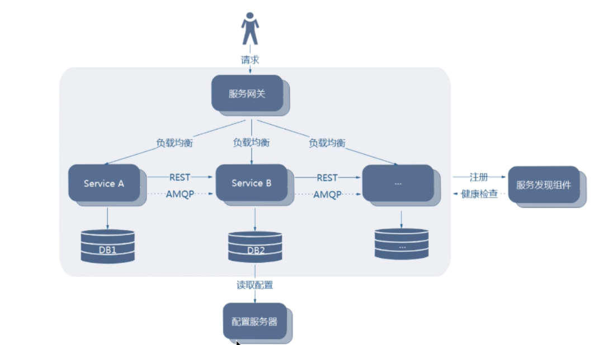
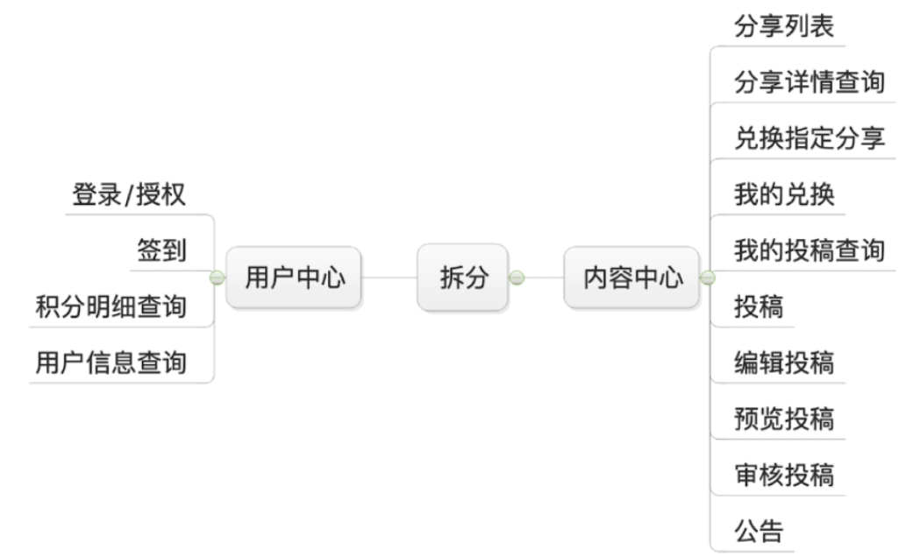

# 一、单体架构

#### 1、优点：

- 架构简单
- 开发、测试、部署方便

#### 2、缺点：

- 复杂性高
- 部署慢，频率低
- 扩展能力受限
- 阻碍技术创新

# 二、微服务

#### 1、简单定义：

​		微服务架构风格是一种将一个单一应用程序开发为一组小型服务的方法，每个服务运行在自己的进程中，服务间通信采用轻量级通信机制(通常用HTTP资源API)。这些服务围绕业务能力构建并且可通过全自动部署机制独立部署。这些服务共用一个最小型的集中式的管理,服务可用不同的语言开发，使用不同的数据存储技术。

#### 2、特性

- 每个微服务可独立运行在自己的进程里
- 一系列独立运行的微服务共同构建起整个系统
- 每个服务为独立的业务开发，一个微服务只关注某个特定的功能，例如订单管理、用户管理等
- 可使用不同的语言与数据存储技术(契合项目情况和团队实力)
- 微服务之间通过轻量的通信机制进行通信，例如通过REST API进行调用
- 全自动的部署机制

#### 3、架构图

   

#### 4、优点

- 单个服务更易于开发、维护
- 单个微服务启动较快
- 局部修改容易部署
- 技术栈不受限
- 按需伸缩

#### 5、缺点

-  运维要求高
- 分布式固有的复杂性
- 重复劳动

#### 6、微服务拆分 

- 领域驱动设计( Domain Driven Design )
- 面向对象( by name./ by verb. )

#### 7、项目拆分案例：

 小程序项目，微服务拆分：

 

