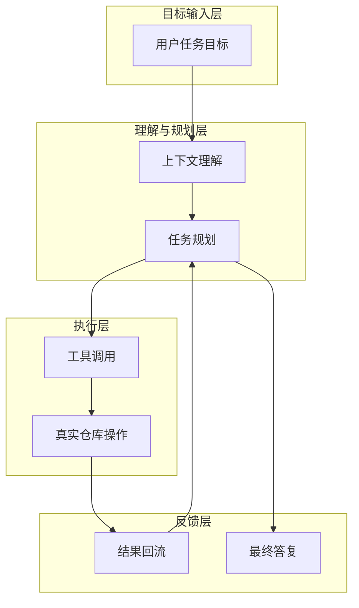

## 1、写在前面

如果把过去两年的 AI 编程工具做一个简单分类，大致可以分成三类：

1. 代码补全型
2. 对话问答型
3. Agent 执行型

Claude Code 更接近第三类。它不是简单给你一段代码建议，而是把大模型、工具调用、上下文理解和真实工程操作串成一条完整执行链路。它既能读代码、改文件、跑命令，也能在更复杂的任务里做规划、拆解和验证。

所以，理解 Claude Code，不能只把它当成“更强一点的代码助手”。它更像一个运行在终端和代码仓库里的 AI Agent。

## 2、Claude Code 到底适合做什么

Claude Code 最适合处理的任务，通常有三个共同点：

- 任务目标明确
- 代码仓库真实存在
- 需要多轮分析和执行

例如下面这些场景，Claude Code 的优势会比较明显：

- 阅读一个现有项目并定位问题
- 在已有代码基础上做局部修改
- 自动补齐测试和验证步骤
- 做一轮偏工程质量的代码审查
- 批量修改文档、配置或脚本

相比之下，如果只是想问一个非常短的语法问题、查一个简单 API，传统对话模型已经够用了。Claude Code 的价值，更多体现在“能持续推进一个真实任务”。

## 3、Claude Code 的核心工作方式

从底层看，Claude Code 的工作方式并不神秘，本质上还是这几步：

1. 接收用户目标
2. 读取当前上下文和仓库信息
3. 决定是否调用工具
4. 执行工具并获取结果
5. 根据结果继续判断下一步

### 本节架构图



你会发现，这种模式和普通聊天产品最大的不同就在于：Claude Code 不只是回答，它还会“行动”。

## 4、怎么正确地给 Claude Code 下任务

很多人第一次用 Claude Code，效果不稳定，问题通常不是模型不行，而是任务描述方式不对。

一个好的任务描述，建议尽量包含下面几项：

- 背景：这是一个什么项目
- 目标：你希望最终改成什么样
- 边界：哪些地方能改，哪些地方不要动
- 验证：希望它如何证明任务完成

例如下面这种写法，就比“帮我修一下这个问题”强很多：

```text
请检查当前仓库的登录模块，定位为什么用户登录后没有跳转首页。
限制条件：
1. 只修改前端登录相关文件
2. 不要改接口定义
3. 修改后请说明原因，并给出验证方式
```

这种写法会明显提高 Claude Code 的稳定性，因为它知道目标、范围和完成标准。

## 5、常见使用方式

Claude Code 的使用方式大致可以分成四类。

### 5.1 仓库分析型

适合第一次接触一个项目时使用，例如：

```text
分析一下这个项目的目录结构，并说明主要模块职责
```

这类任务适合用来快速建立代码上下文。

### 5.2 定点修改型

适合已知要改哪里、改什么的时候，例如：

```text
只修改订单创建流程，补一个参数校验，并保证原接口结构不变
```

这类任务最好给足边界条件，避免模型改动过大。

### 5.3 调试排障型

适合定位构建失败、测试失败、运行报错，例如：

```text
执行测试并定位失败原因，修复后重新验证
```

这类任务最能体现 Claude Code 的 Agent 能力，因为它会读代码、跑命令、看错误、继续修正。

### 5.4 文档维护型

例如：

```text
把这个模块的 README 补完整，并加上启动方式和配置说明
```

这类任务非常适合批量推进，效率通常比纯手写高很多。

## 6、最实用的使用技巧

下面这些技巧，基本都来自真实使用过程中的经验总结。

### 6.1 先让它“看”，再让它“改”

不要一上来就让 Claude Code 直接动手。更稳的做法是先让它阅读当前模块、说明问题，再进入修改阶段。

例如：

```text
先阅读这个模块并说明问题，不要立刻改代码。等你分析完后，再给出修改方案。
```

这能显著降低它误改文件的概率。

### 6.2 明确告诉它“不要碰什么”

很多问题不是因为改得不够，而是因为改多了。你可以明确说：

- 不要改数据库结构
- 不要动接口定义
- 不要修改无关文件
- 不要提交 commit

这类约束非常有用。

### 6.3 把验证要求写进去

一个任务如果没有验证要求，Claude Code 很容易停留在“我觉得应该好了”的状态。

你最好直接要求：

- 修改后执行测试
- 输出关键验证命令
- 给出失败原因和修复结果

这样它的工作闭环会完整很多。

### 6.4 让它分步做，而不是一口气做完

复杂任务尽量拆阶段：

1. 先分析
2. 再修改
3. 再补测试
4. 最后验证

这种方式更容易得到可控结果。

## 7、Claude Code 的最佳实践

如果你想把 Claude Code 真正用在日常开发里，我比较建议遵循下面这些原则。

### 7.1 把它当成“有执行能力的助手”，不是“绝对正确的工程师”

Claude Code 能显著提升效率，但不意味着它的每个判断都对。尤其是在重构、大范围修改和架构变更场景里，人的复核仍然非常必要。

### 7.2 用于高重复、边界清晰的任务收益最高

例如：

- 批量补测试
- 批量重命名
- 统一代码风格
- 补文档
- 修简单 bug

这些场景最容易获得稳定收益。

### 7.3 对关键逻辑必须保留人工把关

例如权限、支付、风控、核心交易、生产配置，这类高风险内容不能完全依赖模型直接修改，至少要经过人工审核。

### 7.4 输出过程比结果更重要

如果你真的想把 Claude Code 用好，不要只盯着它最终改了什么，还要看：

- 它先读了哪些文件
- 为什么这么判断
- 是否验证过结果
- 有没有越过你设定的边界

理解过程，才能长期把它变成稳定工具。

## 8、容易踩坑的地方

即使是很强的模型，Claude Code 依然有典型坑点。

### 8.1 上下文不足导致误判

如果任务描述太短，或者仓库信息没看清，它可能会基于错误假设开始修改。

### 8.2 改动范围失控

如果你没有明确边界，它可能顺手把相关文件一起改了，最后导致 diff 远超预期。

### 8.3 验证不充分

有些时候它会完成修改，但没有真正执行足够验证。尤其是复杂项目中，“代码能写出来”不代表“项目能跑起来”。

### 8.4 工具输出过长

如果日志、测试结果、构建输出特别长，而系统又没有很好压缩，上下文质量会明显下降。

## 9、推荐的使用模板

如果你不知道该怎么下任务，我建议直接用这个模板：

```text
项目背景：
这是一个 ______ 项目，当前需要处理 ______ 模块。

任务目标：
请完成 ______。

限制条件：
1. 只允许修改 ______
2. 不要修改 ______
3. 尽量保持现有结构不变

输出要求：
1. 先说明你的分析
2. 再执行修改
3. 修改后说明改了哪些文件
4. 给出验证步骤和结果
```

这类模板对 Claude Code 非常友好，也适合团队内部形成统一协作规范。

### 更完整的可运行示例

下面这个例子不是 Claude Code 自身源码，而是一个更贴近实际使用的“任务输入模板”，适合你在终端或 Agent 环境中直接复用。

```text
请先分析当前仓库的认证模块实现方式，不要立即修改。

完成分析后：
1. 说明登录态存储在哪里
2. 说明权限校验链路在哪几层完成
3. 如果发现明显问题，给出修改方案

限制条件：
1. 本轮先不要改数据库
2. 先不要动前端页面
3. 仅关注后端认证和鉴权逻辑

如果后续需要修改，请先列出计划，再逐步执行，并在最后说明验证方式。
```

### 本节完整 demo 目录结构

如果你想专门写一篇 Claude Code 使用入门的实验文章，建议目录结构可以这样组织：

```text
demo-claude-code-guide/
├── sample-project/
│   ├── src/
│   ├── tests/
│   └── README.md
├── prompts/
│   ├── analyze.txt
│   ├── refactor.txt
│   └── debug.txt
└── notes.md
```

这样你可以把“样例仓库”“任务提示词”“实验记录”分开管理，后续迭代也更方便。

## 10、补充说明

Claude Code 真正强的地方，不是某一次回答特别聪明，而是它把“理解、执行、修正、验证”串成了连续动作。

这意味着它非常适合进入真实工程流，但前提是你要给它正确的边界、清晰的目标和明确的验证方式。只把它当聊天工具，你只能发挥它一半能力；把它当成可控的 Agent，你才会真正感受到效率提升。

## 11、小结

如果用一句话概括 Claude Code，我会把它定义为：

> 一个运行在真实代码仓库中的工程型 AI Agent。

它不是简单的对话模型，也不是单纯的补全工具，而是一种更偏执行、协作和工程落地的 AI 工作方式。

对于个人开发者来说，它能提升效率；对于团队来说，它更像是在重塑“人和代码仓库之间的交互方式”。
