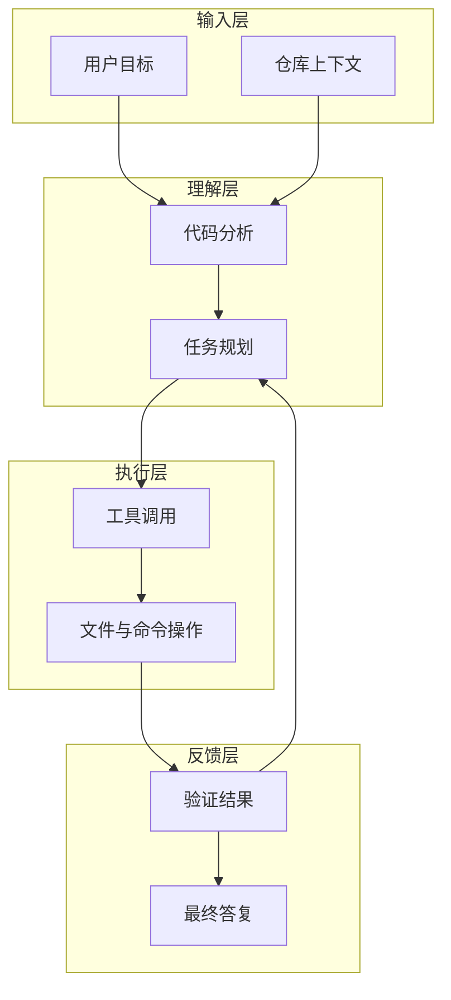
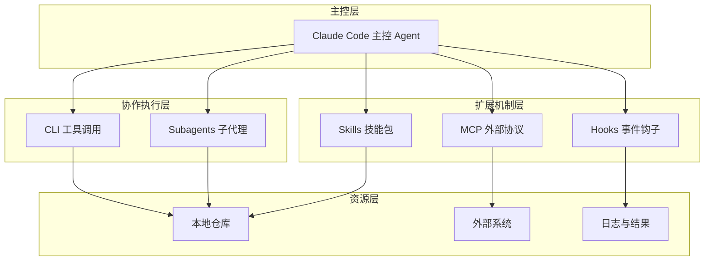
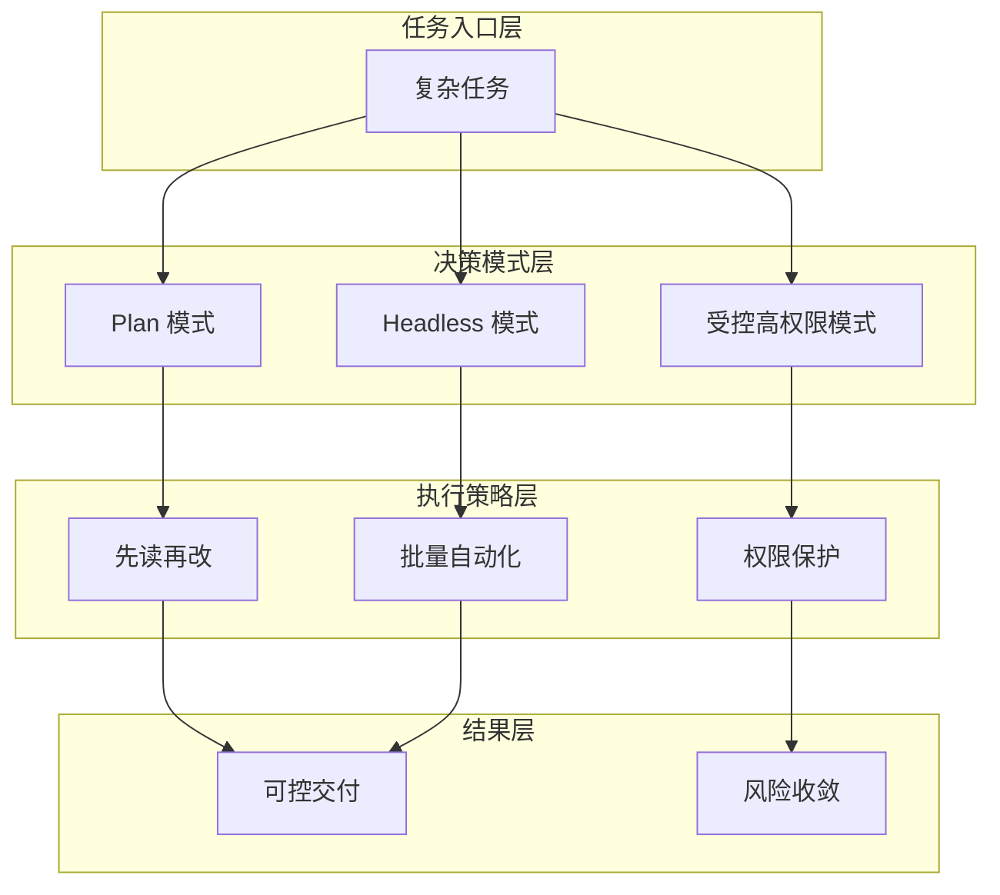

## 1、写在前面

如果把 AI 编程工具按照能力边界来划分，大致可以分成三类：

1. 补全型工具
2. 对话型工具
3. Agent 型工具

Claude Code 更接近第三类。它不是单纯回答问题，也不是只在编辑器里补全代码，而是直接运行在终端和仓库上下文中，能够围绕真实任务做阅读、分析、修改、验证和总结。

很多人第一次接触 Claude Code，只把它当成“命令行里的聊天机器人”。这种理解太浅了。真正高效的用法，是把它看成一个带工具系统、上下文管理和执行能力的工程型 Agent。

这篇文章基于一篇较完整的使用总结重新整合，重点不是逐段复述，而是把“如何上手、如何用好、如何避免踩坑”串成一条更适合博客阅读的主线。

## 2、Claude Code 的能力边界

Claude Code 之所以和传统编程助手不同，核心不在于“会写代码”，而在于它有机会持续推进一个任务闭环。

它比较擅长的场景包括：

- 阅读已有仓库并建立上下文
- 结合文件、命令和日志定位问题
- 在给定边界内完成局部修改
- 补测试、补文档、补脚本这类高重复工作
- 用自然语言驱动多步执行

但也要认识它的边界：

- 不能替代人做架构拍板
- 对高风险改动仍然需要人工审核
- 任务描述不清时很容易基于错误假设行动
- 没有验证要求时，结果质量会明显下降

### 本节架构图



从这个闭环看，Claude Code 的价值不只是“生成”，而是“围绕目标持续执行”。

## 3、安装与基础配置

在真正开始使用前，先把最基础的环境准备好。

### 3.1 前置条件

通常至少要准备这几样：

- Node.js
- Git
- 一个可用的模型 API

你可以先检查本地环境：

```bash
node -v
git --version
```

### 3.2 安装方式

常见安装命令如下：

```bash
npm install -g @anthropic-ai/claude-code
claude --version
```

如果是团队统一环境，建议提前把 Node 和 npm 版本规范好，避免每个人装出来的 CLI 行为不一致。

### 3.3 模型配置思路

Claude Code 的一个关键优势是可以接入兼容 Anthropic API 的模型服务，因此实际使用中，很多人会结合不同服务商做配置。

最常见的做法是通过环境变量注入：

```bash
export ANTHROPIC_BASE_URL=https://your-provider.example.com/anthropic
export ANTHROPIC_AUTH_TOKEN=your_api_key
export ANTHROPIC_MODEL=your_model_name
```

Windows 下可以改成：

```powershell
setx ANTHROPIC_BASE_URL "https://your-provider.example.com/anthropic"
setx ANTHROPIC_AUTH_TOKEN "your_api_key"
setx ANTHROPIC_MODEL "your_model_name"
```

这里真正需要注意的不是命令本身，而是三件事：

1. 把密钥放到环境变量，不要写死进仓库
2. 团队内部统一模型命名和接入方式
3. 记录好默认模型和回退模型

### 3.4 常见启动方式

最基础的启动方式非常简单：

```bash
claude
```

除了普通交互模式，实际开发中比较常见的还有：

```bash
git diff | claude -p "解释这些变更的风险点"
```

这种模式适合做代码评审、变更解释和提交前检查。

## 4、理解 Claude Code 的核心概念

真正决定使用上限的，不是安装，而是你是否理解它背后的几个核心机制。

### 4.1 Skills

Skills 可以理解成预封装的工作流能力。它不是简单的提示词，而是一组针对特定任务的稳定操作方法。

比较典型的作用有：

- 前端页面调整
- 文档协同
- PDF 内容处理
- 特定领域的自动化流程

如果把 Claude Code 比作“主控 Agent”，那么 Skills 更像是可按需挂载的“专业工具包”。

### 4.2 Hooks

Hooks 是事件驱动的扩展点。它适合拦截危险操作、记录日志、自动执行格式化、校验参数等。

简单理解就是：

- 某个事件发生
- Hook 被触发
- 先执行你的自定义逻辑
- 再决定是否继续后续动作

### 4.3 MCP

MCP 可以看成 Claude Code 连接外部能力的统一协议层。只要有合适的 MCP Server，它就不仅能读本地仓库，还能访问外部系统和数据源。

对真实项目而言，这一点非常重要，因为很多任务并不只发生在代码仓库里，还会涉及：

- GitHub
- 数据库
- 浏览器
- 文档系统
- 内部平台

### 4.4 Subagents

当任务变复杂之后，一个 Agent 单线程推进会变慢，这时就会引入子 Agent。子 Agent 的核心价值不是“更智能”，而是把任务拆成多个相对独立的子问题并行推进。

### 本节架构图



这套能力组合起来，才构成 Claude Code 和普通聊天工具的本质差异。

## 5、高级功能怎么用才值钱

高级功能真正的价值，不在于“我会用命令”，而在于“我知道什么时候应该启用它”。

### 5.1 Plan 模式

Plan 模式适合复杂改动。它的思路是先阅读和规划，再让你确认，最后才进入执行。

这很适合下面几类任务：

- 新功能落地前先梳理影响范围
- 历史项目重构前先列改造计划
- 有多人协作时先统一方案

如果你直接让模型盲改，大概率是跑得快但偏得也快。Plan 模式的价值，就是把失控风险尽量前置。

### 5.2 Headless 模式

Headless 模式更适合脚本化场景，例如：

- 自动解释 `git diff`
- 在 CI 中跑一轮总结
- 结合日志或命令结果做批处理分析

它不是取代人工交互，而是把可重复任务流水线化。

### 5.3 危险模式

有些文章会提到跳过权限确认的模式。这个能力本身存在，但我更建议把它理解为“在受控环境下的高权限执行选项”，而不是默认推荐用法。

真实项目里更稳的原则是：

- 本地个人沙箱可以更开放
- 团队项目要保留确认
- 生产相关目录必须谨慎

### 本节架构图



## 6、最实用的日常技巧

真正让使用体验拉开差距的，往往不是复杂功能，而是这些高频技巧。

### 6.1 `/init`

初始化项目说明时很有价值。它能帮你快速生成面向 Claude Code 的项目上下文文档，适合作为仓库的 AI 使用入口。

### 6.2 `@` 引用上下文

如果你希望它聚焦某几个文件，不要只靠口头描述，直接引用路径通常更有效，例如：

```text
@src/auth.ts @src/user.service.ts
请分析登录失败的原因，只关注这两个文件及其直接调用链。
```

### 6.3 常用斜杠命令

这类命令很适合作为日常习惯建立起来：

- `/clear` 清空对话
- `/compact` 压缩上下文
- `/context` 查看上下文占用
- `/model` 切换模型
- `/cost` 查看开销
- `/doctor` 做环境诊断

### 6.4 “先分析，后修改”

这几乎是我最推荐的一条使用纪律。复杂任务直接动手，往往意味着它带着不完整认知开始写代码。

更稳的提示方式通常是：

```text
先阅读模块实现并给出判断，不要立刻修改。确认方案后再开始动手。
```

## 7、最佳实践：如何把 Claude Code 用进真实开发流

如果只是个人试玩，很多问题不会暴露出来；真正一旦进入团队协作，规范就必须更清楚。

### 7.1 给任务加边界

至少明确这些信息：

- 允许修改哪些目录
- 不允许碰哪些模块
- 是否需要跑测试
- 最终要输出哪些验证结果

### 7.2 给任务加完成标准

不要只说“帮我修一下”。更好的说法是：

```text
请修复登录跳转问题。
限制：
1. 只改前端登录相关文件
2. 不改接口定义
3. 修改后说明原因
4. 执行一次最小验证并给出结果
```

### 7.3 高风险逻辑必须人工复核

像权限、支付、风控、生产配置、数据库迁移，这类改动不能只看模型给出的最终答案，而要看：

- 它依据了哪些文件
- 它的推理链条是否站得住
- 它是否做了足够验证

### 7.4 把验证写进任务

如果你不要求验证，很多时候就只能得到“看起来正确”的结果，而不是“被证明正确”的结果。

## 8、实战场景怎么落地

下面几类任务最适合作为 Claude Code 的切入点：

### 8.1 代码审查辅助

你可以把 `git diff`、变更文件和目标模块一起给它，让它从风险、回归和测试覆盖角度做一轮工程化审查。

### 8.2 历史项目理解

对于不熟悉的老系统，它非常适合先帮你做模块职责梳理、调用链分析和关键配置排查。

### 8.3 批量重复工作

例如：

- 统一重命名
- 批量补文档
- 批量补测试
- 统一格式或注释风格

### 8.4 故障定位

只要仓库、日志、报错命令和相关文件都在，它就很适合帮你做第一轮定位和修复建议。

## 9、常见问题与避坑建议

很多人觉得 Claude Code “有时很强，有时不稳定”，根源通常不是模型忽然失灵，而是以下几个环节没有处理好。

### 9.1 安装失败

如果是全局安装权限问题，优先从 Node 和 npm 权限模型入手排查，不要一上来就在生产机器上粗暴提权。

### 9.2 模型配置不生效

优先确认：

- 环境变量是否真的生效
- 终端是否重启
- Base URL 是否兼容
- 模型名是否正确

### 9.3 上下文混乱

如果一次对话里塞了太多无关内容，它就会出现判断漂移。这时应该主动：

- `/compact`
- 重开一轮任务
- 缩小引用范围
- 重新定义当前目标

### 9.4 改动失控

一般是因为你没有提前说清边界。最有效的做法不是事后回滚，而是事前收窄权限和任务范围。

## 10、一个可直接复用的任务模板

如果你想让 Claude Code 在真实项目里更稳定，可以直接套这个模板：

```text
项目背景：
这是一个 ______ 项目，当前需要处理 ______ 模块。

任务目标：
请完成 ______。

限制条件：
1. 只允许修改 ______
2. 不要修改 ______
3. 如果方案不明确，先分析再执行

验证要求：
1. 说明你的判断依据
2. 修改后列出受影响文件
3. 执行最小验证
4. 输出剩余风险
```

这个模板的价值不在于格式，而在于它同时定义了目标、范围和验证。

### 更完整的可运行示例

下面是一段更接近真实使用的任务输入：

```text
请先阅读当前仓库的用户认证模块，不要立刻修改。

任务目标：
定位为什么用户登录成功后没有跳转首页。

限制条件：
1. 只允许修改前端登录相关文件
2. 不要改接口定义
3. 不要改数据库和网关配置

输出要求：
1. 先说明问题出现在哪一层
2. 给出最小修改方案
3. 修改后执行一次最小验证
4. 最后总结剩余风险
```

### 本节完整 demo 目录结构

如果你想围绕 Claude Code 做一套自己的练习工程，建议目录可以这样组织：

```text
demo-claude-code-playbook/
├── sample-project/
│   ├── src/
│   ├── tests/
│   └── README.md
├── prompts/
│   ├── analyze.txt
│   ├── fix-bug.txt
│   ├── review-diff.txt
│   └── refactor-plan.txt
├── outputs/
│   ├── reports/
│   └── logs/
└── notes.md
```

这样做的好处是：任务输入、样例项目、实验输出和复盘记录彼此分离，后续迭代会非常顺。

## 11、补充说明

Claude Code 的竞争力，不是单次回答有多聪明，而是它能在真实工程环境里把“理解、计划、执行、验证”串起来。

很多人真正没有用好它，不是因为功能不够，而是因为任务边界没定义好、验证步骤没写进去、扩展能力没用起来。

一旦你把它放进真实开发流，它最有价值的角色不是“替你写代码”，而是“帮你把大量可结构化的工程工作自动推进一大截”。

## 12、小结

Claude Code 适合的不是所有任务，而是那些目标清晰、边界可控、可验证、需要多轮推进的任务。

对个人开发者来说，它能提升阅读和落地效率；对团队来说，它更像是一个新的工程协作接口。真正的上限，不在命令行本身，而在你是否能把任务设计、扩展机制和验证流程一起组织起来。
