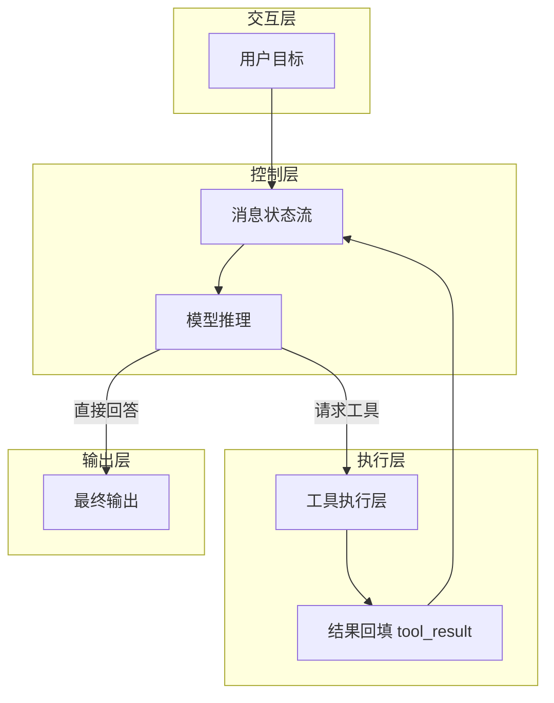

## 1、问题

语言模型本身只能生成文本，它能“推理”应该去读文件、运行命令、查看报错，但它碰不到真实环境。

如果没有循环机制，每次工具执行都需要开发者手工把结果贴回模型上下文里。换句话说，人自己成了那个循环。

这一节的核心观点很直接：

> 一个最小可用的 Agent，本质上就是 while 循环加一个工具。

### 阅读前提

建议你至少具备三个基础：会写最基本的 Python 脚本、知道怎样通过环境变量配置 API Key、理解终端命令的基本执行方式。因为这一节虽然概念简单，但已经开始涉及模型调用、工具执行和消息状态维护。

## 2、最小执行闭环

最简单的执行链路如下：

```text
用户输入 -> LLM -> 工具执行 -> 工具结果回传 -> LLM继续判断
```

### 本节架构图



只要模型的 `stop_reason` 仍然是 `tool_use`，循环就继续；一旦模型不再请求工具，本轮任务结束。

## 3、核心代码

先把用户输入作为第一条消息放进 `messages`：

```python
messages = [{"role": "user", "content": query}]
```

然后进入主循环，请求模型并传入工具定义：

```python
while True:
    response = client.messages.create(
        model=MODEL,
        system=SYSTEM,
        messages=messages,
        tools=TOOLS,
        max_tokens=8000,
    )
    messages.append({"role": "assistant", "content": response.content})

    if response.stop_reason != "tool_use":
        break
```

如果模型请求了工具，就逐个执行并把结果包装成 `tool_result` 再送回去：

```python
results = []
for block in response.content:
    if block.type == "tool_use":
        output = run_bash(block.input["command"])
        results.append({
            "type": "tool_result",
            "tool_use_id": block.id,
            "content": output,
        })

messages.append({"role": "user", "content": results})
```

把这些代码合在一起，一个不到 30 行的最小 Agent 就成型了。

## 4、为什么这一层最重要

后面无论是 Todo、子 Agent、技能系统、任务系统，还是多 Agent 团队，本质上都建立在这一条主循环之上。

这也是整套教程最重要的地基：

- 消息是如何累计的
- 工具结果是如何回流的
- 退出条件是如何控制的

如果这三件事没想清楚，后面的所有机制都会变得不稳定。

## 5、可以自己试一下

教程里给出的几个典型 prompt 包括：

```text
Create a file called hello.py that prints "Hello, World!"
List all Python files in this directory
What is the current git branch?
Create a directory called test_output and write 3 files in it
```

这些例子看起来简单，但已经足够验证 Agent 是否真正具备了“推理 + 执行 + 回传”的闭环能力。

### 更完整的可运行示例

下面这个版本把最小 Agent 需要的几个部分都补齐了：模型客户端、工具定义、`bash` 执行函数和主循环。

```python
import os
import subprocess
from anthropic import Anthropic

MODEL = "claude-sonnet-4-5"
SYSTEM = "You are a helpful coding agent. Use tools when needed."
client = Anthropic(api_key=os.environ["ANTHROPIC_API_KEY"])

TOOLS = [{
    "name": "bash",
    "description": "Run a shell command in the current workspace.",
    "input_schema": {
        "type": "object",
        "properties": {"command": {"type": "string"}},
        "required": ["command"],
    },
}]

def run_bash(command: str) -> str:
    result = subprocess.run(
        command,
        shell=True,
        capture_output=True,
        text=True,
        timeout=30,
    )
    output = (result.stdout + result.stderr).strip()
    return output[:4000] or "(no output)"

def run_agent(query: str) -> str:
    messages = [{"role": "user", "content": query}]
    for _ in range(12):
        response = client.messages.create(
            model=MODEL,
            system=SYSTEM,
            messages=messages,
            tools=TOOLS,
            max_tokens=2000,
        )
        messages.append({"role": "assistant", "content": response.content})

        if response.stop_reason != "tool_use":
            return "".join(
                block.text for block in response.content if hasattr(block, "text")
            )

        results = []
        for block in response.content:
            if block.type == "tool_use":
                output = run_bash(block.input["command"])
                results.append({
                    "type": "tool_result",
                    "tool_use_id": block.id,
                    "content": output,
                })
        messages.append({"role": "user", "content": results})
    return "Stopped after max rounds."

print(run_agent("Create hello.py and show me its content"))
```

### 本节完整 demo 目录结构

如果你想把这一节单独跑通，建议目录先整理成下面这样：

```text
demo-s01/
├── main.py
├── .env
└── workspace/
    └── hello.py
```

其中 `main.py` 放主循环，`.env` 放模型调用配置，`workspace/` 用来承接 Agent 实际创建或修改的文件。

## 6、补充说明

这一节虽然代码最少，但实际开发里还有三个经常被忽略的点。

第一，`messages` 不是简单聊天记录，而是 Agent 的运行时状态。用户输入、模型输出、工具调用、工具结果，全部都要进入这条状态流，否则模型下一轮就会“失忆”。

第二，工具结果不能只返回“成功”或“失败”。越是复杂任务，越需要把 `stdout`、`stderr`、退出码、异常信息做结构化回传，否则模型只能猜。

第三，主循环一定要有护栏。常见做法包括最大轮数、工具超时、单次输出截断和失败重试上限。最小 Agent 可以不优雅，但不能没有边界，不然很容易在真实项目里进入死循环。

### 与下一节的衔接

这一节解决的是“Agent 怎么跑起来”。但只有一个 `bash` 工具还远远不够，下一节会继续把工具层拆开，进入真正可扩展、可约束的工具系统设计。

## 7、小结

这一节没有引入复杂概念，只做了一件事：把模型和工具通过一个循环连接起来。

从代码量上看它非常小，但从架构上看，它是后续 11 节内容的统一起点。
