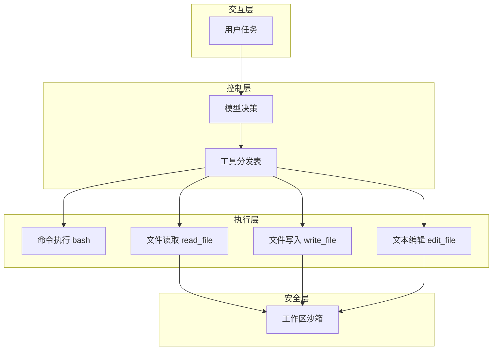

## 1、为什么只有 bash 不够

上一节只有一个 `bash` 工具，所有动作都走 shell。

这种方式虽然灵活，但问题很明显：

- 读取文件时输出可能被截断
- 特殊字符和转义经常出错
- 读写编辑都混在 shell 里，安全边界不清晰

所以这一节的目标，是把“一个万能工具”升级成“多个专用工具”。

### 阅读前提

建议先理解上一节的最小循环，至少要知道 `messages`、`tool_use` 和 `tool_result` 在主循环里是怎么工作的。否则这一节很容易只看到“多了几个工具”，却看不到“为什么循环本身不需要改”。

## 2、核心思路：循环不变，工具可扩展

这一节最重要的设计思想不是新增了多少工具，而是：

> 增加工具时，不需要改主循环，只需要注册新的 handler。

整体结构变成：

```text
用户 -> LLM -> Tool Dispatch Map -> 对应处理函数
```

### 本节架构图



## 3、路径沙箱

教程里特别强调，专用工具可以在工具层做路径安全限制。

例如先把传入路径解析到工作目录下，如果解析后的真实路径已经逃出工作区，就直接拒绝：

```python
def safe_path(p: str) -> Path:
    path = (WORKDIR / p).resolve()
    if not path.is_relative_to(WORKDIR):
        raise ValueError(f"Path escapes workspace: {p}")
    return path
```

这样做之后，`read_file`、`write_file`、`edit_file` 这类工具就有了基本安全边界。

## 4、工具分发表

核心实现是一个分发表，把工具名映射到处理函数：

```python
TOOL_HANDLERS = {
    "bash": lambda **kw: run_bash(kw["command"]),
    "read_file": lambda **kw: run_read(kw["path"], kw.get("limit")),
    "write_file": lambda **kw: run_write(kw["path"], kw["content"]),
    "edit_file": lambda **kw: run_edit(
        kw["path"], kw["old_text"], kw["new_text"]
    ),
}
```

这样主循环里就不再需要写一长串 `if/elif`。

## 5、循环中怎么调用

在处理工具请求时，只需要根据名称查 handler 即可：

```python
for block in response.content:
    if block.type == "tool_use":
        handler = TOOL_HANDLERS.get(block.name)
        output = handler(**block.input) if handler else f"Unknown tool: {block.name}"
        results.append({
            "type": "tool_result",
            "tool_use_id": block.id,
            "content": output,
        })
```

从这里可以看到，主循环的结构和 s01 基本没有变化，变的是工具组织方式。

## 6、这一节带来的变化

相对上一节，主要升级点有四个：

- 工具从 1 个变成 4 个
- 引入 dispatch map
- 文件类工具具备路径沙箱
- 主循环本身保持不变

这说明一个好的 Agent 内核，不应该随着工具数量增加而变得越来越乱。

## 7、练习示例

教程中给出的典型 prompt：

```text
Read the file requirements.txt
Create a file called greet.py with a greet(name) function
Edit greet.py to add a docstring to the function
Read greet.py to verify the edit worked
```

### 更完整的可运行示例

这一版把 `bash`、`read_file`、`write_file`、`edit_file` 都接进了统一分发表，已经接近一个能实际做文件操作的最小工具层。

```python
from pathlib import Path
import subprocess

WORKDIR = Path(".").resolve()

def safe_path(p: str) -> Path:
    path = (WORKDIR / p).resolve()
    if not path.is_relative_to(WORKDIR):
        raise ValueError(f"Path escapes workspace: {p}")
    return path

def run_bash(command: str) -> str:
    r = subprocess.run(command, shell=True, capture_output=True, text=True, timeout=30)
    return ((r.stdout or "") + (r.stderr or "")).strip()[:4000] or "(no output)"

def run_read(path: str, limit: int = 200) -> str:
    file_path = safe_path(path)
    lines = file_path.read_text(encoding="utf-8").splitlines()
    return "\n".join(lines[:limit])

def run_write(path: str, content: str) -> str:
    file_path = safe_path(path)
    file_path.parent.mkdir(parents=True, exist_ok=True)
    file_path.write_text(content, encoding="utf-8")
    return f"Wrote {len(content)} chars to {file_path.name}"

def run_edit(path: str, old_text: str, new_text: str) -> str:
    file_path = safe_path(path)
    text = file_path.read_text(encoding="utf-8")
    if old_text not in text:
        return "Edit failed: old_text not found"
    file_path.write_text(text.replace(old_text, new_text, 1), encoding="utf-8")
    return f"Edited {file_path.name}"

TOOL_HANDLERS = {
    "bash": lambda **kw: run_bash(kw["command"]),
    "read_file": lambda **kw: run_read(kw["path"], kw.get("limit", 200)),
    "write_file": lambda **kw: run_write(kw["path"], kw["content"]),
    "edit_file": lambda **kw: run_edit(kw["path"], kw["old_text"], kw["new_text"]),
}
```

### 本节完整 demo 目录结构

这一节适合把工具层和被操作的工作目录分开：

```text
demo-s02/
├── agent.py
├── tools.py
└── workspace/
    ├── requirements.txt
    └── greet.py
```

`agent.py` 负责主循环，`tools.py` 负责工具分发表和路径沙箱，`workspace/` 用来验证读写编辑是否生效。

## 8、补充说明

从开发角度看，工具设计里最重要的不是“工具数量”，而是工具契约是否稳定。

一个好用的工具通常要满足四点：输入参数清晰、输出结果稳定、异常语义明确、权限边界可控。比如 `read_file(path, limit)` 这种接口，模型更容易稳定调用；而把所有动作都压进一条 shell 命令里，虽然灵活，但可预测性会明显下降。

另外，工具输出最好尽量结构化。像“文件不存在”“路径越界”“命令超时”这类错误，应该返回给模型可判断的文本，而不是直接抛空异常。Agent 是否稳定，很多时候不是看模型多强，而是看工具层是否足够规整。

### 与下一节的衔接

当工具层稳定下来以后，Agent 已经能执行很多操作，但仍然容易在多步骤任务中跑偏。下一节要补的，就是任务规划和执行控制能力。

## 9、小结

这一节真正解决的是“工具如何被组织”。

从单一 `bash` 到分发表 + 专用工具，意味着 Agent 开始具备更清晰的执行边界，也为后续能力扩展留出了稳定接口。
