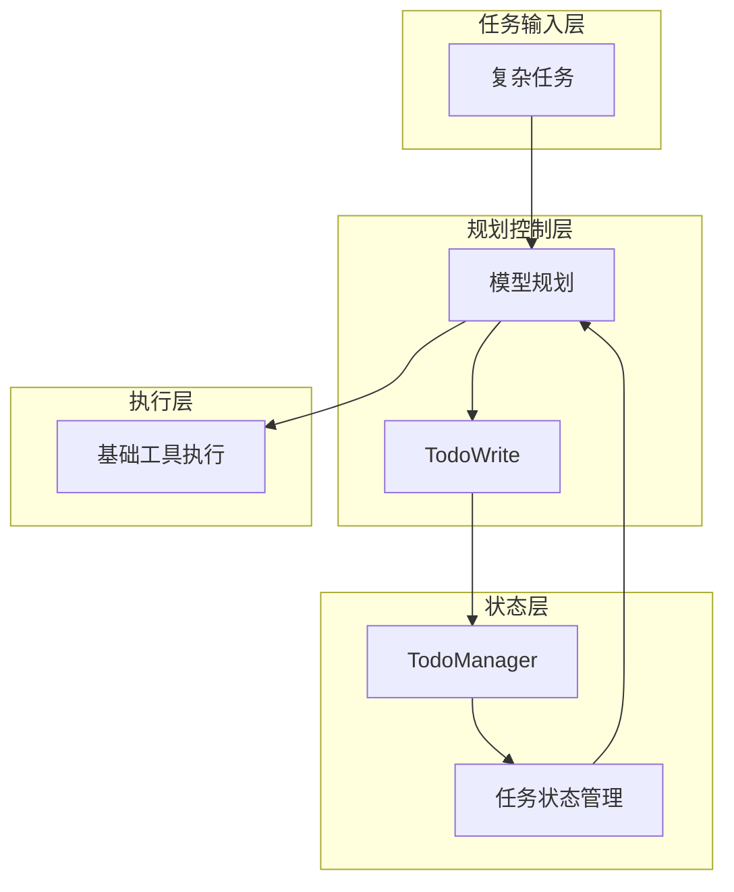

## 1、问题

多步任务里，模型很容易出现下面这些问题：

- 重复做已经做过的事
- 跳过中间步骤
- 随着上下文增长逐渐跑偏

教程对这个问题的概括很直接：没有计划的 Agent，往往走到哪算哪。

### 阅读前提

这一节默认你已经具备两个前提：一是 Agent 已经能稳定调用工具，二是你已经能区分“模型回答”和“模型执行任务”之间的差异。TodoWrite 不是界面功能，而是执行控制机制。

## 2、解决方案

在原有工具体系里新增一个 `todo` 工具，并引入 `TodoManager` 维护任务状态。

整体结构如下：

```text
用户 -> LLM -> 基础工具 + todo
                ^
                |
          TodoManager状态
```

### 本节架构图



TodoManager 不只是记录文本清单，还要求任务具备状态，例如：

- `pending`
- `in_progress`
- `completed`

## 3、TodoManager 的关键限制

教程里有一个非常重要的约束：

> 同一时间只允许一个任务处于 `in_progress`。

核心代码大致如下：

```python
class TodoManager:
    def update(self, items: list) -> str:
        validated = []
        in_progress_count = 0
        for item in items:
            status = item.get("status", "pending")
            if status == "in_progress":
                in_progress_count += 1
            validated.append({
                "id": item["id"],
                "text": item["text"],
                "status": status,
            })
        if in_progress_count > 1:
            raise ValueError("Only one task can be in_progress")
        self.items = validated
        return self.render()
```

这条限制能强制模型聚焦当前步骤，减少并行乱跑。

## 4、把 todo 作为工具接入

和前一节一样，Todo 也是通过 dispatch map 接入：

```python
TOOL_HANDLERS = {
    "bash": ...,
    "read_file": ...,
    "write_file": ...,
    "edit_file": ...,
    "todo": lambda **kw: TODO.update(kw["items"]),
}
```

这说明 TodoWrite 并不是额外外挂的一套系统，而是主循环中的一个普通工具。

## 5、提醒机制

这一节另一个关键点是 nag reminder。

如果模型连续几轮都没有更新 Todo，系统会主动注入提醒，让模型回到计划状态：

```python
if rounds_since_todo >= 3 and messages:
    last = messages[-1]
    if last["role"] == "user" and isinstance(last.get("content"), list):
        last["content"].insert(0, {
            "type": "text",
            "text": "<reminder>Update your todos.</reminder>",
        })
```

这个设计很简单，但很有效，相当于给模型增加了轻量级“督办”机制。

## 6、这一节相比前一节增加了什么

- 新增了 `todo` 工具
- 引入带状态的 TodoManager
- 加入 `rounds_since_todo` 计数
- 连续 3 轮不更新 Todo 时自动提醒

## 7、适合尝试的 prompt

```text
Refactor the file hello.py: add type hints, docstrings, and a main guard
Create a Python package with __init__.py, utils.py, and tests/test_utils.py
Review all Python files and fix any style issues
```

### 更完整的可运行示例

下面的例子把 TodoManager 做成了一个可以直接接入 Agent 工具分发表的类，已经具备基本状态校验和渲染能力。

```python
import json

class TodoManager:
    def __init__(self):
        self.items = []

    def update(self, items: list[dict]) -> str:
        validated = []
        in_progress_count = 0

        for item in items:
            status = item.get("status", "pending")
            if status not in {"pending", "in_progress", "completed"}:
                raise ValueError(f"Invalid status: {status}")
            if status == "in_progress":
                in_progress_count += 1
            validated.append({
                "id": item["id"],
                "text": item["text"],
                "status": status,
            })

        if in_progress_count > 1:
            raise ValueError("Only one task can be in_progress")

        self.items = validated
        return self.render()

    def render(self) -> str:
        lines = []
        for item in self.items:
            marker = {
                "pending": "[ ]",
                "in_progress": "[>]",
                "completed": "[x]",
            }[item["status"]]
            lines.append(f"{marker} {item['id']}: {item['text']}")
        return "\n".join(lines) or "(empty todo list)"

TODO = TodoManager()

def run_todo_tool(raw_json: str) -> str:
    payload = json.loads(raw_json)
    return TODO.update(payload["items"])
```

### 本节完整 demo 目录结构

建议把 Todo 管理器从主循环里拆出来，结构更清晰：

```text
demo-s03/
├── agent.py
├── todo_manager.py
└── workspace/
    └── hello.py
```

其中 `todo_manager.py` 专门维护任务状态，`agent.py` 只负责调用模型、执行工具和在适当时机更新 Todo。

## 8、补充说明

TodoWrite 真正解决的是“多步任务执行控制”而不是“生成待办列表”。

实践里，Todo 最容易失败的地方有两个。一个是任务拆得太粗，导致每一步仍然不可执行；另一个是任务拆得太细，模型把大量精力消耗在更新清单而不是完成任务本身。比较合适的粒度通常是“一步完成一个明确结果”，例如“读配置确认测试框架”“修改核心函数”“执行并修复测试”。

另外，Todo 更新时机也很关键。通常在开始一个新阶段、完成一个子目标、发现计划失效时更新最有效。否则 Todo 很容易沦为只在开头写一次、后面完全不看的摆设。

### 与下一节的衔接

TodoWrite 解决了多步任务的可控性，但还没有解决长上下文污染问题。下一节开始引入子 Agent，把局部探索从主上下文中拆出去。

## 9、小结

TodoWrite 的本质不是“列一个清单”，而是把任务执行状态显式化。

从这一节开始，Agent 不再只是会调用工具，而是开始具备了对多步骤任务进行规划和跟踪的能力。
