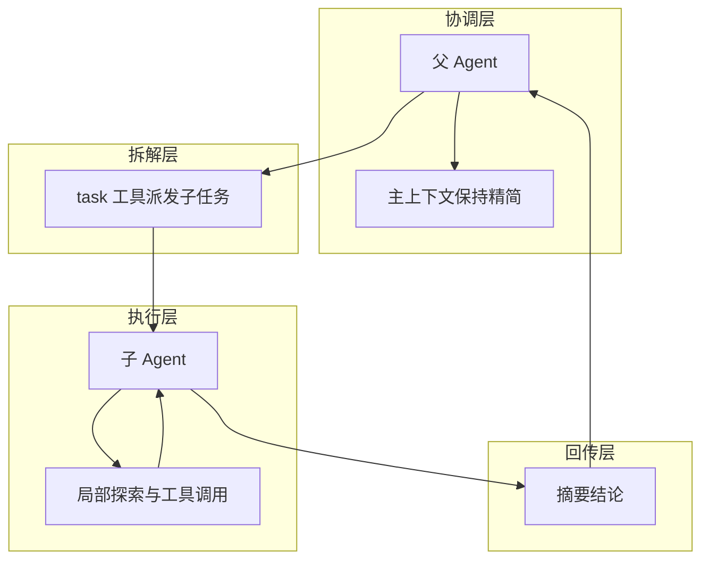

## 1、问题

随着 Agent 不断读文件、执行命令、查看日志，`messages` 会越来越大。

很多时候父 Agent 只需要一个很小的结论，比如“这个项目用的是 pytest”，但为了得到这个结论，可能要读 5 个文件、执行多次工具调用。如果把这些过程全部堆进主对话，上下文很快就会被污染。

## 2、核心思路

这一节的解法是：把局部子任务交给一个全新的子 Agent 去做。

结构如下：

```text
父Agent(messages=[...]) --task--> 子Agent(messages=[])
父Agent <--摘要结果-- 子Agent
```

### 本节架构图



关键点在于子 Agent 用的是一套全新的消息历史，干完之后整个过程被丢弃，只把最终摘要返回给父 Agent。

## 3、父端和子端的工具差异

教程里有一个重要约束：

- 父 Agent 有 `task` 工具
- 子 Agent 只有基础工具
- 子 Agent 不允许继续递归生成子 Agent

可以这样定义：

```python
PARENT_TOOLS = CHILD_TOOLS + [
    {
        "name": "task",
        "description": "Spawn a subagent with fresh context.",
        "input_schema": {
            "type": "object",
            "properties": {"prompt": {"type": "string"}},
            "required": ["prompt"],
        },
    }
]
```

## 4、子 Agent 的运行方式

子 Agent 使用独立的 `messages=[]` 启动，并执行属于自己的循环：

```python
def run_subagent(prompt: str) -> str:
    sub_messages = [{"role": "user", "content": prompt}]
    for _ in range(30):
        response = client.messages.create(
            model=MODEL,
            system=SUBAGENT_SYSTEM,
            messages=sub_messages,
            tools=CHILD_TOOLS,
            max_tokens=8000,
        )
        sub_messages.append({"role": "assistant", "content": response.content})
        if response.stop_reason != "tool_use":
            break
```

如果子 Agent 请求工具，就像主循环那样执行并回填工具结果，最后只返回摘要文本：

```python
return "".join(
    block.text for block in response.content if hasattr(block, "text")
) or "(no summary)"
```

## 5、为什么这一节很重要

它解决的不是“多开一个模型”这么简单，而是上下文隔离问题。

原教程强调的重点是：

- 父上下文保持干净
- 子上下文只服务于当前子任务
- 子任务中间过程不会长期污染主会话

这为后面的更复杂协作机制打下了基础。

## 6、试一试

```text
Use a subtask to find what testing framework this project uses
Delegate: read all .py files and summarize what each one does
Use a task to create a new module, then verify it from here
```

### 更完整的可运行示例

这个版本把“父 Agent 生成子任务，子 Agent 独立运行并返回摘要”的主干流程补全了。

```python
def run_subagent(prompt: str) -> str:
    sub_messages = [{"role": "user", "content": prompt}]

    for _ in range(20):
        response = client.messages.create(
            model=MODEL,
            system="You are a focused subagent. Solve only the assigned task.",
            messages=sub_messages,
            tools=CHILD_TOOLS,
            max_tokens=2000,
        )
        sub_messages.append({"role": "assistant", "content": response.content})

        if response.stop_reason != "tool_use":
            return "".join(
                block.text for block in response.content if hasattr(block, "text")
            ) or "(no summary)"

        tool_results = []
        for block in response.content:
            if block.type == "tool_use":
                handler = CHILD_TOOL_HANDLERS[block.name]
                output = handler(**block.input)
                tool_results.append({
                    "type": "tool_result",
                    "tool_use_id": block.id,
                    "content": output,
                })

        sub_messages.append({"role": "user", "content": tool_results})

    return "Subagent stopped after max rounds."

def run_task_tool(prompt: str) -> str:
    summary = run_subagent(prompt)
    return f"Subagent summary:\n{summary}"
```

### 本节完整 demo 目录结构

子 Agent 最好和父 Agent 分文件放置，边界会更明确：

```text
demo-s04/
├── parent_agent.py
├── subagent.py
├── tools.py
└── workspace/
    └── sample_project/
```

`parent_agent.py` 负责总控和 `task` 工具，`subagent.py` 负责独立上下文中的子任务执行，`sample_project/` 用来模拟真实分析对象。

## 7、补充说明

子 Agent 并不是所有任务都适合用。它最适合的场景有三类：边界清晰的信息搜集、局部实现、专项验证。

如果一个问题本身需要持续和主流程来回互动，或者依赖大量全局上下文，那么拆给子 Agent 反而可能让沟通成本更高。一个实用原则是：父 Agent 只把“目标、约束、交付格式”发给子 Agent，而不是把所有背景都复制过去。

另外，子 Agent 返回值最好是“摘要 + 关键结论 + 必要证据”，而不是大段流水账。否则虽然做了上下文隔离，最后又会因为返回内容过大把主上下文重新塞满。

## 8、小结

子 Agent 的核心价值不是并发，而是局部隔离。

把复杂问题拆成干净的子任务，并且只把结果摘要带回主流程，这一步会显著提升长期对话里的上下文质量。

