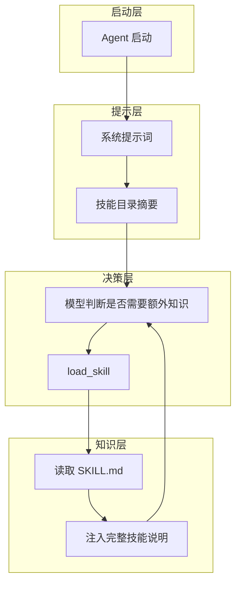

## 1、问题

Agent 常常需要遵守很多额外知识，比如：

- Git 工作流
- 测试规范
- 代码审查清单
- 特定领域的操作手册

如果把这些内容全部塞进系统提示词，会让 prompt 非常臃肿，而且大部分知识和当前任务没有直接关系。

## 2、两层注入

这一节的解决方案是 SkillLoader + 两层知识注入。

第一层放在系统提示词里，只保留技能名称和简要说明，成本很低。  
第二层通过工具按需加载完整技能内容，成本较高，但只在需要时使用。

整体结构如下：

```text
Layer 1: system prompt 中放技能目录
Layer 2: tool_result 中注入某个技能全文
```

### 本节架构图



## 3、技能目录结构

原教程里，每个技能对应一个目录，目录下有一个 `SKILL.md`：

```text
skills/
  pdf/
    SKILL.md
  code-review/
    SKILL.md
```

`SKILL.md` 里既有 frontmatter，也有正文说明。

## 4、SkillLoader

SkillLoader 会递归扫描所有 `SKILL.md` 文件，并读取元信息与正文：

```python
class SkillLoader:
    def __init__(self, skills_dir: Path):
        self.skills = {}
        for f in sorted(skills_dir.rglob("SKILL.md")):
            text = f.read_text()
            meta, body = self._parse_frontmatter(text)
            name = meta.get("name", f.parent.name)
            self.skills[name] = {"meta": meta, "body": body}
```

然后它能提供两种输出：

- 获取所有技能简介
- 按名称获取某个技能完整内容

## 5、把技能接入系统

第一层描述被放进系统提示词中：

```python
SYSTEM = f"""You are a coding agent at {WORKDIR}.
Skills available:
{SKILL_LOADER.get_descriptions()}"""
```

第二层则作为普通工具接入：

```python
TOOL_HANDLERS = {
    "bash": ...,
    "read_file": ...,
    "write_file": ...,
    "edit_file": ...,
    "load_skill": lambda **kw: SKILL_LOADER.get_content(kw["name"]),
}
```

这意味着模型先知道“有哪些技能”，需要时再调用 `load_skill` 获取完整内容。

## 6、这一步比直接堆 Prompt 更好在哪里

- 系统提示词更轻
- 知识可以按需注入
- 技能之间相互独立，便于维护
- 后续新增技能只需要新增目录和 `SKILL.md`

## 7、可以尝试的 prompt

```text
What skills are available?
Load the agent-builder skill and follow its instructions
I need to do a code review -- load the relevant skill first
Build an MCP server using the mcp-builder skill
```

### 更完整的可运行示例

这个版本把技能扫描、frontmatter 解析和按名称读取正文串了起来，已经可以直接作为本地技能加载器使用。

```python
from pathlib import Path

class SkillLoader:
    def __init__(self, skills_dir: Path):
        self.skills = {}
        for file in sorted(skills_dir.rglob("SKILL.md")):
            text = file.read_text(encoding="utf-8")
            meta, body = self._parse_frontmatter(text)
            name = meta.get("name", file.parent.name)
            self.skills[name] = {
                "meta": meta,
                "body": body.strip(),
                "path": str(file),
            }

    def _parse_frontmatter(self, text: str):
        if not text.startswith("---"):
            return {}, text
        _, fm, body = text.split("---", 2)
        meta = {}
        for line in fm.splitlines():
            if ":" in line:
                key, value = line.split(":", 1)
                meta[key.strip()] = value.strip()
        return meta, body

    def get_descriptions(self) -> str:
        lines = []
        for name, item in self.skills.items():
            desc = item["meta"].get("description", "")
            lines.append(f"- {name}: {desc}")
        return "\n".join(lines)

    def get_content(self, name: str) -> str:
        if name not in self.skills:
            return f"Skill not found: {name}"
        item = self.skills[name]
        return f"# {name}\n\n{item['body']}"

loader = SkillLoader(Path("./skills"))
print(loader.get_descriptions())
```

### 本节完整 demo 目录结构

技能系统最适合用独立目录组织：

```text
demo-s05/
├── agent.py
├── skill_loader.py
└── skills/
    ├── code-review/
    │   └── SKILL.md
    └── mcp-builder/
        └── SKILL.md
```

这样后续新增技能时，只需要继续往 `skills/` 下添加目录和 `SKILL.md`，主程序不用大改。

## 8、补充说明

技能系统要真正落地，关键不是把知识塞进 `SKILL.md`，而是把技能边界划清楚。

一个技能最好只解决一类明确问题。例如“代码审查”“MCP 服务开发”“PDF 提取”都可以是独立技能，但不要把多个领域知识混在一个技能里，否则模型加载以后仍然会被无关信息干扰。

此外，技能文档最好同时包含三层内容：适用场景、执行步骤、失败时的处理办法。只有这样，模型在加载技能后才能既知道“什么时候用”，也知道“怎么用”，还知道“遇到问题怎么办”。

## 9、小结

这一节把“额外知识”从固定 Prompt 中拆了出来，变成可动态加载的技能系统。

从此之后，Agent 的知识不再是一次性灌进去的，而是可以按任务场景逐步加载。

