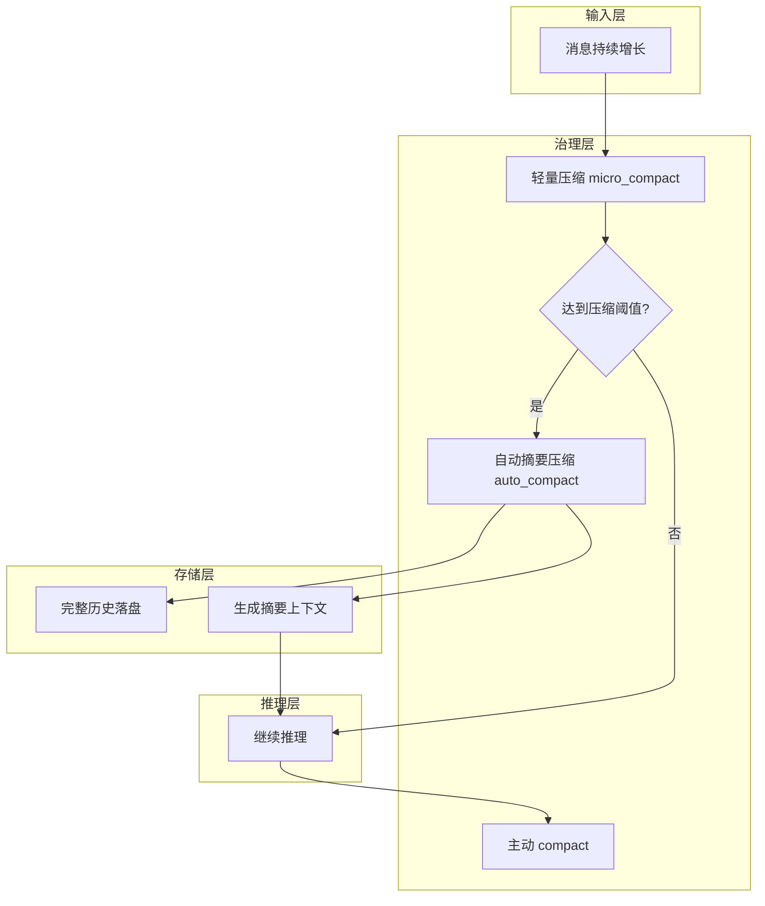

## 1、问题

上下文窗口是有限的。

教程举的例子很直观：读一个 1000 行文件，可能就会吃掉几千 token；再读几十个文件、跑几十条命令，上下文很快就会被撑满。

如果没有压缩机制，Agent 根本没法在大项目里持续工作。

## 2、三层压缩策略

这一节提出的是三层压缩方案，而且压缩力度逐步增强：

1. micro-compact
2. auto-compact
3. manual compact

整体流程可以理解成：

```text
每轮先做轻量压缩
如果 token 超阈值 -> 自动摘要压缩
如果模型主动要求 -> 手动触发 compact
```

### 本节架构图



## 3、第一层：micro_compact

在每次调用模型之前，把比较早的 `tool_result` 替换为简短占位符：

```python
def micro_compact(messages: list) -> list:
    tool_results = []
    for i, msg in enumerate(messages):
        if msg["role"] == "user" and isinstance(msg.get("content"), list):
            for j, part in enumerate(msg["content"]):
                if isinstance(part, dict) and part.get("type") == "tool_result":
                    tool_results.append((i, j, part))

    if len(tool_results) <= KEEP_RECENT:
        return messages

    for _, _, part in tool_results[:-KEEP_RECENT]:
        if len(part.get("content", "")) > 100:
            part["content"] = "[Previous: used tool]"
    return messages
```

它不会真正删除历史，只是把旧的、体积大的结果替换成简短标记。

## 4、第二层：auto_compact

当 token 使用量超过阈值后，系统会自动做两件事：

1. 把完整对话保存到磁盘
2. 调用 LLM 生成摘要，用摘要替换当前消息列表

示意代码如下：

```python
def auto_compact(messages: list) -> list:
    transcript_path = TRANSCRIPT_DIR / f"transcript_{int(time.time())}.jsonl"
    with open(transcript_path, "w") as f:
        for msg in messages:
            f.write(json.dumps(msg, default=str) + "\n")

    response = client.messages.create(
        model=MODEL,
        messages=[{
            "role": "user",
            "content": "Summarize this conversation for continuity..."
        }],
        max_tokens=2000,
    )
    return [
        {"role": "user", "content": f"[Compressed]\n\n{response.content[0].text}"},
        {"role": "assistant", "content": "Understood. Continuing."},
    ]
```

## 5、第三层：手动 compact

除了自动触发，模型也可以通过 `compact` 工具显式请求压缩。

这意味着压缩不只是系统内部机制，也成为模型可以主动使用的一项能力。

## 6、如何整合到主循环

三层压缩被串到循环里：

```python
while True:
    micro_compact(messages)
    if estimate_tokens(messages) > THRESHOLD:
        messages[:] = auto_compact(messages)
    response = client.messages.create(...)
```

原教程特别强调一点：完整历史并没有消失，而是转移到了 `.transcripts/` 目录里。

## 7、可以尝试的 prompt

```text
Read every Python file in the agents/ directory one by one
Keep reading files until compression triggers automatically
Use the compact tool to manually compress the conversation
```

### 更完整的可运行示例

下面这个版本把轻量压缩、阈值判断和摘要压缩串起来了，适合直接嵌进主循环里做实验。

```python
import json
import time
from pathlib import Path

TRANSCRIPT_DIR = Path(".transcripts")
TRANSCRIPT_DIR.mkdir(exist_ok=True)
KEEP_RECENT = 6
TOKEN_THRESHOLD = 12000

def estimate_tokens(messages: list) -> int:
    return sum(len(json.dumps(m, ensure_ascii=False)) // 2 for m in messages)

def micro_compact(messages: list) -> None:
    tool_results = []
    for msg in messages:
        if msg["role"] == "user" and isinstance(msg.get("content"), list):
            for part in msg["content"]:
                if isinstance(part, dict) and part.get("type") == "tool_result":
                    tool_results.append(part)

    for part in tool_results[:-KEEP_RECENT]:
        if isinstance(part.get("content"), str) and len(part["content"]) > 300:
            part["content"] = "[Previous tool result omitted for brevity]"

def auto_compact(messages: list) -> list:
    path = TRANSCRIPT_DIR / f"transcript_{int(time.time())}.jsonl"
    with path.open("w", encoding="utf-8") as f:
        for msg in messages:
            f.write(json.dumps(msg, ensure_ascii=False) + "\n")

    prompt = "Summarize the conversation, preserve goals, completed steps and next actions."
    response = client.messages.create(
        model=MODEL,
        messages=[{"role": "user", "content": prompt}],
        max_tokens=1500,
    )
    summary = "".join(block.text for block in response.content if hasattr(block, "text"))
    return [
        {"role": "user", "content": f"[Compressed conversation]\n\n{summary}"},
        {"role": "assistant", "content": "Continuing from summary."},
    ]
```

### 本节完整 demo 目录结构

压缩模块最好和主循环解耦，这样后面更容易单独调试：

```text
demo-s06/
├── agent.py
├── compaction.py
└── .transcripts/
```

`agent.py` 管主循环和阈值判断，`compaction.py` 放轻量压缩和自动摘要逻辑，`.transcripts/` 用来保存完整历史。

## 8、补充说明

上下文压缩最难的不是“压缩”，而是“压完以后还要能继续做事”。

一个好的摘要至少要保留这些信息：当前总体目标、已经完成的步骤、未完成的问题、关键文件路径、失败原因、下一步建议。如果只保留概括性描述，比如“已经做了很多分析”，那对后续决策几乎没有帮助。

此外，压缩策略最好和存档策略一起设计。因为摘要天然会丢细节，所以原始 transcript 必须能追溯；否则一旦模型后面需要重新核对某个错误日志，就只能重新执行一遍。

## 9、小结

这一节把“上下文会满”这个现实问题正式纳入架构设计。

从这里开始，Agent 才真正具备了长会话持续工作的基础条件。

