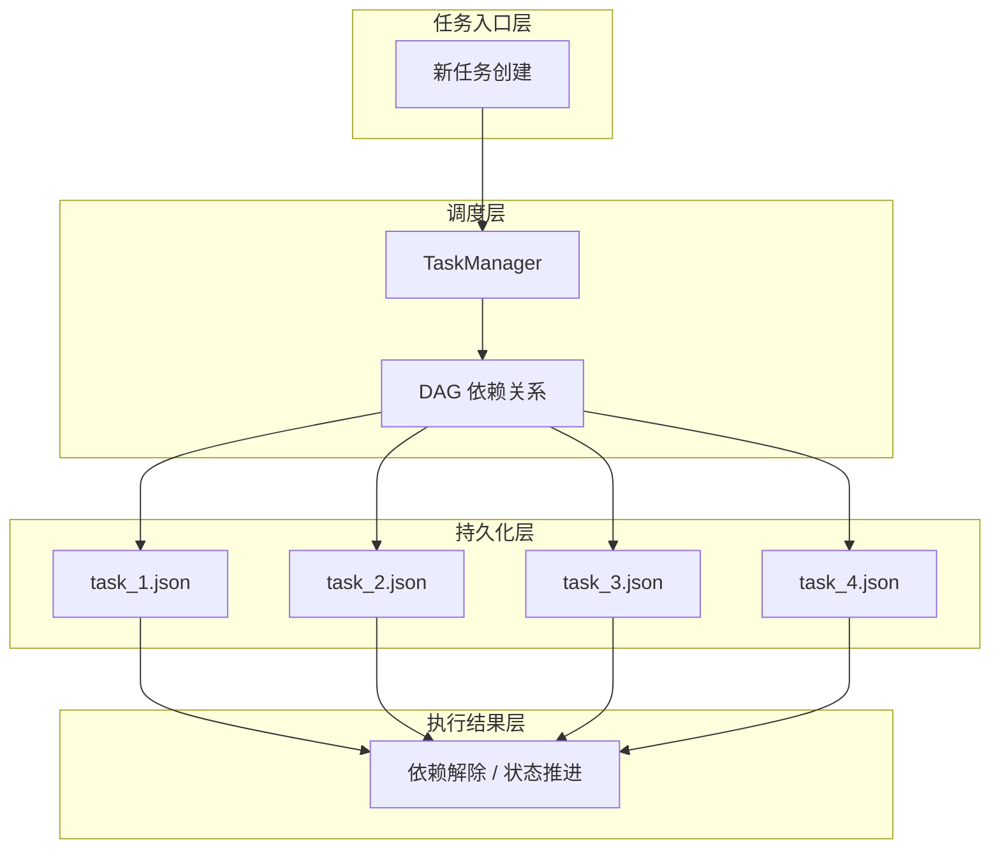

## 1、问题

s03 的 TodoManager 只是一个内存里的扁平清单，它有几个明显不足：

- 没有依赖关系
- 没有顺序表达
- 状态粒度太粗
- 一旦上下文压缩，内存态就可能丢失

真实项目里的任务往往不是平铺的，而是有前后依赖和并行关系的。

## 2、任务图

这一节把 Todo 升级成了基于文件持久化的任务图。

每个任务对应一个 JSON 文件，主要字段包括：

- `id`
- `subject`
- `status`
- `blockedBy`
- `blocks`
- `owner`

任务之间可以构成一个 DAG。

例如：

```text
task1 -> task2
task1 -> task3
task2 + task3 -> task4
```

### 本节架构图



## 3、任务落盘

TaskManager 的初始化会准备任务目录，并管理下一个任务 ID：

```python
class TaskManager:
    def __init__(self, tasks_dir: Path):
        self.dir = tasks_dir
        self.dir.mkdir(exist_ok=True)
        self._next_id = self._max_id() + 1
```

创建任务时会把任务直接写到磁盘：

```python
def create(self, subject, description=""):
    task = {
        "id": self._next_id,
        "subject": subject,
        "status": "pending",
        "blockedBy": [],
        "blocks": [],
        "owner": "",
    }
    self._save(task)
    self._next_id += 1
    return json.dumps(task, indent=2)
```

## 4、依赖解除

任务完成后，需要自动解除后继任务的依赖：

```python
def _clear_dependency(self, completed_id):
    for f in self.dir.glob("task_*.json"):
        task = json.loads(f.read_text())
        if completed_id in task.get("blockedBy", []):
            task["blockedBy"].remove(completed_id)
            self._save(task)
```

也就是说，任务完成不仅仅是修改自己状态，还会影响整个任务图。

## 5、任务工具

这一节新增了四个核心工具：

```python
TOOL_HANDLERS = {
    "task_create": lambda **kw: TASKS.create(kw["subject"]),
    "task_update": lambda **kw: TASKS.update(kw["task_id"], kw.get("status")),
    "task_list": lambda **kw: TASKS.list_all(),
    "task_get": lambda **kw: TASKS.get(kw["task_id"]),
}
```

从这里开始，任务状态已经不再依赖上下文，而是独立存在于磁盘之上。

## 6、这一节的意义

原教程强调，从 s07 开始，任务图成为多步工作的默认选择。

因为它可以回答三个关键问题：

- 什么可以做
- 什么被卡住
- 什么已经完成

而且这些信息在上下文压缩、会话重启后仍然存在。

## 7、练习示例

```text
Create 3 tasks: "Setup project", "Write code", "Write tests". Make them depend on each other in order.
List all tasks and show the dependency graph
Complete task 1 and then list tasks to see task 2 unblocked
Create a task board for refactoring: parse -> transform -> emit -> test
```

### 更完整的可运行示例

下面这个版本已经能在本地 `.tasks/` 目录下创建、更新、读取任务，并在完成任务后自动解除后继依赖。

```python
import json
from pathlib import Path

class TaskManager:
    def __init__(self, tasks_dir: Path):
        self.dir = tasks_dir
        self.dir.mkdir(exist_ok=True)
        self._next_id = self._max_id() + 1

    def _max_id(self) -> int:
        ids = [int(f.stem.split("_")[1]) for f in self.dir.glob("task_*.json")]
        return max(ids, default=0)

    def _path(self, task_id: int) -> Path:
        return self.dir / f"task_{task_id}.json"

    def _save(self, task: dict) -> None:
        self._path(task["id"]).write_text(
            json.dumps(task, ensure_ascii=False, indent=2), encoding="utf-8"
        )

    def create(self, subject: str, blocked_by=None) -> dict:
        task = {
            "id": self._next_id,
            "subject": subject,
            "status": "pending",
            "blockedBy": blocked_by or [],
            "blocks": [],
            "owner": "",
        }
        self._save(task)
        self._next_id += 1
        return task

    def update(self, task_id: int, status: str) -> dict:
        task = json.loads(self._path(task_id).read_text(encoding="utf-8"))
        task["status"] = status
        self._save(task)
        if status == "completed":
            self._clear_dependency(task_id)
        return task

    def _clear_dependency(self, completed_id: int) -> None:
        for f in self.dir.glob("task_*.json"):
            task = json.loads(f.read_text(encoding="utf-8"))
            if completed_id in task.get("blockedBy", []):
                task["blockedBy"].remove(completed_id)
                self._save(task)
```

### 本节完整 demo 目录结构

这一节的重点是把任务状态真正落到磁盘上：

```text
demo-s07/
├── agent.py
├── task_manager.py
└── .tasks/
    ├── task_1.json
    ├── task_2.json
    └── task_3.json
```

`task_manager.py` 负责创建、更新和解除依赖，`.tasks/` 则让任务状态脱离上下文单独存在。

## 8、补充说明

任务系统从扁平 Todo 升级到 DAG 之后，开发思路会发生明显变化。

最关键的一点是，任务不再只是“记录工作项”，而是开始表达依赖关系和可执行条件。也就是说，系统要能判断一个任务当前是可做、阻塞、进行中还是已完成，而不是只在 UI 上列出来。

实际实现里，建议把状态流转定义得更严格一些，例如 `pending -> in_progress -> completed/failed`。如果允许任务状态随意跳转，后续做自动认领、依赖解除和恢复现场时就会非常混乱。

另一个很重要的字段是 `owner`。只要进入多 Agent 场景，任务归属就必须显式记录，不然系统很难判断某个任务是“没人做”还是“有人正在做”。

## 9、小结

这一节把“计划”从会话内的临时清单，升级成了可持久化、可表达依赖关系的任务图。

这一步为后面的后台任务、多 Agent 团队和 worktree 隔离打下了协调基础。

