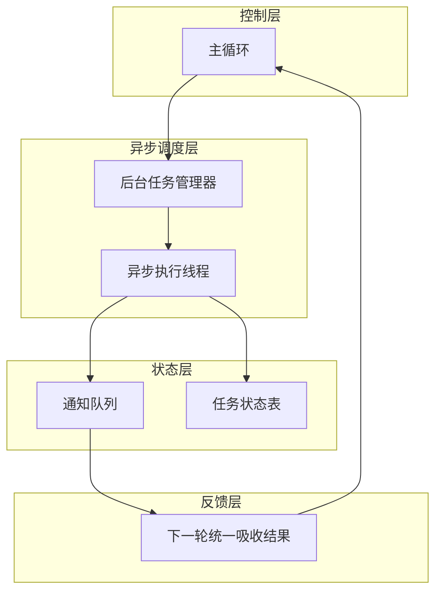

## 1、问题

很多命令都是慢操作，例如：

- `npm install`
- `pytest`
- `docker build`

在阻塞式主循环里，模型只能干等，无法继续做别的事。这对复杂任务的执行效率影响很大。

## 2、解决思路

这一节引入 BackgroundManager，把慢命令丢到后台线程执行。

架构变成：

```text
主线程: Agent loop
后台线程: 执行慢命令
通知队列: 后台结果回流
```

### 本节架构图



这样主线程在等待一个长命令时，还可以继续推动其他动作。

## 3、后台管理器

BackgroundManager 用一个线程安全的通知队列维护后台任务：

```python
class BackgroundManager:
    def __init__(self):
        self.tasks = {}
        self._notification_queue = []
        self._lock = threading.Lock()
```

启动后台任务时，立即返回 task_id，不阻塞主循环：

```python
def run(self, command: str) -> str:
    task_id = str(uuid.uuid4())[:8]
    self.tasks[task_id] = {"status": "running", "command": command}
    thread = threading.Thread(
        target=self._execute, args=(task_id, command), daemon=True
    )
    thread.start()
    return f"Background task {task_id} started"
```

## 4、后台执行

后台线程里真正执行命令，并把结果放进通知队列：

```python
def _execute(self, task_id, command):
    try:
        r = subprocess.run(
            command,
            shell=True,
            cwd=WORKDIR,
            capture_output=True,
            text=True,
            timeout=300,
        )
        output = (r.stdout + r.stderr).strip()[:50000]
    except subprocess.TimeoutExpired:
        output = "Error: Timeout (300s)"

    with self._lock:
        self._notification_queue.append({
            "task_id": task_id,
            "result": output[:500],
        })
```

## 5、结果回流

每次调用模型前，先把通知队列里的结果全部取出并注入消息：

```python
notifs = BG.drain_notifications()
if notifs:
    notif_text = "\n".join(
        f"[bg:{n['task_id']}] {n['result']}" for n in notifs
    )
    messages.append({
        "role": "user",
        "content": f"<background-results>\n{notif_text}\n</background-results>"
    })
    messages.append({"role": "assistant", "content": "Noted background results."})
```

原教程特别说明：主循环依然是单线程，真正并行化的是外部命令 I/O。

## 6、典型实验

```text
Run "sleep 5 && echo done" in the background, then create a file while it runs
Start 3 background tasks: "sleep 2", "sleep 4", "sleep 6". Check their status.
Run pytest in the background and keep working on other things
```

### 更完整的可运行示例

下面这个版本已经包含了后台启动、命令执行、状态记录和通知回流四个关键部分。

```python
import subprocess
import threading
import uuid

class BackgroundManager:
    def __init__(self):
        self.tasks = {}
        self._notification_queue = []
        self._lock = threading.Lock()

    def run(self, command: str) -> str:
        task_id = str(uuid.uuid4())[:8]
        self.tasks[task_id] = {"status": "running", "command": command}
        thread = threading.Thread(
            target=self._execute, args=(task_id, command), daemon=True
        )
        thread.start()
        return task_id

    def _execute(self, task_id: str, command: str) -> None:
        try:
            r = subprocess.run(
                command,
                shell=True,
                capture_output=True,
                text=True,
                timeout=300,
            )
            output = ((r.stdout or "") + (r.stderr or "")).strip()[:4000]
            status = "completed" if r.returncode == 0 else "failed"
        except Exception as e:
            output = f"Background execution error: {e}"
            status = "failed"

        with self._lock:
            self.tasks[task_id]["status"] = status
            self.tasks[task_id]["result"] = output
            self._notification_queue.append({
                "task_id": task_id,
                "status": status,
                "result": output[:500],
            })

    def drain_notifications(self) -> list[dict]:
        with self._lock:
            items = self._notification_queue[:]
            self._notification_queue.clear()
            return items
```

### 本节完整 demo 目录结构

后台任务建议单独抽成一个模块，主循环只消费通知：

```text
demo-s08/
├── agent.py
├── background_manager.py
└── workspace/
```

`background_manager.py` 管理异步命令和通知队列，`agent.py` 负责在每轮模型调用前把通知回流到消息历史中。

## 7、补充说明

后台任务这一步真正难的地方，不是开线程，而是保证异步结果不会把主流程搞乱。

比较稳妥的做法是把后台任务当成“外部状态变化源”，统一通过通知队列进入主循环，而不是在任意时刻直接修改 `messages`。这样主循环始终还是唯一协调中心，系统更容易调试和回放。

另外，慢命令通常都要加资源限制，比如最大执行时间、输出截断、并发上限。否则一旦后台同时跑多个大任务，很容易把系统拖死，最后主循环虽然还活着，但已经没有可用资源继续推进工作了。

## 8、小结

这一节把 Agent 从“只能同步等待的执行者”升级成了“能并行处理慢任务的协调者”。

后台任务机制的重点不是线程本身，而是结果如何回到主循环中继续影响后续决策。

