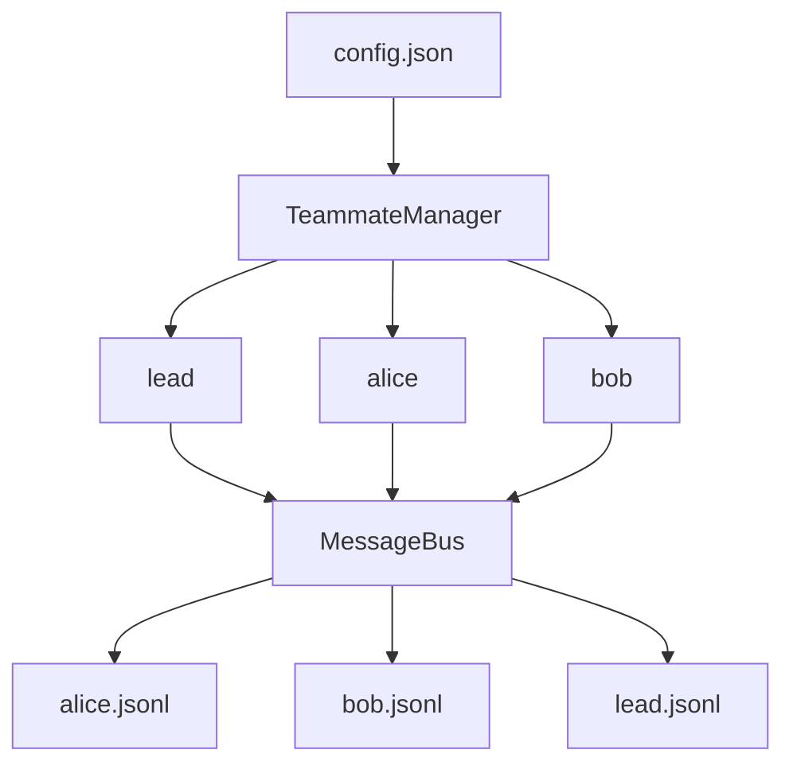

## 1、问题

前面的子 Agent 是一次性的：创建、工作、返回结果、销毁。

这种模式虽然适合局部子任务，但不适合真正的团队协作，因为它缺少：

- 持续存在的身份
- 生命周期状态
- Agent 之间的通信通道

## 2、团队结构

这一节引入持久化队友与邮箱机制。

目录结构大致如下：

```text
.team/
  config.json
  inbox/
    alice.jsonl
    bob.jsonl
    lead.jsonl
```

### 团队通信图



每个队友都有独立邮箱，消息通过 JSONL 追加写入。

## 3、队友生命周期

原教程给出的典型状态流转是：

```text
spawn -> WORKING -> IDLE -> WORKING -> ... -> SHUTDOWN
```

这意味着 Agent 不再是一次性函数调用，而是具备了持续运行的生命周期。

## 4、TeammateManager

团队名册由 `config.json` 维护：

```python
class TeammateManager:
    def __init__(self, team_dir: Path):
        self.dir = team_dir
        self.dir.mkdir(exist_ok=True)
        self.config_path = self.dir / "config.json"
        self.config = self._load_config()
        self.threads = {}
```

创建队友时，除了更新配置，还会拉起一个线程运行它自己的 Agent loop：

```python
def spawn(self, name: str, role: str, prompt: str) -> str:
    member = {"name": name, "role": role, "status": "working"}
    self.config["members"].append(member)
    self._save_config()
    thread = threading.Thread(
        target=self._teammate_loop,
        args=(name, role, prompt),
        daemon=True,
    )
    thread.start()
    return f"Spawned teammate '{name}' (role: {role})"
```

## 5、邮箱通信

MessageBus 采用 append-only JSONL 收件箱：

```python
class MessageBus:
    def send(self, sender, to, content, msg_type="message", extra=None):
        msg = {"type": msg_type, "from": sender, "content": content}
        if extra:
            msg.update(extra)
        with open(self.dir / f"{to}.jsonl", "a") as f:
            f.write(json.dumps(msg) + "\n")
```

读取收件箱后会清空，实现 drain-on-read：

```python
def read_inbox(self, name):
    path = self.dir / f"{name}.jsonl"
    if not path.exists():
        return "[]"
    msgs = [json.loads(line) for line in path.read_text().splitlines() if line]
    path.write_text("")
    return json.dumps(msgs, indent=2)
```

## 6、队友如何消费消息

每个队友在每次调用模型前都会先检查收件箱：

```python
inbox = BUS.read_inbox(name)
if inbox != "[]":
    messages.append({"role": "user", "content": f"<inbox>{inbox}</inbox>"})
    messages.append({"role": "assistant", "content": "Noted inbox messages."})
```

这样 Agent 之间就形成了异步通信机制。

## 7、可以尝试的 prompt

```text
Spawn alice (coder) and bob (tester). Have alice send bob a message.
Broadcast "status update: phase 1 complete" to all teammates
Check the lead inbox for any messages
```

### 更完整的可运行示例

这一版把消息总线和队友管理器拼起来了，已经能完成“启动队友 + 发送消息 + 读取邮箱”这套最小团队机制。

```python
import json
import threading
from pathlib import Path

class MessageBus:
    def __init__(self, inbox_dir: Path):
        self.dir = inbox_dir
        self.dir.mkdir(parents=True, exist_ok=True)

    def send(self, sender: str, to: str, content: str, msg_type="message", extra=None):
        msg = {"type": msg_type, "from": sender, "content": content}
        if extra:
            msg.update(extra)
        with open(self.dir / f"{to}.jsonl", "a", encoding="utf-8") as f:
            f.write(json.dumps(msg, ensure_ascii=False) + "\n")

    def read_inbox(self, name: str) -> list[dict]:
        path = self.dir / f"{name}.jsonl"
        if not path.exists():
            return []
        lines = [json.loads(line) for line in path.read_text(encoding="utf-8").splitlines() if line]
        path.write_text("", encoding="utf-8")
        return lines

class TeammateManager:
    def __init__(self, team_dir: Path, bus: MessageBus):
        self.dir = team_dir
        self.dir.mkdir(exist_ok=True)
        self.bus = bus
        self.members = {}

    def spawn(self, name: str, role: str):
        self.members[name] = {"role": role, "status": "working"}
        threading.Thread(target=self._loop, args=(name,), daemon=True).start()

    def _loop(self, name: str):
        inbox = self.bus.read_inbox(name)
        for msg in inbox:
            print(f"[{name}] received:", msg)
```

### 本节完整 demo 目录结构

团队机制最重要的是把名册和收件箱放进独立目录：

```text
demo-s09/
├── lead.py
├── teammate_manager.py
├── message_bus.py
└── .team/
    ├── config.json
    └── inbox/
        ├── lead.jsonl
        ├── alice.jsonl
        └── bob.jsonl
```

这套结构能清楚区分控制入口、队友状态和通信数据。

## 8、补充说明

团队机制真正成熟起来以后，领导 Agent 和队友 Agent 的职责最好是分开的。

领导更适合做三件事：拆解目标、分配资源、处理高风险决策。队友更适合做边界明确的实现和验证。如果领导既要调度又要亲自做大量底层执行，很快就会成为瓶颈。

邮箱机制虽然简单，但最好尽早定义消息类型，例如普通消息、任务消息、审批消息、状态通知。消息一旦开始增多，如果全都只有一段自由文本，后面想做自动处理和审计会非常困难。

## 9、小结

这一节的重点是把“一次性子任务”升级成“持久化协作成员”。

从这里开始，Agent 系统不再只有一个主循环，而是开始出现真正意义上的团队结构。

## 10、原文链接

- https://learn.shareai.run/zh/s09/
