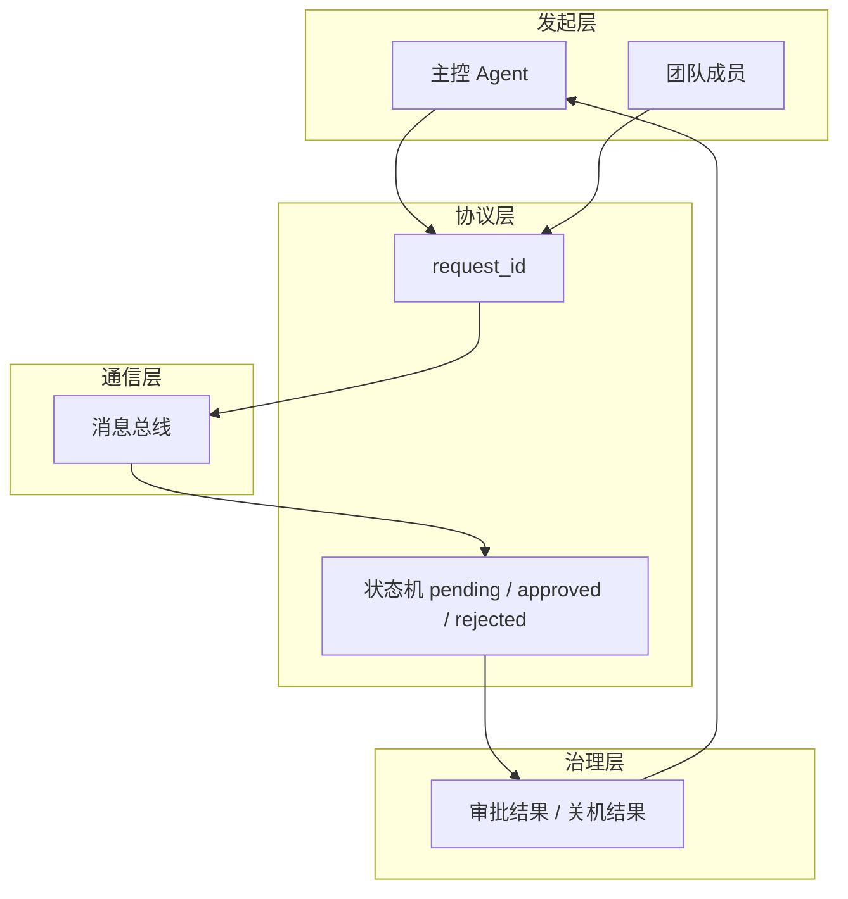

## 1、问题

s09 已经有了队友和邮箱，但通信仍然比较原始。

比如两个典型场景：

- 领导请求某个队友优雅关机
- 队友提交高风险计划，等待领导审批

这两类交互都需要一个共同能力：能够把请求和响应准确关联起来。

### 阅读前提

这一节默认你已经有了持久化队友和邮箱通信的基础。因为协议并不是孤立能力，它是建立在已有团队通信机制之上的治理层补充。

## 2、统一的 request-response 模式

这一节用同一个模型来处理关机协议和计划审批协议：

```text
发送方 -> request_id -> 接收方
接收方 -> 同一个request_id -> 响应
```

状态机也统一成：

```text
pending -> approved
pending -> rejected
```

### 本节架构图



## 3、关机请求

领导先生成一个唯一 `request_id`，再通过收件箱发送：

```python
shutdown_requests = {}

def handle_shutdown_request(teammate: str) -> str:
    req_id = str(uuid.uuid4())[:8]
    shutdown_requests[req_id] = {"target": teammate, "status": "pending"}
    BUS.send(
        "lead",
        teammate,
        "Please shut down gracefully.",
        "shutdown_request",
        {"request_id": req_id},
    )
    return f"Shutdown request {req_id} sent (status: pending)"
```

## 4、关机响应

队友收到请求后，可以批准或拒绝：

```python
if tool_name == "shutdown_response":
    req_id = args["request_id"]
    approve = args["approve"]
    shutdown_requests[req_id]["status"] = "approved" if approve else "rejected"
    BUS.send(
        sender,
        "lead",
        args.get("reason", ""),
        "shutdown_response",
        {"request_id": req_id, "approve": approve},
    )
```

这让“优雅关机”不再是简单杀线程，而是一次有状态的协商。

## 5、计划审批

计划审批沿用完全相同的 request-response 结构：

```python
plan_requests = {}

def handle_plan_review(request_id, approve, feedback=""):
    req = plan_requests[request_id]
    req["status"] = "approved" if approve else "rejected"
    BUS.send(
        "lead",
        req["from"],
        feedback,
        "plan_approval_response",
        {"request_id": request_id, "approve": approve},
    )
```

原教程强调的重点是：一个状态机，可以支撑多种协议。

## 6、这一节的主要变化

- 增加 request_id 关联机制
- 关机从自然退出升级成握手协议
- 新增计划提交与审批流程
- 统一采用 `pending -> approved/rejected` 状态机

## 7、练习示例

```text
Spawn alice as a coder. Then request her shutdown.
List teammates to see alice's status after shutdown approval
Spawn bob with a risky refactoring task. Review and reject his plan.
Spawn charlie, have him submit a plan, then approve it.
```

### 更完整的可运行示例

下面这段代码把请求创建、状态记录和响应处理放到了同一套协议流里，方便继续扩展更多团队协作动作。

```python
import uuid

shutdown_requests = {}
plan_requests = {}

def create_shutdown_request(bus, teammate: str) -> str:
    request_id = str(uuid.uuid4())[:8]
    shutdown_requests[request_id] = {
        "target": teammate,
        "status": "pending",
    }
    bus.send(
        "lead",
        teammate,
        "Please shut down gracefully.",
        "shutdown_request",
        {"request_id": request_id},
    )
    return request_id

def handle_shutdown_response(bus, sender: str, request_id: str, approve: bool, reason=""):
    shutdown_requests[request_id]["status"] = "approved" if approve else "rejected"
    bus.send(
        sender,
        "lead",
        reason,
        "shutdown_response",
        {"request_id": request_id, "approve": approve},
    )

def create_plan_request(bus, sender: str, plan_text: str) -> str:
    request_id = str(uuid.uuid4())[:8]
    plan_requests[request_id] = {"from": sender, "plan": plan_text, "status": "pending"}
    bus.send(sender, "lead", plan_text, "plan_review_request", {"request_id": request_id})
    return request_id
```

### 本节完整 demo 目录结构

协议层最好单独拆出一个文件，不要和队友业务逻辑完全混在一起：

```text
demo-s10/
├── lead.py
├── protocol.py
├── message_bus.py
└── .team/
    └── inbox/
```

其中 `protocol.py` 负责 request_id、状态流转和响应处理，`lead.py` 负责发起审批或关机请求。

## 8、补充说明

协议的价值在多人协作里会越来越明显，因为它解决的是“消息怎么被正确理解”。

如果没有 `request_id`，系统很难判断某条回复是在回应哪一次关机请求、哪一次计划审批，尤其在多个请求同时存在时更容易串线。把消息做成“请求 + 响应 + 状态”三段式，本质上是在给 Agent 协作建立最小事务语义。

此外，高风险动作最好都走协议而不是直接执行。比如关机、强制接管、危险代码修改这类动作，如果没有显式批准流程，系统在扩展后会非常脆弱。

### 与下一节的衔接

协议层把团队协作变得可治理了，下一步自然就是让队友在规则下自己找活干。下一节会进入自主 Agent。

## 9、小结

这一节的核心不是增加了两个功能，而是让团队协作开始有“规矩”。

从此之后，Agent 之间的关键协商不再是自由文本，而是可跟踪、可关联、可审批的协议流。
