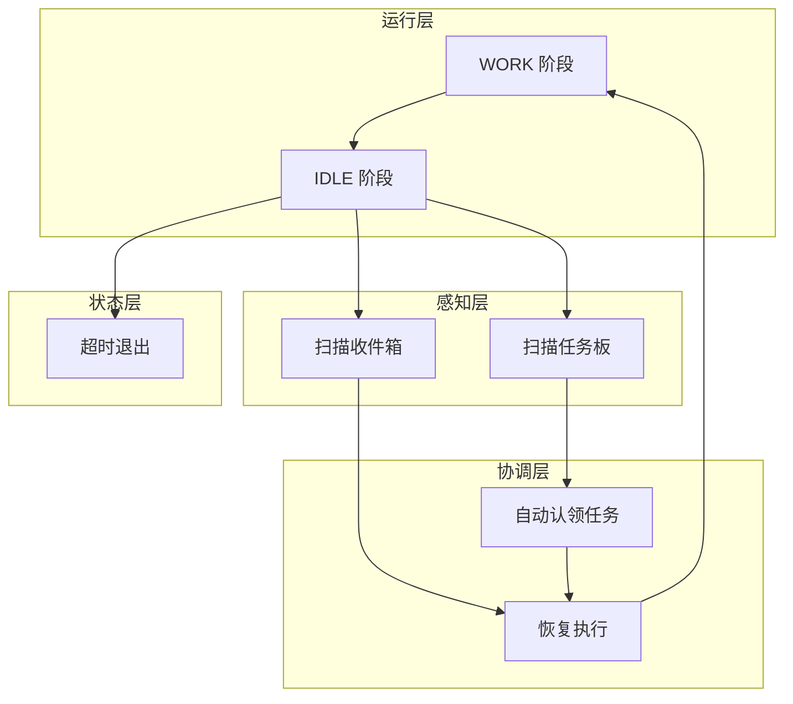

## 1、问题

s09-s10 里的队友依然高度依赖领导调度。

如果任务板上有 10 个待办任务，领导必须一个个指定谁来做，这种模式很难扩展。

这一节的目标，是让队友自己扫描任务板，发现可做任务后主动认领。

## 2、生命周期升级

Agent 的循环被分成两个阶段：

- WORK
- IDLE

当模型不再调用工具，或者显式请求进入空闲态后，队友会进入 IDLE，并周期性轮询：

- 自己的收件箱
- 任务板中的可认领任务

### 本节架构图



## 3、WORK / IDLE 双阶段

主循环的结构大致如下：

```python
def _loop(self, name, role, prompt):
    while True:
        # WORK
        messages = [{"role": "user", "content": prompt}]
        for _ in range(50):
            response = client.messages.create(...)
            if response.stop_reason != "tool_use":
                break
            # execute tools...
            if idle_requested:
                break

        # IDLE
        self._set_status(name, "idle")
        resume = self._idle_poll(name, messages)
        if not resume:
            self._set_status(name, "shutdown")
            return
        self._set_status(name, "working")
```

## 4、空闲阶段轮询

IDLE 阶段会每隔几秒检查一次邮箱和任务板：

```python
def _idle_poll(self, name, messages):
    for _ in range(IDLE_TIMEOUT // POLL_INTERVAL):
        time.sleep(POLL_INTERVAL)

        inbox = BUS.read_inbox(name)
        if inbox:
            messages.append({"role": "user", "content": f"<inbox>{inbox}</inbox>"})
            return True

        unclaimed = scan_unclaimed_tasks()
        if unclaimed:
            claim_task(unclaimed[0]["id"], name)
            messages.append({
                "role": "user",
                "content": f"<auto-claimed>Task #{unclaimed[0]['id']}</auto-claimed>",
            })
            return True

    return False
```

如果在超时时间内没有消息也没有新任务，Agent 就会自动关机。

## 5、扫描未认领任务

可认领任务的筛选条件很清晰：

- `status == pending`
- 没有 `owner`
- 没有 `blockedBy`

代码类似下面这样：

```python
def scan_unclaimed_tasks() -> list:
    unclaimed = []
    for f in sorted(TASKS_DIR.glob("task_*.json")):
        task = json.loads(f.read_text())
        if task.get("status") == "pending" and not task.get("owner") and not task.get("blockedBy"):
            unclaimed.append(task)
    return unclaimed
```

## 6、身份重注入

教程里还提到了一个很细的点：上下文压缩后，Agent 可能会忘记自己的身份。

因此在消息长度很短时，要重新插入身份块：

```python
if len(messages) <= 3:
    messages.insert(0, {
        "role": "user",
        "content": f"<identity>You are '{name}', role: {role}, team: {team_name}. Continue your work.</identity>",
    })
    messages.insert(1, {
        "role": "assistant",
        "content": f"I am {name}. Continuing.",
    })
```

### 更完整的可运行示例

下面这个版本把空闲轮询、扫描任务板和自动认领三个关键动作串起来了。

```python
import json
import time
from pathlib import Path

TASKS_DIR = Path(".tasks")
IDLE_TIMEOUT = 30
POLL_INTERVAL = 3

def scan_unclaimed_tasks() -> list[dict]:
    items = []
    for f in sorted(TASKS_DIR.glob("task_*.json")):
        task = json.loads(f.read_text(encoding="utf-8"))
        if (
            task.get("status") == "pending"
            and not task.get("owner")
            and not task.get("blockedBy")
        ):
            items.append(task)
    return items

def claim_task(task_id: int, owner: str) -> bool:
    path = TASKS_DIR / f"task_{task_id}.json"
    task = json.loads(path.read_text(encoding="utf-8"))
    if task.get("owner") or task.get("status") != "pending" or task.get("blockedBy"):
        return False
    task["owner"] = owner
    task["status"] = "in_progress"
    path.write_text(json.dumps(task, ensure_ascii=False, indent=2), encoding="utf-8")
    return True

def idle_poll(name: str) -> str | None:
    for _ in range(IDLE_TIMEOUT // POLL_INTERVAL):
        time.sleep(POLL_INTERVAL)
        unclaimed = scan_unclaimed_tasks()
        if unclaimed and claim_task(unclaimed[0]["id"], name):
            return f"{name} claimed task #{unclaimed[0]['id']}"
    return None
```

### 本节完整 demo 目录结构

自治执行依赖任务板、轮询逻辑和 Agent 主体三部分：

```text
demo-s11/
├── autonomous_agent.py
├── task_board.py
└── .tasks/
    ├── task_1.json
    └── task_2.json
```

`autonomous_agent.py` 负责 WORK / IDLE 双阶段循环，`task_board.py` 负责扫描和认领任务，`.tasks/` 存放共享任务状态。

## 7、补充说明

自主 Agent 的难点不在“会不会轮询”，而在“如何避免多个队友同时抢同一个任务”。

一个比较稳妥的实现方式是在认领任务时做原子更新，例如先重新读取任务文件，再校验 `owner` 和 `status` 是否仍满足认领条件，最后一次性写回。否则两个 Agent 在同一时间窗口里看到同一个空任务，就可能同时认领成功。

另外，自治并不等于完全放任。任务认领规则、超时退出、身份重注入这些机制，本质上都是为了让队友在自主执行时仍然保持角色边界和系统一致性。

## 8、小结

这一节的关键是“自组织”。

队友不再只是被动等待指令，而是能够在空闲时主动查看任务板、认领任务、恢复工作。到这里，多 Agent 协作已经开始具备自治特征。

