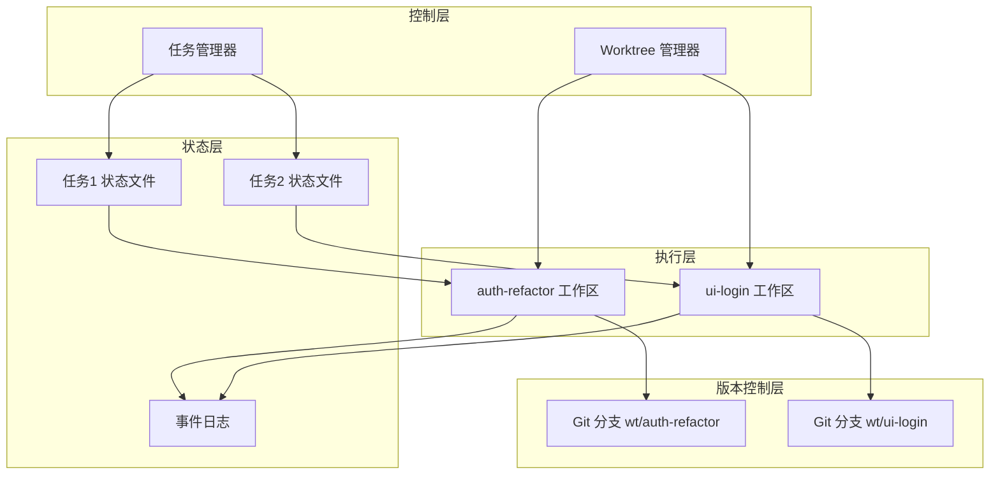

## 1、问题

到 s11 为止，Agent 已经可以自主认领任务，但所有任务仍然共享同一个目录。

这会导致一个现实问题：两个 Agent 同时改不同任务时，如果都动到同一批文件，未提交修改会互相污染，很难回滚，也很难明确某段改动属于哪个任务。

所以任务板只能回答“做什么”，还回答不了“在哪做”。

### 阅读前提

这一节默认你已经理解任务系统、多 Agent 协作和 Git 的基本工作方式。因为 worktree 绑定既涉及状态治理，也涉及真实仓库目录和分支管理。

## 2、控制平面与执行平面

这一节把系统拆成两层：

- `.tasks/` 负责目标和状态
- `.worktrees/` 负责独立执行目录

二者通过 `task_id` 绑定。

结构示意：

```text
.tasks/task_1.json  <---->  .worktrees/auth-refactor/
.tasks/task_2.json  <---->  .worktrees/ui-login/
```

### 本节架构图



## 3、创建任务

第一步仍然是先落盘任务：

```python
TASKS.create("Implement auth refactor")
# -> .tasks/task_1.json
```

这时任务还没有绑定 worktree。

## 4、创建并绑定 worktree

创建 worktree 时，传入 `task_id`，系统会自动建立绑定关系：

```python
WORKTREES.create("auth-refactor", task_id=1)
# -> git worktree add -b wt/auth-refactor .worktrees/auth-refactor HEAD
```

绑定逻辑会同步写入任务状态：

```python
def bind_worktree(self, task_id, worktree):
    task = self._load(task_id)
    task["worktree"] = worktree
    if task["status"] == "pending":
        task["status"] = "in_progress"
    self._save(task)
```

也就是说，worktree 的建立不仅是目录创建，也是任务状态推进。

## 5、在隔离目录中执行

之后所有命令都不再在共享目录里跑，而是指向对应 worktree 目录：

```python
subprocess.run(
    command,
    shell=True,
    cwd=worktree_path,
    capture_output=True,
    text=True,
    timeout=300,
)
```

这样每个任务都有自己的执行空间。

## 6、收尾阶段

原教程提供了两种处理方式：

- `worktree_keep(name)`：保留目录
- `worktree_remove(name, complete_task=True)`：删除目录并完成任务

删除时不仅要移除 worktree，还会更新任务状态并写入事件流：

```python
def remove(self, name, force=False, complete_task=False):
    self._run_git(["worktree", "remove", wt["path"]])
    if complete_task and wt.get("task_id") is not None:
        self.tasks.update(wt["task_id"], status="completed")
        self.tasks.unbind_worktree(wt["task_id"])
        self.events.emit("task.completed", ...)
```

## 7、事件流与可恢复性

每个 worktree 生命周期事件都会写入 `.worktrees/events.jsonl`，例如：

```json
{
  "event": "worktree.remove.after",
  "task": {"id": 1, "status": "completed"},
  "worktree": {"name": "auth-refactor", "status": "removed"}
}
```

这一节最后强调了一件事：会话记忆是易失的，但磁盘状态是持久的。

也就是说，崩溃之后仍然可以根据 `.tasks/` 和 `.worktrees/index.json` 重建现场。

### 更完整的可运行示例

下面这个版本把任务绑定、Git worktree 创建和删除收尾串到了一起，已经能作为最小实验版本使用。

```python
import json
import subprocess
from pathlib import Path

class WorktreeManager:
    def __init__(self, root: Path, tasks):
        self.root = root
        self.root.mkdir(exist_ok=True)
        self.index_path = self.root / "index.json"
        self.tasks = tasks
        if not self.index_path.exists():
            self.index_path.write_text("{}", encoding="utf-8")

    def _index(self) -> dict:
        return json.loads(self.index_path.read_text(encoding="utf-8"))

    def _save_index(self, data: dict) -> None:
        self.index_path.write_text(json.dumps(data, ensure_ascii=False, indent=2), encoding="utf-8")

    def create(self, name: str, task_id: int):
        path = self.root / name
        subprocess.run(
            ["git", "worktree", "add", "-b", f"wt/{name}", str(path), "HEAD"],
            check=True,
        )
        index = self._index()
        index[name] = {"path": str(path), "task_id": task_id, "status": "active"}
        self._save_index(index)
        self.tasks.bind_worktree(task_id, name)
        return index[name]

    def remove(self, name: str, complete_task: bool = False):
        index = self._index()
        wt = index[name]
        subprocess.run(["git", "worktree", "remove", wt["path"]], check=True)
        if complete_task:
            self.tasks.update(wt["task_id"], status="completed")
        del index[name]
        self._save_index(index)
```

### 本节完整 demo 目录结构

这一节最适合把任务状态和执行目录并列出来看：

```text
demo-s12/
├── worktree_manager.py
├── task_manager.py
├── .tasks/
│   ├── task_1.json
│   └── task_2.json
└── .worktrees/
    ├── index.json
    ├── events.jsonl
    ├── auth-refactor/
    └── ui-login/
```

这样可以很直观地看到：任务状态在 `.tasks/`，实际执行空间在 `.worktrees/`，两者通过 task_id 和 worktree 名称建立绑定。

## 8、补充说明

Worktree 隔离真正解决的是“并行开发中的工作区污染”问题。

如果只有任务板而没有独立目录，多个 Agent 最后还是会在同一份未提交改动上互相影响。把任务和 worktree 绑定以后，系统的控制平面和执行平面才真正对齐：任务知道自己归谁、在哪做、做到哪一步，目录也知道自己对应哪个任务。

实际落地时，还建议把 worktree 生命周期和分支策略一起管理好，例如统一分支前缀、统一清理策略、统一保留规则。否则 worktree 虽然隔离了目录，但很快又会在 Git 管理层面重新变乱。

### 与下一节的衔接

这一节已经是这组教程的收束章节。学到这里，你其实已经把 Agent 从最小循环一路搭到了多 Agent + 任务系统 + 工作区隔离的完整工程骨架。后续最值得继续深化的方向，一般是测试体系、权限治理和真实业务集成。

## 9、小结

这一节给多 Agent 系统补上了最后一个关键拼图：执行环境隔离。

从任务状态到执行目录再到事件流，系统终于既知道“做什么”，也知道“在哪做”，还能知道“做到了什么阶段”。
