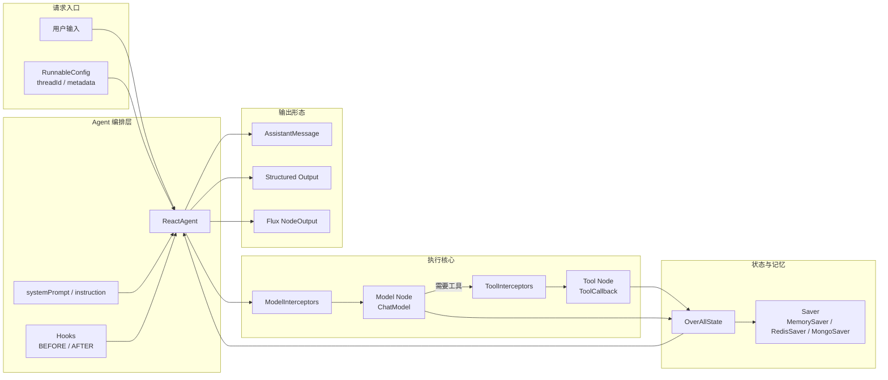
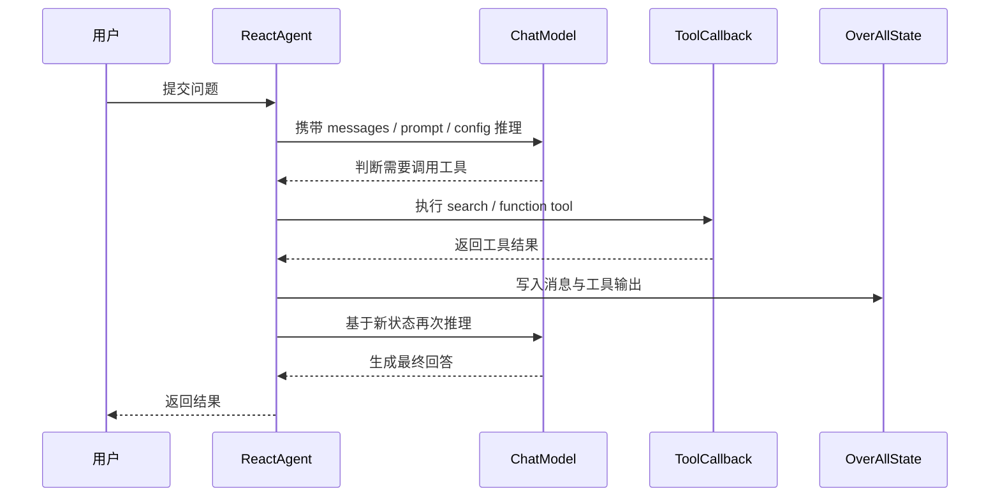

## 概述

在很多 AI 应用场景里，模型只会“说”还不够，它还需要会“做”。比如查询外部信息、调用本地工具、在多轮对话里保留上下文，甚至把结果按固定结构返回给业务系统。这时，普通的聊天接口就很难支撑完整链路，Agent 框架才是更合适的抽象。

Java Agent Framework 的 `ReactAgent`，就是面向这类场景提供的一套生产级能力。它把模型、工具、提示词、记忆、执行状态、拦截器和 Hook 组织到一个统一运行时里，让开发者可以像搭积木一样构建可执行的智能体。

本文基于官方教程 **Agents** 的内容，结合 Java 开发者的使用习惯，梳理 `ReactAgent` 的核心机制、常见调用方式以及几个在真实项目里最实用的增强点。

## 1、为什么要用 ReactAgent

很多人一开始接触 Agent，都会把它理解成“带工具调用的聊天”。这个理解不算错，但还不够完整。

一个真正可用的 Agent，至少要解决下面几件事：

- 模型何时该直接回答，何时该调用工具
- 工具结果怎样回流到模型上下文
- 多轮任务怎样保留线程级状态
- 执行过程怎样被监控、裁剪和限制
- 最终结果怎样稳定输出给上层系统

`ReactAgent` 采用的是典型的 ReAct 思路，也就是：

```text
推理 -> 行动 -> 观察 -> 再推理
```

在这个闭环里，模型不再只是一次性生成答案，而是会根据当前目标不断判断是否需要调用工具、读取工具结果、继续推进任务，直到得到最终输出。

## 2、ReactAgent 的运行结构

官方教程里提到，`ReactAgent` 是建立在 Graph 运行时之上的。可以把它理解成一个围绕模型节点、工具节点和 Hook 节点组织起来的执行图。

和“单次请求、单次返回”的普通聊天接口相比，`ReactAgent` 的重点不只是生成答案，而是维护一条可持续推进的任务状态流：模型负责判断，工具负责执行，Hook 与 Interceptor 负责治理，Saver 负责把状态保存下来。

### 本节架构图



从职责上看，可以把 `ReactAgent` 拆成四部分：

- `ChatModel`：负责模型推理
- `ToolCallback`：负责工具执行
- `systemPrompt` / `instruction`：负责约束行为
- `Saver + RunnableConfig`：负责记忆与线程状态

如果你把这四层理解清楚，后面的结构化输出、记忆、Hook 和 Interceptor 基本都能顺着这个图往下推。

更具体一点说，`ReactAgent` 的运行不是“一次 prompt 直接出结果”，而更像下面这条闭环：

- 先读取用户输入和运行时上下文
- 再进入模型节点判断是否需要工具
- 如果需要，就进入工具节点执行
- 执行结果回写到 `OverAllState`
- 再次把状态送回模型继续判断
- 直到最终产出普通文本、结构化对象或流式事件

## 3、先搭一个最小可用 Agent

最小示例非常直接，核心是把模型塞进 `ReactAgent.builder()`：

```java
ReactAgent agent = ReactAgent.builder()
    .name("my_agent")
    .model(chatModel)
    .build();
```

这段代码虽然短，但已经把 `ReactAgent` 的核心入口确定下来了：所有能力几乎都会围绕这个 builder 继续叠加，比如工具、提示词、记忆、Hook、拦截器和结构化输出。

模型部分，教程使用的是 DashScope：

```java
DashScopeApi dashScopeApi = DashScopeApi.builder()
    .apiKey(System.getenv("AI_DASHSCOPE_API_KEY"))
    .build();

ChatModel chatModel = DashScopeChatModel.builder()
    .dashScopeApi(dashScopeApi)
    .build();
```

如果你希望更细粒度地控制模型行为，可以继续加默认参数：

```java
ChatModel chatModel = DashScopeChatModel.builder()
    .dashScopeApi(dashScopeApi)
    .defaultOptions(DashScopeChatOptions.builder()
        .withModel(DashScopeChatModel.DEFAULT_MODEL_NAME)
        .withTemperature(0.7)
        .withMaxToken(2000)
        .withTopP(0.9)
        .build())
    .build();
```

这里几个参数的含义很直观：

- `temperature`：控制回答发散程度
- `withMaxToken`：控制单次最大输出长度
- `topP`：控制采样范围

对于业务系统来说，一个常见经验是：

- 要求稳定、确定时，尽量降低 `temperature`
- 要求长文本生成时，再适当提高 `max token`
- 不要一上来就把参数调得太激进，先跑通链路更重要

如果你只是本地验证教程内容，到这一步已经能跑通一个最小 Agent；但它此时还只是“可推理”，还没有真正获得对外部世界的操作能力。下一步就要把工具接进去。

## 4、工具接入是 Agent 价值的核心

如果没有工具，Agent 和普通聊天模型的差距不会太大。真正拉开能力上限的，往往是 `ToolCallback`。

教程里给出的工具接入方式，是通过 `FunctionToolCallback` 把一个 Java 函数包装成工具：

```java
ToolCallback searchTool = FunctionToolCallback.builder("search", new SearchTool())
    .description("搜索工具")
    .build();
```

其中工具实现可以基于：

```java
BiFunction<String, ToolContext, String>
```

然后挂到 Agent 上：

```java
ReactAgent agent = ReactAgent.builder()
    .name("search_agent")
    .model(chatModel)
    .tools(searchTool)
    .build();
```

这一步的意义非常大。因为从这里开始，模型回答不再局限于参数里已有的信息，而是能借助工具和外部环境协作完成任务。

### 工具调用闭环



这张图体现了 Agent 和普通聊天接口最大的不同：工具不是“外挂”，而是被纳入了主执行循环。工具输出会重新回到状态里，再参与下一轮推理。

实际项目里，工具通常会落在下面几类场景：

- 搜索：企业知识库、搜索引擎、文档系统
- 数据访问：数据库、缓存、检索系统
- 业务操作：下单、审批、工单、发布流程
- 环境交互：文件、命令、接口编排

换句话说，工具决定了 Agent 的“手脚”有多长。

另外一个容易被忽略的点是：工具描述要足够清楚。工具名、描述和输入结构，都会直接影响模型是否能正确选择这个工具、以及如何组织调用参数。所以在真实项目里，工具设计本身就是 Prompt Engineering 的一部分。

## 5、System Prompt 决定 Agent 的边界

教程中单独强调了 `System Prompt`。这一点很关键，因为 Agent 一旦接了工具，能力会变强，但失控风险也会更高。

最简单的写法是：

```java
ReactAgent.builder()
    .name("my_agent")
    .model(chatModel)
    .systemPrompt("你是一个严谨的技术助手，回答时优先给出明确结论。")
    .build();
```

如果提示词很长，更适合使用 `instruction(...)`：

```java
ReactAgent.builder()
    .name("architect_agent")
    .model(chatModel)
    .instruction(instruction)
    .build();
```

这里可以把两者简单理解为：

- `systemPrompt`：适合短而稳定的行为约束
- `instruction`：适合复杂角色、输出规范和执行要求

教程还展示了动态提示词的做法：通过 `ModelInterceptor` 根据请求上下文动态生成系统消息。比如从 `request.getContext()` 中读取 `user_role`，再拼装对应的 `SystemMessage`。

这意味着系统提示词不再是“写死”的，而是可以随运行时身份、租户、场景变化。

这在企业应用里非常实用，比如：

- 管理员看到更完整的运维信息
- 普通用户只能拿到业务解释
- 不同租户加载不同知识域规则

## 6、call、invoke、stream 怎么选

教程里这部分非常值得单独拿出来讲，因为很多开发者第一次接触 Agent 框架时，最容易混淆的就是三种调用方式。

### 6.1 `call`：只关心最终回复

如果你只需要最终答案，`call(...)` 是最简单的入口。

它支持多种输入方式：

- `call(String)`
- `call(UserMessage)`
- `call(List<Message>)`
- `call(String, RunnableConfig)`

返回值是 `AssistantMessage`。

这类调用适合：

- 页面聊天回复
- 简单问答服务
- 只取最终结果、不关心中间过程的接口

### 6.2 `invoke`：需要完整状态

如果你想拿到整条执行链中的状态，而不是只拿一句回复，就该用 `invoke(...)`。

```java
Optional<OverAllState> result = agent.invoke("帮我分析这段文本的情绪倾向");
```

随后你可以从状态中读取：

```java
state.value("messages")
state.value("custom_key")
```

这特别适合做两类事情：

- 调试 Agent 行为
- 在业务层读取中间状态或自定义状态

### 6.3 `stream`：需要实时输出

如果你的场景是 WebSocket、SSE、控制台实时反馈，`stream()` 才是更自然的方式。

教程中，`stream()` 返回的是：

```java
Flux<NodeOutput>
```

配套的核心类型包括：

- `StreamingOutput`
- `OutputType`
- `AssistantMessage`
- `ToolResponseMessage`

官方给出的 `OutputType` 分类很完整：

- `AGENT_MODEL_STREAMING`
- `AGENT_MODEL_FINISHED`
- `AGENT_TOOL_STREAMING`
- `AGENT_TOOL_FINISHED`
- `AGENT_HOOK_STREAMING`
- `AGENT_HOOK_FINISHED`

它的价值在于，你可以精确知道当前流出来的是模型增量、工具执行结果，还是 Hook 阶段输出，而不是把所有内容都当成普通文本拼接。

如果把三种调用方式放在一起看，可以这样记：

- `call`：我要最终答案
- `invoke`：我要完整状态
- `stream`：我要执行过程中的实时事件

这一层区分非常重要。因为很多团队一开始会无差别地用 `call`，等到要做调试面板、前端实时回显、工具执行观测时，才发现接口粒度不够。

## 7、RunnableConfig 和 threadId 是多轮记忆的关键

教程里反复出现的一个对象是 `RunnableConfig`：

```java
RunnableConfig runnableConfig = RunnableConfig.builder()
    .threadId("thread_123")
    .addMetadata("key", "value")
    .build();
```

它至少承担两件事：

- 用 `threadId` 标识同一条会话线程
- 用 `metadata` 传递运行时上下文

这在 Agent 场景里非常关键。因为很多多轮任务并不是一次对话就结束，而是需要围绕“同一个用户、同一条任务链、同一个业务上下文”持续推进。

如果没有 `threadId`，每次调用都像重新开局；如果有了 `threadId`，Agent 才真正具备连续工作的基础。

## 8、MemorySaver 让 Agent 记住上下文

要让 `threadId` 真正发挥作用，还需要给 Agent 配一个状态保存器。

教程示例里使用的是：

```java
ReactAgent.builder()
    .name("chat_agent")
    .model(chatModel)
    .saver(new MemorySaver())
    .build();
```

然后配合 `RunnableConfig.threadId(...)`，就能维持多轮上下文。

这里要特别注意一点：`MemorySaver` 解决的是“状态如何保存”，`threadId` 解决的是“这些状态属于哪条会话”。这两个点缺一个都不行。

举个很实际的例子：

- 用户第一次提问：“帮我写一个订单分析助手”
- 第二次追问：“输出改成 JSON，保留风险等级字段”
- 如果没有线程级记忆，第二次调用很可能会丢掉第一次的上下文
- 如果线程能持续复用，Agent 才能理解这是在延续同一个任务

这套组合非常适合开发和本地验证。但教程也明确提示了，生产环境通常要换成持久化实现，比如：

- `RedisSaver`
- `MongoSaver`

这里的思路其实很清楚：

- `MemorySaver`：适合演示、测试、单机运行
- 持久化 Saver：适合服务化部署和多实例场景

也就是说，教程不只是教你“怎么跑通”，还把“怎么走向生产”提前点出来了。

## 9、结构化输出比自由文本更适合系统集成

在很多企业项目里，文本回答并不是终点。真正需要的是结构化结果，比如：

- 任务摘要
- 情感分析结果
- 审批建议
- 风险标签
- 评分与解释

教程给了两种结构化输出方式。

### 9.1 `outputType(...)`

如果输出结构比较固定，最推荐这种方式：

```java
ReactAgent.builder()
    .name("poem_agent")
    .model(chatModel)
    .outputType(PoemOutput.class)
    .build();
```

这种做法的优势是类型直接落在 Java 类上，业务层接起来更自然。

### 9.2 `outputSchema(...)`

如果你需要更灵活的格式控制，可以用 `BeanOutputConverter` 先生成 schema：

```java
BeanOutputConverter<TextAnalysisResult> outputConverter =
    new BeanOutputConverter<>(TextAnalysisResult.class);
String format = outputConverter.getFormat();
```

然后：

```java
ReactAgent.builder()
    .name("analysis_agent")
    .model(chatModel)
    .outputSchema(format)
    .build();
```

从选型上说，可以简单记一条经验：

- 结构稳定，优先 `outputType`
- 结构需要更灵活约束时，再考虑 `outputSchema`

## 10、Hook 和 Interceptor 是生产增强的两把刀

教程后半部分最有价值的内容，就是 Hook 和 Interceptor。因为这两类机制，决定了 Agent 能不能真正变成可维护、可治理的系统组件。

很多人第一次看这部分时容易混淆。可以先记一个简单判断：

- Hook 更偏“执行阶段插点”
- Interceptor 更偏“调用链拦截与改写”

也就是说，Hook 更像流程中的检查点；Interceptor 更像模型调用和工具调用周围的一层增强壳。

### 10.1 Hook：在执行阶段插入控制逻辑

教程中出现的 Hook 相关类型包括：

- `AgentHook`
- `MessagesModelHook`
- `ModelHook`
- `HookPosition`
- `HookPositions`
- `AgentCommand`
- `UpdatePolicy`
- `JumpTo`

支持的位置有：

- `BEFORE_AGENT`
- `AFTER_AGENT`
- `BEFORE_MODEL`
- `AFTER_MODEL`

例如日志 Hook，可以在 Agent 前后输出统一日志；消息裁剪 Hook，则可以在 `beforeModel(...)` 中截断历史消息，避免上下文无限膨胀。

教程里这部分其实对应了两个很常见的问题：

- 上下文太长，消息越堆越多
- Agent 跑得太久，迟迟不退出

前者可以通过 `MessagesModelHook` 做消息裁剪，后者则可以通过限制执行轮次或自定义停止条件解决。

教程里还展示了一个内置能力：

```java
hooks(ModelCallLimitHook.builder().runLimit(5).build())
```

这非常适合防止 Agent 因为工具调用或推理失控而陷入过长循环。

### 10.2 Interceptor：在模型和工具调用链上做拦截

Interceptor 更像一层可组合的调用链治理机制。

教程中提到的核心类型包括：

- `ModelInterceptor`
- `ToolInterceptor`
- `ModelRequest`
- `ModelResponse`
- `ModelCallHandler`
- `ToolCallRequest`
- `ToolCallResponse`
- `ToolCallHandler`

它们适合解决下面这些问题：

- 模型输入输出审查
- 动态系统提示词注入
- 工具调用监控
- 工具异常兜底
- 统一日志与耗时统计

例如教程中的 `ToolErrorInterceptor`，就是在工具失败时返回友好的响应，而不是把异常直接暴露给最终用户。

这一点在企业项目里非常重要，因为模型并不知道工具异常是否可恢复，但业务系统通常希望拿到“可解释的失败结果”，而不是一个难以处理的栈追踪。

多个拦截器还可以组合挂载：

```java
.interceptors(new GuardrailInterceptor(), new LoggingInterceptor(), new ToolMonitoringInterceptor())
```

这说明 `ReactAgent` 的扩展方式并不是把逻辑硬塞进主流程，而是鼓励通过拦截链做横切治理。

## 11、一个适合实际项目的理解方式

如果把整篇教程压缩成一句话，我觉得可以这样理解：

> `ReactAgent` 不是“一个能聊天的类”，而是一套围绕模型、工具、状态和治理能力搭出来的执行框架。

它适合的，不只是 demo 式问答，而是下面这些更真实的业务场景：

- 带工具调用的企业知识问答
- 有多轮上下文的业务 Copilot
- 需要结构化输出的分析型服务
- 有审计、日志、限流、错误兜底要求的生产 Agent

如果你只是想做一个简单聊天页，直接调模型接口也许就够了；但如果你想做的是“能执行、能记忆、能治理、能接系统”的智能体，那么 `ReactAgent` 这套抽象就会非常顺手。

从工程实现角度看，我更建议把它拆成三层来落地：

- 第一层先跑通 `model + call`，验证模型接入没问题
- 第二层接入 `tools + threadId + saver`，让 Agent 真正可执行、可记忆
- 第三层再补 `hooks + interceptors + structured output`，把它变成可上线、可治理的系统能力

这样推进的好处是非常稳：先验证主链路，再增强可用性，最后补治理能力，不容易一开始就把复杂度堆满。

## 12、总结

官方教程 **Agents** 的价值，不只是教你把 `ReactAgent` 跑起来，更重要的是把一条完整的 Agent 设计路径讲清楚了：

- 用 `ChatModel` 建立推理能力
- 用 `ToolCallback` 扩展行动能力
- 用 `systemPrompt` 和 `instruction` 约束行为边界
- 用 `call`、`invoke`、`stream` 适配不同调用场景
- 用 `RunnableConfig` 和 `threadId` 管理线程上下文
- 用 `MemorySaver` 或持久化 Saver 保留多轮状态
- 用 `outputType` / `outputSchema` 输出结构化结果
- 用 Hook 和 Interceptor 做生产级治理

对于 Java 开发者来说，这套设计最大的好处是足够工程化。它并没有把 Agent 写成一个“神奇黑盒”，而是把模型调用、工具接入、上下文管理和扩展机制拆成了清晰的层次。

这也意味着，后续无论你是继续往多 Agent、Graph API，还是企业工具集成方向走，基础都会比较稳。
