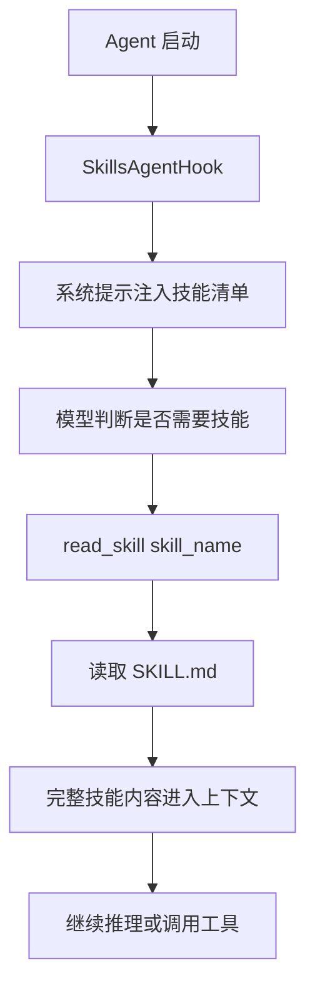
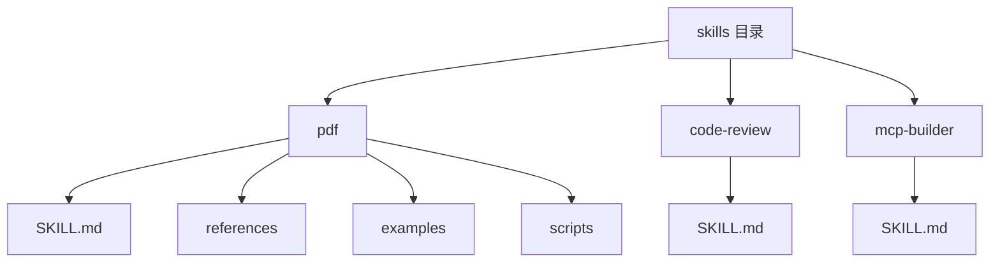
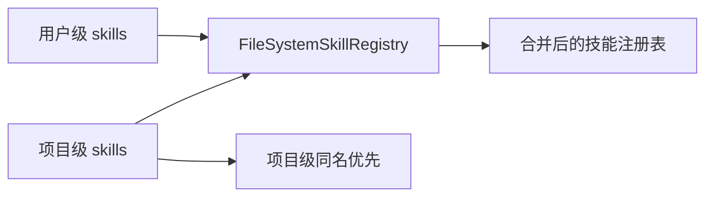
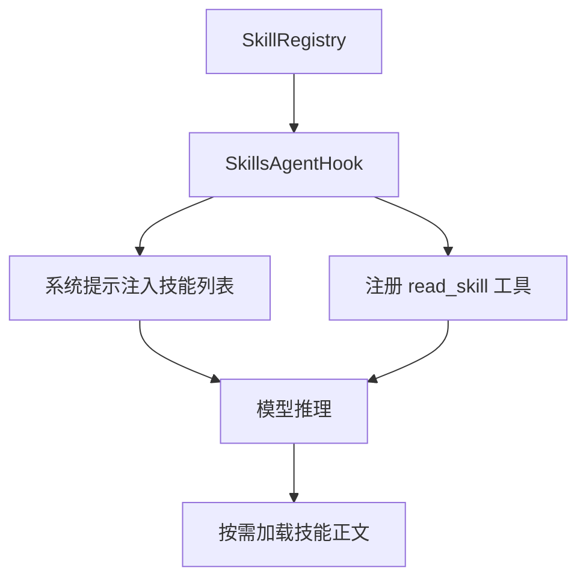

## 概述

当 Agent 需要掌握越来越多的领域知识时，一个最直接、也最容易失控的做法，就是把所有规则、说明、操作手册都塞进系统提示词里。但这种方式的代价很明显：prompt 会越来越重，而且大多数知识在当前任务里根本用不上。

Java Agent Framework 在 Skills 这部分能力设计里提供了一套更工程化的解法：把知识组织成独立技能目录，通过 `SkillRegistry` 管理，再由 `SkillsAgentHook` 把技能摘要注入系统提示，真正需要时再通过 `read_skill(skill_name)` 按需读取完整内容。

本文系统梳理 Java Agent Framework 的技能系统设计、目录规范、核心 API、Agent 集成方式和生产环境下的使用建议。

## 1、为什么需要 Skills

Skill 的核心目标，不是替代模型能力，而是让 Agent 能够在恰当的时候读取恰当的知识。

教程里强调，Skills 本质上是一组可复用的指令与上下文集合。它适合解决下面这些问题：

- 系统提示词过重
- 不同任务依赖不同领域知识
- 规则和操作手册需要独立维护
- 想新增知识能力，但不想频繁改主 Agent 代码

换句话说，Skills 解决的是“知识如何按需加载”，而不是“知识如何一次性塞满”。

## 2、技能系统的核心机制：先暴露目录，再按需读取全文

Skills 教程延续的其实是一种很典型的渐进式披露思路：

- 第一步，只把技能清单和简短说明暴露给模型
- 第二步，模型判断当前任务需要某项技能时，再调用 `read_skill(skill_name)` 读取完整 `SKILL.md`

这样做的好处非常明确：

- 平时上下文更轻
- 技能内容只在需要时进入上下文
- 技能之间相互独立，维护成本更低
- 新增技能只要加目录和文件，不需要大改主流程

### Skills 工作流程图



这个设计和直接把所有技能全文塞进系统提示相比，最大的区别就是：**把知识加载从静态注入改成了按需注入。**

## 3、SkillRegistry：技能系统的统一入口

教程里，技能系统的核心抽象是 `SkillRegistry`。

它的职责非常清楚：统一管理技能的发现、读取和元数据暴露。

页面明确提到的接口方法包括：

- `get`
- `listAll`
- `contains`
- `size`
- `readSkillContent`
- `getSkillLoadInstructions`
- `getRegistryType`
- `getSystemPromptTemplate`
- 可选 `reload()`

这里可以把它简单理解成“技能注册表”。上层 Hook 和 Advisor 不直接关心技能来自哪里，只关心能不能通过注册表拿到：

- 技能清单
- 技能元数据
- 技能正文
- 技能加载说明

教程里还提到 `SkillMetadata`，其中包含：

- `name`
- `description`
- `skillPath`
- 可选 `source`

这意味着技能本身不仅仅是一段说明文本，它还有明确的身份和来源信息。

从职责划分上看，可以把这一层理解成：

- Registry 负责“存什么、去哪找、怎么读”
- Hook 负责“怎么让 Agent 知道这些技能”
- Tool 负责“在需要时把技能正文真正读进上下文”

这个分层很重要，因为它避免了把扫描目录、构造提示词、读取技能正文三件事揉成一个难维护的大模块。

## 4、技能目录怎么组织

Skills 页面给出了非常清晰的目录约定。

每个技能对应一个独立目录，目录下至少要有：

- `SKILL.md`

还可以带一些辅助资源：

- `references/`
- `examples/`
- `scripts/`

### 技能目录结构图



这种设计的好处是非常直观的：技能本身就是一个完整包，说明文档、参考材料、示例代码、辅助脚本都可以收在同一目录下，不容易散落。

## 5、SKILL.md 的规范

教程里说明，`SKILL.md` 不只是普通 Markdown 文件，它需要 front matter。

其中必填元数据包括：

- `name`
- `description`

页面还给出了命名建议：

- `name` 建议使用小写字母、数字和连字符
- 最长 64 字符
- `description` 过长会被截断

正文部分则可以放：

- 功能说明
- 使用方式
- 资源列表
- 与该技能相关的额外约束和提示

这里最重要的一点是：`SKILL.md` 要写成“模型能读懂并执行”的说明，而不是写成只给人看的流水账。因为它最终是会被注入模型上下文里的。

## 6、FileSystemSkillRegistry：适合开发和本地维护

如果技能是放在文件系统中维护的，教程推荐使用 `FileSystemSkillRegistry`。

它的构建方式是：

```java
FileSystemSkillRegistry.builder()
```

页面明确出现的配置项包括：

- `userSkillsDirectory(String|Resource)`
- `projectSkillsDirectory(String|Resource)`
- `systemPromptTemplate(...)`

教程里还提到默认目录：

- 用户级：`~/saa/skills`
- 项目级：`./skills`

并且同名冲突时：**项目目录优先于用户目录**。

### FileSystemSkillRegistry 结构图



这套机制非常适合本地开发，因为它同时支持：

- 用户维度的通用技能
- 项目维度的专属技能
- 项目覆盖用户默认技能

从工程习惯上说，这种“全局默认 + 项目覆盖”的设计非常实用。

## 7、ClasspathSkillRegistry：适合跟应用一起打包

如果技能需要随着应用一起打包发布，教程给出的对应实现是 `ClasspathSkillRegistry`。

它的构建方式是：

```java
ClasspathSkillRegistry.builder()
```

明确出现的配置项包括：

- `classpathPath("skills")`
- 可选 `basePath("/tmp")`

其中 `basePath` 用于设置 JAR 资源复制目录，页面说明默认是 `/tmp`。

这类方式特别适合：

- 技能和应用一同发布
- 容器化部署
- 不希望运行时依赖外部技能目录

也就是说：

- `FileSystemSkillRegistry` 更适合开发态和可运维场景
- `ClasspathSkillRegistry` 更适合打包分发场景

## 8、SkillsAgentHook：把技能真正接入 Agent

如果说 `SkillRegistry` 解决的是“技能怎么被管理”，那么 `SkillsAgentHook` 解决的就是“技能怎么进入 Agent 执行链路”。

它的构建方式是：

```java
SkillsAgentHook.builder()
```

页面明确出现的配置项包括：

- `skillRegistry(registry)`
- `groupedTools(groupedTools)`
- `autoReload(true)`

教程里强调，`SkillsAgentHook` 做了两件核心事情：

- 注册 `read_skill` 工具
- 把技能清单注入系统提示

也就是说，模型在一开始先知道“当前有哪些技能可用”，真正需要时再通过 `read_skill(skill_name)` 读取完整内容。

### SkillsAgentHook 工作图



这个 Hook 才是 Skills 真正落地的关键，因为它把技能目录、系统提示和工具调用三件事串成了一条完整链路。

页面还给了几个便捷 API：

- `hook.listSkills()`
- `hook.hasSkill(name)`
- `hook.getSkillCount()`

这说明 `SkillsAgentHook` 不只是被动注入提示，它本身也提供了对技能状态的轻量查询能力，便于调试和运行期检查。

## 9、read_skill 与 groupedTools：先读技能，再暴露工具

教程里有一个很实用的设计点，就是 `groupedTools`。

它的类型示例是：

```java
Map<String, List<ToolCallback>>
```

并且 key 需要与 `SKILL.md` 中的技能名一致。

它带来的效果是：

- 一开始不是所有工具都暴露给模型
- 模型先读取相关技能
- 某个技能被激活后，对应工具才加入本次请求
- 激活后的工具还可以在后续轮次继续使用

### 技能与工具联动图


这一步特别重要，因为它让 Skills 不只是“文本知识包”，而是能进一步和工具暴露策略绑定。这样一来，模型不会一开始就面对一大堆无关工具，工具选择也会更稳定。

换句话说，`read_skill` 解决的是“把规则读进来”，`groupedTools` 解决的是“规则读进来之后，哪些能力可以被安全地开放出来”。这两个机制配合起来，才形成了完整的技能激活闭环。

## 10、autoReload：让技能修改更快生效

页面里还给了 `autoReload(true)`。

它的行为是：在一次 Agent 执行开始时、首次模型推理前，尝试执行 `registry.reload()`。

如果当前注册表实现不支持 `reload()`，会抛 `UnsupportedOperationException`，而 Hook 会捕获它并仅记录 debug 日志。

这意味着：

- 开发时可以更快看到技能改动
- 生产时则要根据具体注册表实现决定是否开启

这个设计也很合理：能力允许时自动重载，不支持时也不会直接把主流程打崩。

## 11、在 ReactAgent 中集成 Skills

教程里给出的典型接法，就是把 Skills 作为 Hook 挂到 `ReactAgent` 上。

页面中明确出现的调用链包括：

- `ReactAgent.builder()`
- `name(...)`
- `model(...)`
- `saver(new MemorySaver())`
- `hooks(...)`
- `tools(...)`
- `enableLogging(true)`
- `call(...)`

同时，完整集成示例里还出现了：

- `ShellToolAgentHook`
- `ShellTool2.builder(workDir).build()`
- `PythonTool.createPythonToolCallback(PythonTool.DESCRIPTION)`

这说明 Skills 并不是孤立功能，而是可以和 Shell、Python、普通工具能力一起组装成完整 Agent。

## 12、在 ChatClient / Graph 中使用 Skills

教程还讲了另一个很实用的方向：即使你不直接用 `ReactAgent`，也可以在 `ChatClient` 或 Graph 链路里使用 Skills。

这里用到的核心组件是：

- `SkillPromptAugmentAdvisor.builder()`
- `projectSkillsDirectory("./skills")`
- `lazyLoad(false)`
- `skillRegistry(registry)`
- `ChatClient.builder(chatModel).defaultAdvisors(skillAdvisor).build()`

它的作用边界也说得很明确：

- `SkillPromptAugmentAdvisor` 只负责把技能列表和加载说明写入系统提示
- **它不会注册 `read_skill`**

也就是说，如果你希望在 ChatClient 场景里也能读取完整技能内容，就还需要额外注册 `read_skill`，例如使用带 `SkillsAgentHook` 的 Agent 节点，或者额外提供 `ReadSkillTool`。

### ChatClient 集成图


这一点很关键，因为很多人看到 Advisor 会误以为它已经包含完整技能读取能力，但教程明确把它们拆开了：一个负责提示增强，一个负责工具式读取。

从使用边界上看，可以这样理解：

- `SkillsAgentHook` 更偏 Agent 执行链路，既注入技能列表，也提供 `read_skill`
- `SkillPromptAugmentAdvisor` 更偏提示增强，只负责让模型“知道有这些技能”

这个区别如果一开始没想清楚，后面很容易出现“模型知道技能存在，但为什么读不到技能正文”的疑惑。

## 13、最佳实践：把技能当成可维护资产，而不是提示词碎片

如果把 Skills 教程压缩成几条实用建议，我觉得最重要的是下面这些：

- 技能边界要清晰，不要把多个不相关主题塞进同一个 `SKILL.md`
- `name` 要稳定，因为它会和 `read_skill`、`groupedTools`、状态约定直接关联
- `description` 要短而准，因为模型会先根据它判断要不要读该技能
- 文件系统注册表适合开发，classpath 注册表适合发布
- 不是所有场景都要自动重载，生产环境要结合实现能力来开
- Skills 最适合和工具分组一起使用，形成“先读规则，再开放能力”的控制链路

归根到底，Skills 最好的用法不是把它当“知识仓库”，而是当“Agent 的按需能力说明层”。

从工程维护角度看，还可以再补三条：

- 技能目录尽量保持自包含，说明、示例和脚本放在一起
- 技能名称一旦对外使用，就尽量不要频繁改名
- 如果某项知识总是被读取，应该反过来检查它是不是已经适合上升为默认系统规则，而不再只是一个可选技能

## 14、总结

Skills 这部分能力的价值，在于它把“知识如何进入 Agent”这件事做成了一套清晰、可维护、可扩展的机制：

- 用 `SkillRegistry` 统一管理技能来源
- 用 `FileSystemSkillRegistry` 和 `ClasspathSkillRegistry` 适配不同部署方式
- 用 `SkillsAgentHook` 把技能目录和 `read_skill` 接进 Agent
- 用 `groupedTools` 把技能激活和工具暴露联动起来
- 用 `SkillPromptAugmentAdvisor` 在 ChatClient / Graph 场景下做提示增强

对于 Java 开发者来说，这套设计最大的价值是把技能系统做成了标准化扩展点，而不是把规则文档硬编码在 prompt 字符串里。

当你的 Agent 开始进入企业知识、领域规则、工具约束越来越复杂的场景时，Skills 这套模式会比“不断往系统提示里堆内容”稳定得多，也更容易维护。
