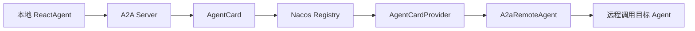
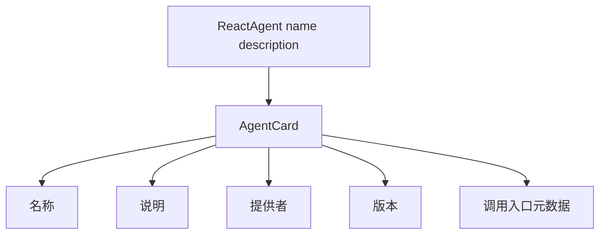
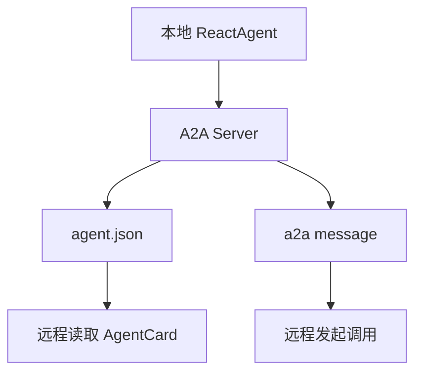
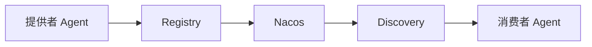
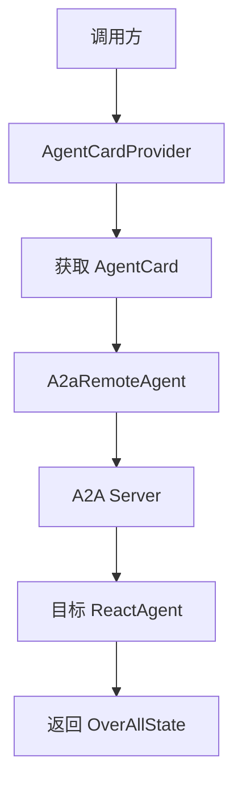
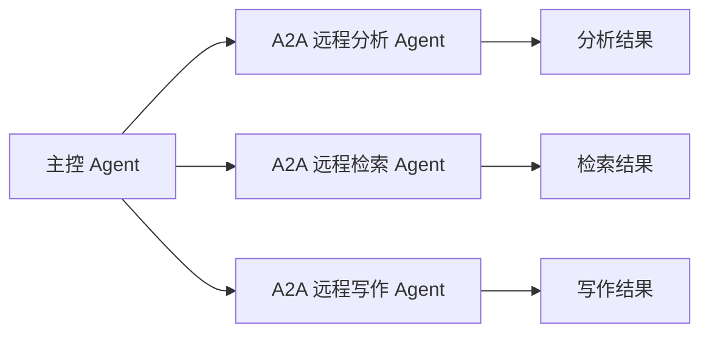
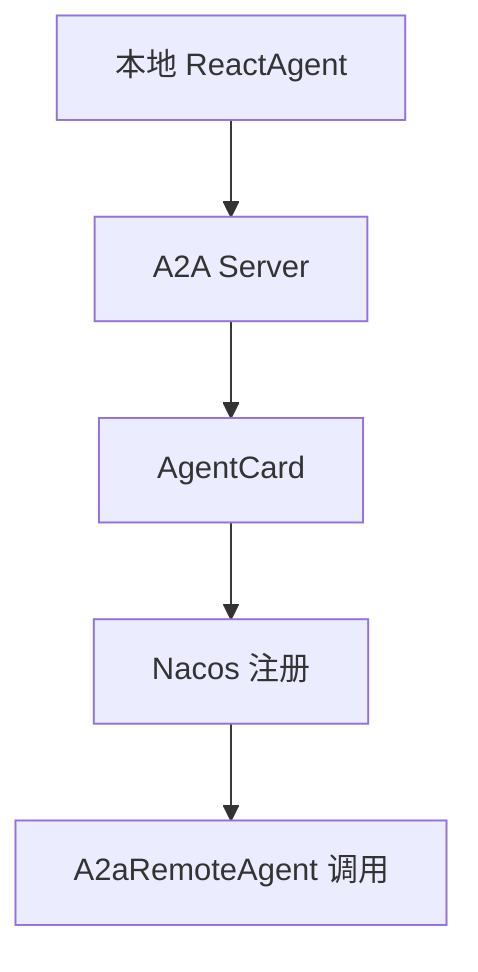

## 概述

当一个 Agent 只在本地进程里运行时，问题通常还比较简单：模型、工具、状态都在同一个运行时里，调用链也相对可控。但一旦系统开始走向分布式，就会很快碰到几个更现实的问题：别的服务里的 Agent 怎么找、怎么调、怎么知道它能做什么、怎么让不同节点上的智能体协同起来。

A2A 的价值就在这里。它关注的不是“单个 Agent 怎么推理”，而是“多个 Agent 如何跨进程、跨服务互联”。在 Java Agent Framework 这套能力里，本地 `ReactAgent` 不再只是一个只能在当前应用里使用的对象，它还可以被发布成一个远程可访问的 A2A 服务，并通过注册中心完成发现与调用。

本文围绕 A2A 这部分能力，系统梳理它的核心组成、发布方式、注册发现机制、远程代理调用流程，以及在分布式多 Agent 场景下更值得关注的工程边界。

## 1、为什么单机 Agent 还不够

很多 Agent 示例默认都是单应用内运行：

- Agent 在本地创建
- 调用在本地完成
- 工具和模型都在同一个服务里

这种方式适合快速验证，也适合单体型 Copilot。但在更真实的业务系统里，Agent 往往不会都放在一个进程内。

常见情况包括：

- 某个 Agent 部署在数据服务旁边，方便访问内部数据库
- 某个 Agent 部署在知识库服务旁边，方便接近向量检索系统
- 某个 Agent 由另一个团队维护，生命周期独立
- 某个 Agent 需要被多个应用复用，而不是在每个服务里重复实现一次

这时真正的问题就不再只是“Agent 会不会做事”，而变成：

- 怎么让其他服务知道这个 Agent 存在
- 怎么获取它的元数据和能力描述
- 怎么按统一协议远程调用它
- 怎么把本地 Agent 和远程 Agent 放进同一条协作链路里

A2A 解决的就是这类问题。它把 Agent 从“进程内能力”推进成“网络上的可寻址能力”。

## 2、A2A 的核心，不是替代 ReactAgent，而是把它发布出去

这里最容易误解的一点是：A2A 不是另一套和 `ReactAgent` 平行的新 Agent 实现。

更准确地说，它是在已有 Agent 之上增加一层远程互联能力。

也就是说：

- `ReactAgent` 负责本地智能体的推理、工具和执行
- A2A 负责把这个智能体变成可注册、可发现、可远程调用的服务

从职责上可以把它拆成三层：

- 本地执行层：`ReactAgent`
- 元数据描述层：`AgentCard`
- 远程调用层：A2A Server / Discovery / `A2aRemoteAgent`

### A2A 总体结构图



这个结构说明了一件很重要的事：A2A 并没有改写本地 Agent 的核心实现，而是给它补上了“对外暴露”和“跨服务互联”这两层能力。

## 3、先看本地 Agent：A2A 的起点依然是 ReactAgent

A2A 链路的起点，仍然是一个普通的本地 `ReactAgent`。例如页面里给出的典型定义方式：

```java
@Bean(name = "dataAnalysisAgent")
ReactAgent dataAnalysisAgent(ChatModel chatModel) {
    return ReactAgent.builder()
        .name("data_analysis_agent")
        .model(chatModel)
        .description("数据分析类 Agent")
        .instruction("处理统计分析与结论总结")
        .outputKey("messages")
        .build();
}
```

这里有几个点很值得注意：

- `name(...)` 是后续远程互联里的关键标识
- `description(...)` 不只是说明文字，也会进入 AgentCard 元数据
- `instruction(...)` 仍然决定这个 Agent 的本地行为边界
- `outputKey(...)` 仍然决定返回结果写入哪个状态键

这说明 A2A 场景并没有推翻前面 Agent 的设计规律，很多本地建模习惯依然成立。真正新增的是：这些信息不再只服务于当前进程，而是会进一步参与远程发现与调用。

如果从服务治理角度再看一层，`name(...)` 在这里已经不只是代码里的名字，它同时影响注册标识、远程定位和后续调用约定；而 `description(...)` 也不只是给人看的注释，它会直接影响别的服务如何理解这个 Agent 的职责边界。

## 4、AgentCard：让远程世界知道“你是谁、你能干什么”

要让一个 Agent 能被远程调用，只靠名字还不够，还需要一份标准化的描述信息。这就是 `AgentCard` 的作用。

可以把它简单理解成 Agent 的“名片”或“服务描述”。它通常承载的信息包括：

- Agent 名称
- 功能说明
- 提供者信息
- 版本信息
- 服务入口相关元数据

### AgentCard 关系图



这一层非常关键，因为在分布式环境里，消费者并不会先拿到你的 Java Bean，它首先能看到的通常就是 AgentCard。

换句话说：

- 本地看的是 `ReactAgent`
- 远程先看到的是 `AgentCard`

这也是为什么 `name`、`description` 这类字段在 A2A 场景里会比单机场景更重要。它们不只是给开发者自己看，而是参与服务识别、路由和接入。

## 5、A2A Server：把本地 Agent 变成远程服务

当本地 Agent 定义好之后，下一步就是把它通过 A2A Server 暴露出去。

页面里提到，启动之后会自动出现两个关键入口：

- `/.well-known/agent.json`
- `/a2a/message`

可以这样理解它们的职责：

- `/.well-known/agent.json`：对外暴露 AgentCard 元数据
- `/a2a/message`：真正接收远程调用请求

### A2A Server 暴露流程图



这一步意味着：本地 Agent 不再只是“应用内部对象”，而是正式成为了网络中的一个可访问节点。

从工程角度看，这层的价值主要有两点：

- 让 Agent 的能力描述与调用入口标准化
- 让远程调用方不需要关心目标 Agent 的内部实现细节

也就是说，调用方以后面对的不是“某个 Spring Bean”，而是“一个可被协议访问的 Agent 服务”。

## 6、Nacos 的角色：注册与发现分开看

A2A 页面里一个很关键的设计点，是把 **Registry** 和 **Discovery** 拆开。

很多人第一次看会觉得它们差不多，但职责其实不同：

- Registry：负责把“我是谁”注册出去
- Discovery：负责把“别人是谁”查回来

对应配置通常会像这样：

```yaml
spring:
  ai:
    alibaba:
      a2a:
        nacos:
          server-addr: 127.0.0.1:8848
          username: nacos
          password: nacos
          discovery:
            enabled: true
          registry:
            enabled: true
```

### 注册发现关系图



如果把运行模式展开，其实有三种典型组合：

### 6.1 只开 Registry

这表示当前应用只负责把自己的 Agent 发布出去，供别人发现和调用。

### 6.2 只开 Discovery

这表示当前应用自己不对外发布 Agent，只负责发现并调用别人的 Agent。

### 6.3 Registry 和 Discovery 都开

这表示当前应用既能作为提供者被远程调用，也能作为消费者继续调用其他 Agent。

这三种模式很适合真实系统里的不同角色分工。比如有的服务专门提供知识问答能力，有的服务专门负责编排和聚合，也有的服务两者都做。

## 7、A2aRemoteAgent：把远程 Agent 当成本地代理来用

完成注册和发现之后，消费者侧最核心的抽象就是：

- `AgentCardProvider`
- `A2aRemoteAgent`

其中可以这样理解：

- `AgentCardProvider` 负责查找远程 AgentCard
- `A2aRemoteAgent` 负责把远程 Agent 包装成本地可调用代理

典型构造方式如下：

```java
A2aRemoteAgent remote = A2aRemoteAgent.builder()
    .name("data_analysis_agent")
    .agentCardProvider(agentCardProvider)
    .description("远程数据分析代理")
    .build();
```

然后就可以像调用普通 Agent 一样发起调用：

```java
Optional<OverAllState> result =
    remote.invoke("请根据季度数据给出同比与环比分析概要。");
```

### 远程代理调用流程图



这一层的体验非常重要，因为它让远程调用在代码层面尽量保持了 Agent 风格的一致性。

也就是说，对调用方来说：

- 本地 Agent 可以 `invoke(...)`
- 远程 Agent 也可以 `invoke(...)`

底层差别当然很大，但上层调用体验尽量被统一了。这种抽象非常有利于后续把本地与远程 Agent 组合在同一条流程里。

## 8、OverAllState：远程调用拿回来的不只是字符串

A2A 调用返回的依然是 `OverAllState`，这说明远程调用并没有把 Agent 简化成一个“只回字符串的 RPC 接口”。

例如页面里展示的是：

```java
result.ifPresent(state -> state.value("output"));
```

这背后代表的意义很大：

- 远程 Agent 的输出仍然保留状态化特征
- 调用方可以按键读取结果，而不只是拿一段自由文本
- 后续如果要把这个结果继续放入多 Agent 流程，也更自然

从工程角度说，这种设计有两个明显好处：

- 本地 Agent 和远程 Agent 的消费方式更一致
- 后续更容易和 `SequentialAgent`、`SupervisorAgent` 一类流程组合

再往前走一步，它还有一个实际意义：主控 Agent 可以不关心下游能力到底部署在本地 JVM 里，还是部署在另一个服务节点上。只要输入输出约定稳定，上层编排就可以把远程 Agent 当成一个可替换的执行单元。

如果远程结果只能拿到一段字符串，那么复杂流程编排会很快变得脆弱；而 `OverAllState` 让远程调用依然保留了可组合性。

## 9、A2A 真正适合的场景，不只是“跨服务调用”

很多人看到 A2A，第一反应是“这不就是远程调用 Agent 吗”。这当然没错，但它真正的价值其实更偏系统协作层。

更适合它的场景通常包括：

- 不同团队维护不同 Agent，需要独立部署
- 数据和能力分散在不同服务边界内
- 希望把某些 Agent 做成共享基础能力
- 一个主控 Agent 需要调度多个远程专家 Agent
- 多个应用之间希望复用统一的 Agent 协议，而不是各写各的接口

### 分布式协作示意图



从这个角度看，A2A 的意义并不只是“让 Agent 能被远程访问”，而是让多 Agent 系统真正具备跨边界协作的基础。

## 10、几个很关键的接入细节

A2A 这类能力在真正落地时，往往不是大方向最容易出错，而是配置细节最容易踩坑。

页面里有几个点非常值得单独记住。

### 10.1 `server.card.name` 要和 Agent 名称对齐

如果发布配置里的名字和 `ReactAgent.name(...)` 对不上，后续注册、发现和调用都会变得混乱。

### 10.2 想注册自己，就必须开 `registry.enabled`

如果只配置了 Nacos 地址，但没有打开注册能力，那当前 Agent 不会被发布到注册中心。

### 10.3 想发现别人，就必须开 `discovery.enabled`

发现和注册不是一回事。能把自己注册出去，不代表你就已经具备发现别人的能力。

### 10.4 默认只注册一个 Agent Bean

页面里还提到一个很实际的约束：默认只会注册一个 Agent Bean。如果需要发布多个 Agent，更稳妥的做法通常是拆成多个应用实例。

这一点其实很符合分布式系统的常见实践，因为：

- 每个 Agent 可以有独立生命周期
- 每个 Agent 可以有更清晰的职责边界
- 更方便做资源隔离、伸缩和权限控制

## 11、怎么验证链路有没有打通

A2A 接好之后，最好不要一上来就把问题归结为“远程 Agent 不工作”，而是按链路分层验证。

比较稳的顺序通常是：

### 11.1 先验证本地 Agent 能正常工作

先直接本地调用 `ReactAgent`，确保模型、提示词和输出链路没问题。

### 11.2 再验证 A2A Server 是否暴露成功

检查：

- `/.well-known/agent.json` 是否可访问
- `/a2a/message` 是否已启动

### 11.3 再看注册中心里有没有对应 AgentCard

例如在 Nacos 控制台确认当前 Agent 是否成功注册。

### 11.4 最后再验证远程代理调用

也就是用 `AgentCardProvider + A2aRemoteAgent` 走完整远程调用链。

### A2A 排查顺序图



这种逐层验证很重要，因为 A2A 失败可能出在：

- 本地 Agent 本身没跑通
- 服务端点没暴露出来
- AgentCard 没注册成功
- Discovery 没查到目标
- 远程代理配置不一致

如果不按层拆开，很容易把所有问题都误判成“远程调用失败”。

## 12、A2A 和多 Agent 的关系：本地编排之外，再加一层网络协作

如果把前面写过的多 Agent、Skills、RAG 放在一起看，A2A 的位置会更清楚。

它并不直接替代这些能力，而是给它们加上跨服务协作半径。

可以这样理解：

- `ReactAgent` 解决单个 Agent 怎么执行
- `Skills` 解决知识如何按需进入 Agent
- `RAG` 解决外部事实如何进入回答链路
- `Multi-Agent` 解决多个 Agent 在一个运行时里怎么编排
- `A2A` 解决多个 Agent 跨应用、跨节点怎么互联

也就是说，A2A 扩展的是系统边界，不是单次推理能力本身。

对于企业系统来说，这一点尤其重要。因为当 Agent 数量开始增长时，真正的瓶颈往往不是“少一个 prompt 技巧”，而是“怎么把这些 Agent 放进可治理的服务结构里”。A2A 恰好补上的就是这块能力。

## 13、总结

A2A 这部分最值得关注的地方，不是多了几个新类名，而是它把分布式 Agent 协作这件事拆清楚了：

- 用 `ReactAgent` 定义本地智能体能力
- 用 `AgentCard` 暴露标准化元数据
- 用 A2A Server 提供远程访问入口
- 用 Nacos 承担注册与发现职责
- 用 `AgentCardProvider` 和 `A2aRemoteAgent` 完成远程代理调用
- 用 `OverAllState` 保持远程结果的状态化消费方式

对于 Java 开发者来说，这套设计最大的价值是：它没有把分布式 Agent 互联做成一堆零散接口，而是延续了前面 Agent 体系里的建模方式，让本地能力、远程服务和注册发现可以被放进一套相对统一的抽象里。

当你的系统开始从“单个 Agent 能不能工作”走向“多个 Agent 怎么跨边界协作”时，A2A 这套能力会非常关键。它决定的不是某一次回答的质量，而是整个 Agent 网络能不能真正连接起来。