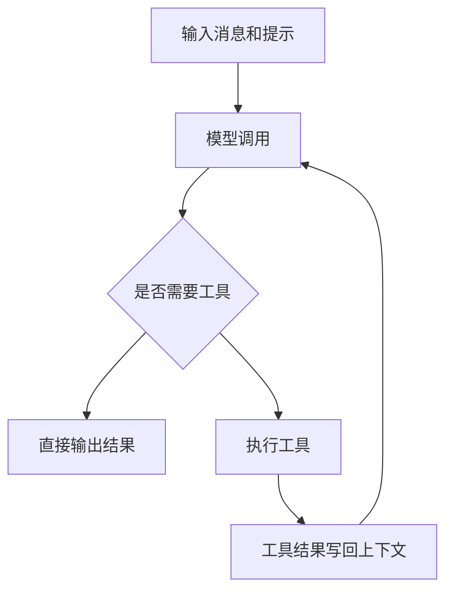
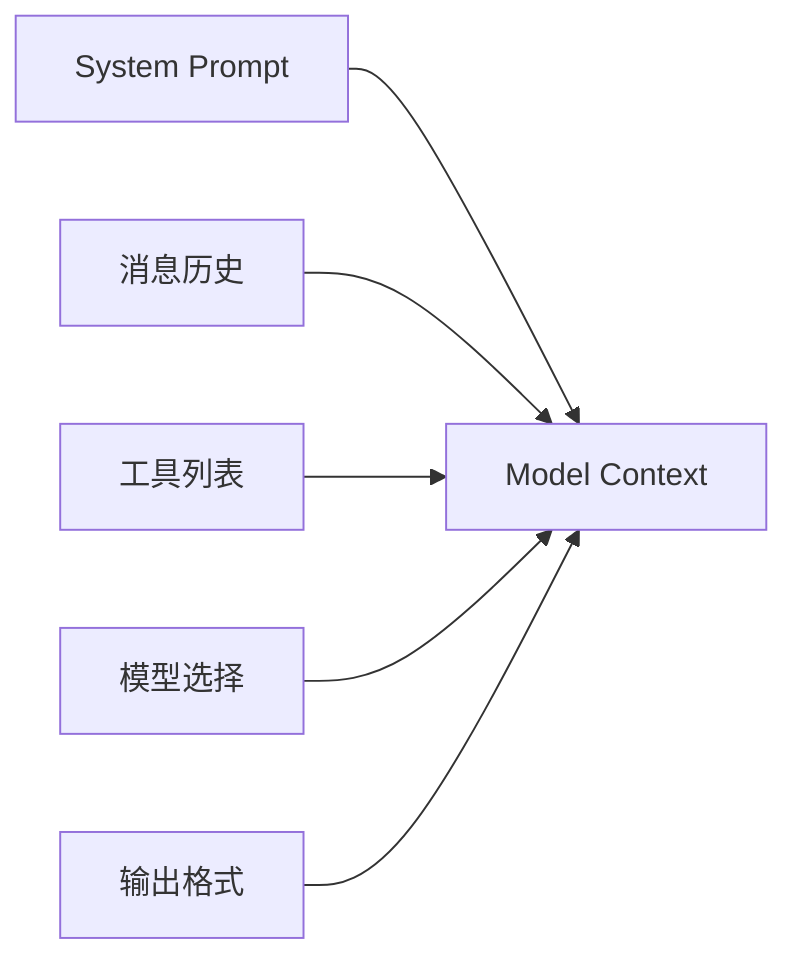
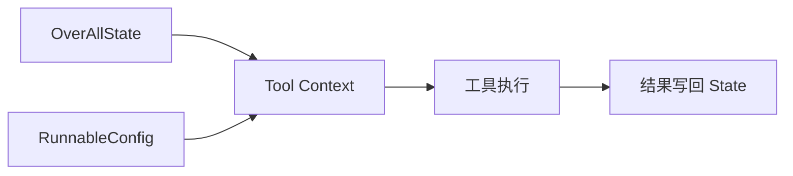
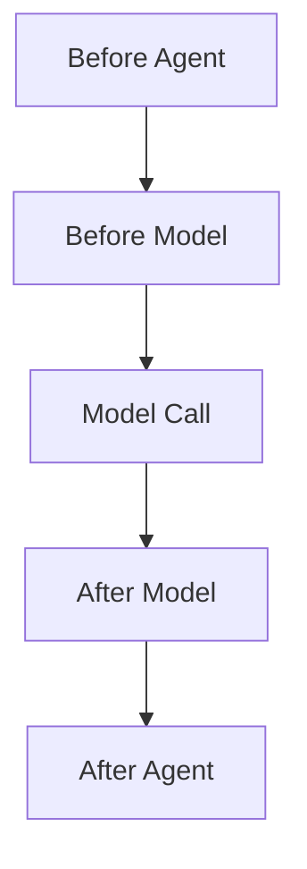
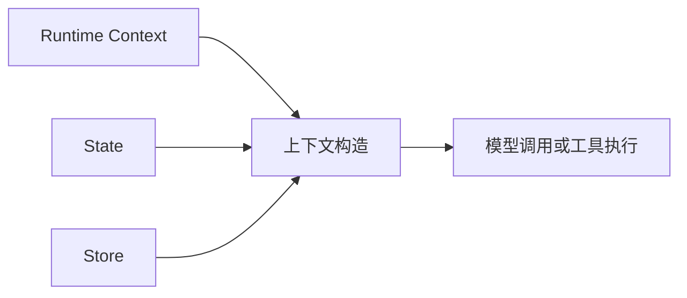
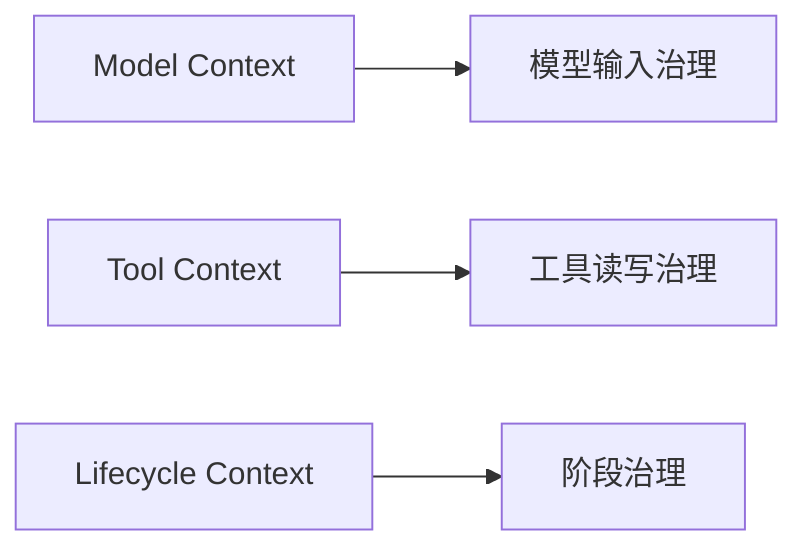
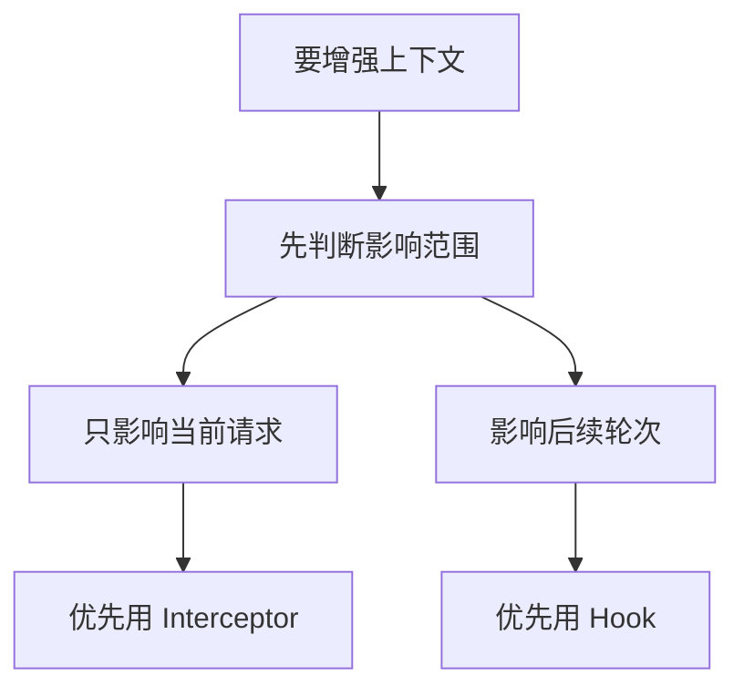

## 概述

很多人做 Agent 时，最先关注的往往是模型够不够强、工具够不够多、提示词写得够不够细。但真正到了生产场景，问题常常并不出在这些地方，而是出在上下文组织得不对：该给模型的信息没给够，不该给的噪音给太多，工具看不到该看的状态，生命周期里的摘要、日志和治理动作也没有放在合适的位置。

这就是 Context Engineering 想解决的问题。它关注的不是“再加一个能力点”，而是让 Agent 在每次模型调用、每次工具执行、每一轮状态更新里，都拿到合适的信息和合适的约束。

本文围绕 Java Agent Framework 的 Context Engineering 能力展开，梳理它的核心思想、三类上下文、Hook / Interceptor 分工、状态与存储边界，以及在长对话、个性化、工具协作和生产治理里的典型做法。

## 1、为什么 Agent 经常不是“模型不行”，而是上下文没喂对

很多 Agent demo 看起来效果不错，但一旦进入更复杂的业务场景，就很容易开始漂移：

- 回答越来越冗长
- 长对话里忘记前文重点
- 工具调用结果没有被后续流程有效利用
- 不同用户拿到的回答风格和粒度不一致
- 成本随着消息历史增长不断上升

这些问题背后，往往不是模型能力突然下降，而是上下文管理失控了。

更具体一点说，Agent 的不稳定通常来自下面几类原因：

- 给模型的消息太多，噪音盖过了重点
- 系统提示是静态的，不能反映当前会话阶段
- 工具拿不到所需状态或用户上下文
- 生命周期里缺少摘要、日志、防护和状态治理
- 短期状态与长期记忆混在一起，边界不清

所以 Context Engineering 的价值，不是让模型“更聪明”，而是让 Agent 在工程上更稳定、更省成本、更可控。

## 2、什么是 Context Engineering

如果压缩成一句话，Context Engineering 可以理解为：

> 在合适的时机，把合适的信息、合适的工具和合适的格式交给 LLM。

这里有三个关键词：

- 合适的信息
- 合适的时机
- 合适的边界

因为 Agent 运行不是一次性 prompt，而是一条循环链路。每一轮里，模型看到什么、工具能访问什么、状态如何被更新，都会影响下一轮行为。

### Agent 主循环图



所以从工程角度看，Context Engineering 本质上是在治理这条循环，而不是只改一段 prompt 文本。

## 3、三类上下文：Model、Tool、Lifecycle

这部分是整页里最关键的结构。页面把上下文拆成三类，而不是笼统地把所有内容都叫“上下文”。

如果用更偏工程的方式去理解，可以把它们记成三个不同的问题：

- Model Context：这一轮到底喂给模型什么
- Tool Context：这一轮工具到底能读写什么
- Lifecycle Context：这一轮和下一轮之间要不要做额外治理

把这三个问题拆开之后，很多原本混在一起的设计决策就会变得清楚。

## 3.1 Model Context

Model Context 关注的是：**单次模型调用能看到什么。**

它通常包括：

- 系统提示
- 消息历史
- 工具列表
- 当前使用的模型
- 输出格式约束

这部分是瞬态的，重点是控制“这一轮送给模型的内容”。

### Model Context 示意图



它最直接影响的是：

- 当前回答质量
- 当前 token 成本
- 当前工具选择结果
- 当前结构化输出是否稳定

## 3.2 Tool Context

Tool Context 关注的是：**工具在执行时可以读取和写入什么。**

它通常涉及：

- 工具读取 `OverAllState`
- 工具读取 `RunnableConfig`
- 工具把结果写回状态

这部分更偏持久，因为工具执行结果往往不会只服务当前一行代码，而是会影响后续 Agent 循环。

### Tool Context 示意图



如果 Tool Context 设计得不好，常见后果就是：

- 工具做完事，后续流程却接不上
- 工具拿不到用户身份、权限或环境信息
- 中间结果无法在后续节点复用

## 3.3 Lifecycle Context

Lifecycle Context 关注的是：**模型调用之间要发生什么。**

这部分更适合放：

- 摘要
- 日志
- 防护栏
- 生命周期中的状态更新

这一层和前两层最大的不同是，它不是只盯着“这一轮模型输入”，而是盯着 Agent 在整个运行过程中如何被治理。

### Lifecycle Context 示意图



也正因为如此，Lifecycle Context 更适合承接那些“横切型”的逻辑，而不是把它们塞进主提示词里。

## 4、三类数据源：Runtime、State、Store

除了三类上下文本身，页面还把它们依赖的数据来源拆成三类。这一点非常工程化，因为很多问题都来自“数据从哪里来”没有想清楚。

## 4.1 Runtime Context

Runtime Context 更偏静态配置或会话级配置，比如：

- 用户 ID
- API Key
- 权限信息
- 环境设置
- 数据库连接

这类信息往往通过 `RunnableConfig` 或 request context 进入调用链。

## 4.2 State

State 更偏短期记忆，主要服务当前会话或当前任务，比如：

- 当前对话消息
- 上传内容
- 鉴权状态
- 工具执行结果

它解决的是“这一条任务链走到现在，系统已经知道了什么”。

## 4.3 Store

Store 更偏长期记忆，跨会话存在，例如：

- 用户偏好
- 历史洞察
- 长期记忆数据

这类信息不是每轮都要重新计算，而是应该被稳定存下来，再在需要时拿出来参与上下文构造。

### 数据来源关系图



这一层的关键价值在于：它把“短期会话信息”和“长期用户记忆”清楚分开，避免所有东西都堆在 messages 里。

再进一步说，三类数据源和三类上下文并不是一一对应的硬绑定关系，而更像一个组合表：

- Runtime Context 常常参与 Model Context 和 Tool Context 的构造
- State 同时服务模型输入、工具执行和生命周期更新
- Store 则更适合在需要时被取出，补充个性化或长期记忆信息

理解这层关系之后，后面设计个性化、摘要和工具回写时，就不容易把短期状态与长期存储混在一起。

## 5、Interceptor 和 Hook：一个改请求，一个管生命周期

这部分最容易混淆，但也是最值得掌握的。

可以先记一个非常实用的判断：

- `Interceptor` 更适合做单次请求级别的改写
- `Hook` 更适合做生命周期阶段的操作

## 5.1 Interceptor：在单次调用前后改请求

页面中出现的典型接口包括：

- `ModelInterceptor`
- `ModelRequest`
- `ModelResponse`
- `ModelCallHandler`

最典型的方法是：

```java
interceptModel(ModelRequest request, ModelCallHandler handler)
```

它特别适合处理：

- 动态系统提示
- 临时裁剪消息
- 临时决定输出格式
- 根据请求上下文补充个性化内容

例如一个最小挂载方式：

```java
ReactAgent agent = ReactAgent.builder()
    .name("context_aware_agent")
    .model(chatModel)
    .interceptors(new StateAwarePromptInterceptor())
    .build();
```

这一层的重点是：它改的是**当前这一次模型请求**。

## 5.2 Hook：在阶段之间做治理动作

Hook 相关能力则更偏执行链路本身，例如：

- `ModelHook`
- `MessagesModelHook`
- `HookPosition`
- `HookPositions`
- `AgentCommand`
- `UpdatePolicy`

挂载方式例如：

```java
ReactAgent agent = ReactAgent.builder()
    .name("logged_agent")
    .model(chatModel)
    .hooks(new LoggingHook())
    .build();
```

它更适合处理：

- 调用前摘要
- 调用前后日志记录
- 消息列表替换
- 生命周期中的状态更新

### Hook / Interceptor 分工图



如果只想临时改一下这一轮模型的输入，优先 Interceptor；如果你想真正参与 Agent 生命周期，优先 Hook。

还有一个很实用的判断标准是：如果你的修改在下一轮调用里应该继续生效，那通常就不该只停留在 Interceptor 里，而应该考虑通过 Hook 或状态更新把它真正落到 State 上。

## 6、动态系统提示：让 Prompt 不再是固定字符串

一个很典型的上下文工程实践，就是让系统提示根据当前状态动态变化。

页面里给出的思路是：先读取当前消息数，再判断当前对话处于什么阶段，然后拼装出更适合当前轮次的 prompt。

例如：

```java
class StateAwarePromptInterceptor extends ModelInterceptor {
  @Override
  public ModelResponse interceptModel(ModelRequest request, ModelCallHandler handler) {
    int messageCount = request.getMessages().size();

    String prompt = "基础助手提示";
    if (messageCount > 10) {
      prompt += "长对话时保持精炼";
    }

    SystemMessage newSystem = request.getSystemMessage() == null
        ? new SystemMessage(prompt)
        : new SystemMessage(request.getSystemMessage().getText() + prompt);

    ModelRequest enhanced = ModelRequest.builder(request)
        .systemMessage(newSystem)
        .build();

    return handler.call(enhanced);
  }
}
```

这个思路很实用，因为它把提示词从“写死”变成了“按状态生成”。

从工程上看，它适合处理：

- 长对话要求简洁输出
- 不同阶段切换回答风格
- 任务进入后半程时提高收敛性

## 7、个性化上下文：让不同用户拿到不同系统提示

另一类非常常见的场景是个性化提示。

这里的关键不是把所有用户都写进一个 prompt，而是：

- 从运行时上下文拿到用户 ID
- 从 Store 里查用户偏好
- 再动态生成系统提示

例如：

```java
class PersonalizedPromptInterceptor extends ModelInterceptor {
  private final UserPreferenceStore store;

  @Override
  public ModelResponse interceptModel(ModelRequest request, ModelCallHandler handler) {
    String userId = request.getContext().get("user-id");
    UserPreferences prefs = store.getPreferences(userId);

    String prompt = buildPersonalizedPrompt(prefs);

    ModelRequest enhanced = ModelRequest.builder(request)
        .systemMessage(new SystemMessage(prompt))
        .build();

    return handler.call(enhanced);
  }
}
```

这背后的工程价值非常明确：

- 用户身份来自 Runtime Context
- 用户偏好来自 Store
- 最终组合成当前轮的 Model Context

也就是说，三类数据源在这里被真正串起来了。

## 8、消息裁剪与摘要：长对话治理的核心手段

长对话是 Context Engineering 最典型的应用场景之一。

因为消息一旦不断累积，问题会非常直接：

- token 成本持续上涨
- 模型开始被旧内容干扰
- 当前关键信息在上下文里被冲淡

页面里给了两种典型手段：

- 截断
- 摘要

## 8.1 截断：先把噪音裁掉

例如只保留最近若干条消息：

```java
class MessageFilterInterceptor extends ModelInterceptor {
  private final int maxMessages;

  @Override
  public ModelResponse interceptModel(ModelRequest request, ModelCallHandler handler) {
    List<Message> messages = request.getMessages();

    if (messages.size() > maxMessages) {
      List<Message> filtered = new ArrayList<>();

      messages.stream()
          .filter(m -> m instanceof SystemMessage)
          .findFirst()
          .ifPresent(filtered::add);

      int start = Math.max(0, messages.size() - maxMessages + 1);
      filtered.addAll(messages.subList(start, messages.size()));
      messages = filtered;
    }

    ModelRequest enhanced = ModelRequest.builder(request)
        .messages(messages)
        .build();

    return handler.call(enhanced);
  }
}
```

这种方式简单直接，适合优先控成本。

但要特别注意：这种 Interceptor 级改写只影响**当前这一次请求**，不会自动改写持久状态。

## 8.2 摘要：把旧内容压缩成可延续的信息

如果你不想简单丢掉旧消息，而是想保留长期上下文，就更适合使用摘要 Hook。

例如：

```java
@HookPositions({HookPosition.BEFORE_MODEL})
class SummarizationHook extends MessagesModelHook {

  @Override
  public AgentCommand beforeModel(List<Message> previousMessages, RunnableConfig config) {
    if (previousMessages.size() <= triggerLength) {
      return new AgentCommand(previousMessages);
    }

    String summary = generateSummary(previousMessages);
    SystemMessage system = findSystemMessage(previousMessages);

    UserMessage summaryMsg = new UserMessage("上下文摘要：" + summary);
    List<Message> recent = takeRecentMessages(previousMessages, 5);

    List<Message> newMessages = new ArrayList<>();
    if (system != null) newMessages.add(system);
    newMessages.add(summaryMsg);
    appendRecentExceptSystem(newMessages, recent, system);

    return new AgentCommand(newMessages, UpdatePolicy.REPLACE);
  }
}
```

这里最值得注意的，不只是“做摘要”本身，而是它背后的分层：

- 角色规则继续由 `SystemMessage` 承担
- 历史压缩结果变成一条摘要消息
- 最近几轮上下文仍然保留原始形式
- 最终通过 `UpdatePolicy.REPLACE` 替换当前消息集

这说明在长对话治理里，最稳的做法通常不是“全删”或“全留”，而是把规则、摘要和最近上下文分开管理。

## 9、工具上下文：工具不只是执行，还要读状态、写状态

如果说前面几节主要在讲模型上下文，那么这一节关注的是工具上下文。

页面给出的一个重要思路是：工具执行时也可以读取 Agent 当前状态和运行时配置。

例如：

```java
class StatefulTool implements Function<Request, Response> {
  @Override
  public Response apply(Request request, ToolContext toolContext) {
    OverAllState state = (OverAllState) toolContext.getContext().get("state");
    RunnableConfig config = (RunnableConfig) toolContext.getContext().get("config");

    Optional<Object> messages = state.value("messages");
    Optional<Object> userContext = config.metadata("user_context_key");

    String result = processWithContext(request.query(), messages, userContext);
    return new Response(result);
  }
}
```

这意味着工具不再只是一个“纯输入、纯输出”的黑盒函数，而是能真正接触到当前会话上下文。

从工程上看，这种设计特别适合：

- 根据当前会话状态调整工具行为
- 基于用户身份决定工具访问范围
- 把工具执行变成 Agent 链路里真正有上下文感知的一环

## 10、工具写状态：让结果能被后续循环继续消费

除了读取状态，工具还可以把结果写回状态。

例如：

```java
class StateModifyingTool implements Function<Request, Response> {
  @Override
  public Response apply(Request request, ToolContext toolContext) {
    Map<String, Object> extraState =
        (Map<String, Object>) toolContext.getContext().get("extraState");

    String processed = process(request.data());
    extraState.put("processed_data", processed);

    return new Response("done");
  }
}
```

这一层非常关键，因为它决定了工具输出是不是“做完就丢”。

`extraState` 的价值在于：

- 工具结果可以被持久化进状态
- 后续 loop 节点可以继续读取这些值
- 中间结果不需要重新计算

这特别适合：

- 工具结果缓存
- 工作流节点之间传值
- 中间推理产物沉淀

换句话说，Tool Context 真正成熟的标志，不只是工具能被调用，而是工具产物能进入后续推理链路。

## 11、生命周期治理：日志、审计、防护和摘要都应该有位置

Lifecycle Context 最直接的落地方式，就是 Hook。

例如一个日志 Hook：

```java
class LoggingHook extends ModelHook {
  @Override
  public HookPosition[] getHookPositions() {
    return new HookPosition[] {
        HookPosition.BEFORE_MODEL,
        HookPosition.AFTER_MODEL
    };
  }

  @Override
  public CompletableFuture<Map<String, Object>> beforeModel(
      OverAllState state, RunnableConfig config) {
    return CompletableFuture.completedFuture(Map.of());
  }

  @Override
  public CompletableFuture<Map<String, Object>> afterModel(
      OverAllState state, RunnableConfig config) {
    return CompletableFuture.completedFuture(Map.of());
  }
}
```

它看起来简单，但工程意义很大，因为很多生产能力都适合放在这里，例如：

- 调用前后日志
- 输入输出审计
- 防护栏检查
- 生命周期状态更新

把这些逻辑放在 Hook 层，而不是散落在主业务代码里，最大的好处就是职责边界清楚。

## 12、结构化输出与动态格式控制

Context Engineering 关注的并不只是“给模型什么上下文”，也包括“要求模型按什么格式输出”。

页面里提到了两种常见入口：

- 创建 Agent 时通过 `.outputType(...)`
- 创建 Agent 时通过 `.outputSchema(...)`

例如：

```java
ReactAgent agent = ReactAgent.builder()
    .name("structured_agent")
    .model(chatModel)
    .outputType(MyResponseClass.class)
    .build();
```

也可以用 schema：

- `.outputSchema(jsonSchema)`

从选型上说，可以简单记成：

- 固定结构，优先 `outputType(...)`
- 更灵活的格式约束，再考虑 `outputSchema(...)`

而如果某些请求才需要特殊格式，则可以把格式控制放到 Interceptor 里动态注入。

这也说明一个问题：输出格式本身也是上下文工程的一部分，而不只是最终结果的“包装层”。

## 13、什么时候用 Interceptor，什么时候用 Hook

如果把整页内容压缩成一条非常实用的判断标准，我会建议这样记：

### 优先用 Interceptor 的情况

- 只想影响当前这次模型请求
- 想动态改系统提示
- 想临时裁剪消息
- 想按请求补个性化内容
- 想临时切换输出格式

### 优先用 Hook 的情况

- 想在生命周期阶段做动作
- 想摘要长对话并更新消息集
- 想做调用前后日志和审计
- 想把状态治理纳入执行流程
- 想做更偏“长期运行”的控制逻辑

### 选择建议图



这个边界一旦想清楚，后面很多设计选择都会简单很多。

## 14、给 Java 开发者的几条落地建议

如果把这些能力落到实际项目里，我觉得最值得记住的是下面几条。

### 14.1 先分清短期状态和长期存储

不要把所有内容都塞进 messages。短期会话信息放 State，跨会话偏好放 Store。

### 14.2 长对话优先考虑“摘要 + 最近窗口”

单纯保留全部历史，很快就会把成本和噪音一起拉满。

### 14.3 工具不要只会执行，还要能回写状态

只有这样，工具产物才能真正参与后续推理。

### 14.4 动态个性化依赖调用方传入 Runtime Context

如果调用时不把用户 ID、权限、租户等信息传进来，后面很多个性化逻辑都无从谈起。

### 14.5 不要把 Hook 和 Interceptor 混着用

它们都能增强上下文，但关注点不一样。边界越清楚，系统越容易维护。

## 15、总结

Context Engineering 这部分能力最有价值的地方，不是多了几个新扩展点，而是它把 Agent 运行中真正影响效果的那条链路拆清楚了：

- `Model Context` 决定模型每次调用看到什么
- `Tool Context` 决定工具能读取和写入什么
- `Lifecycle Context` 决定不同阶段之间如何治理
- `Runtime Context`、`State`、`Store` 决定这些上下文的数据来源
- `Interceptor` 和 `Hook` 则把这些控制点落成了可实现的工程机制

对于 Java 开发者来说，这套设计最大的意义在于：它把 Agent 的稳定性问题，从“调 prompt 的玄学”逐步变成“可拆分、可定位、可治理的工程问题”。

当你的 Agent 开始进入长对话、个性化、复杂工具协作和生产治理场景时，Context Engineering 往往比“再换一个模型”更值得优先做好。