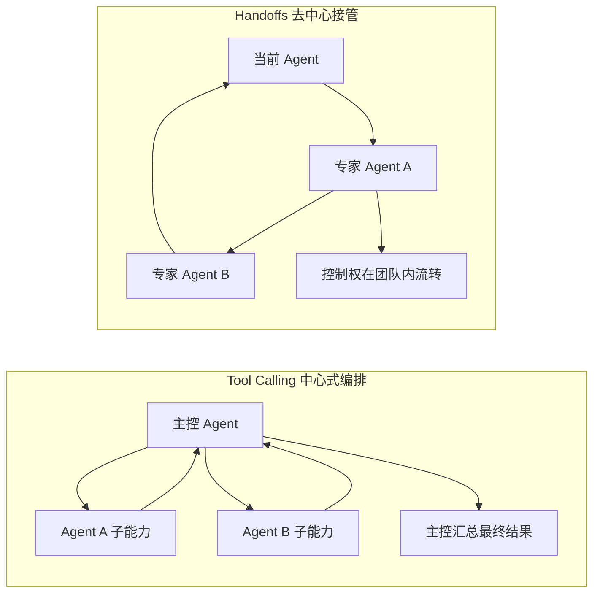
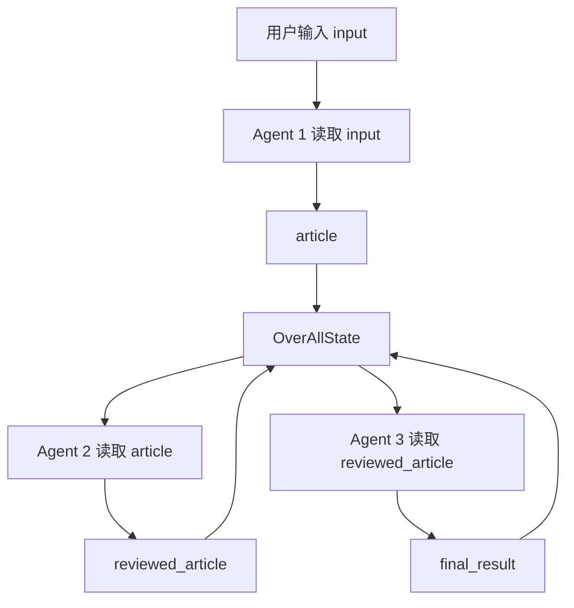
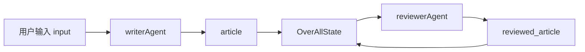
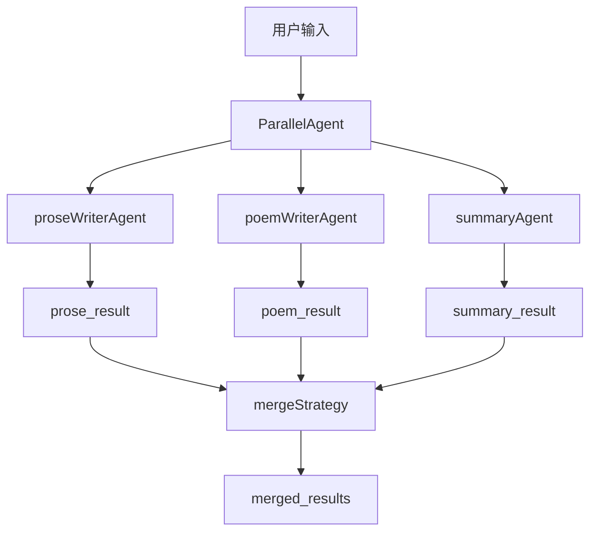
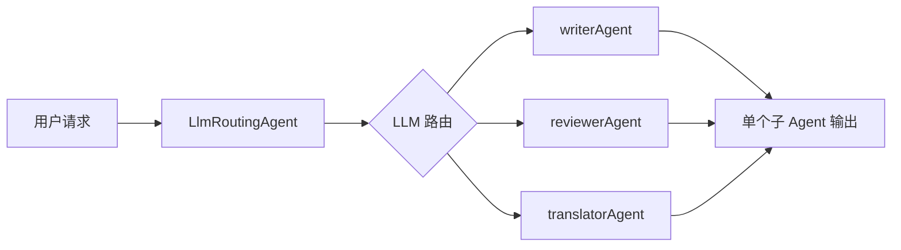
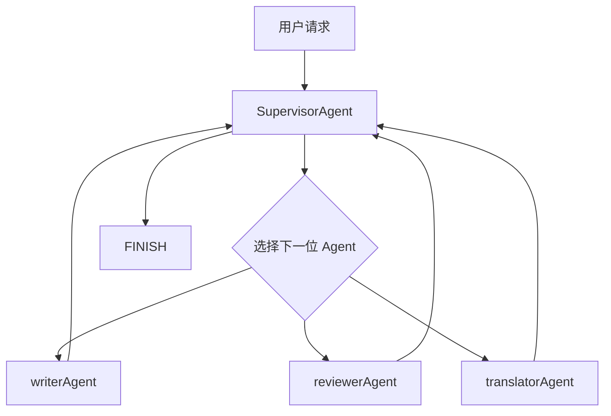
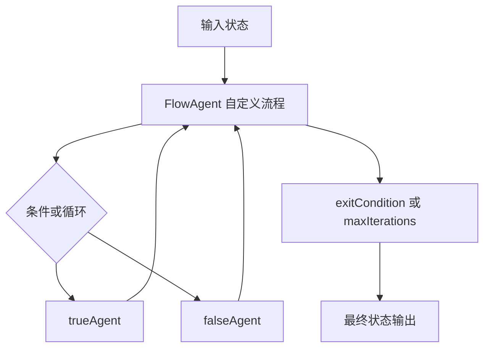
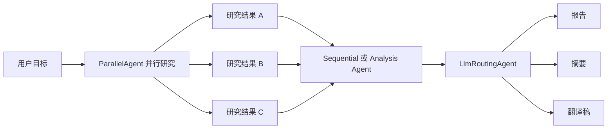

## 概述

当一个 Agent 既要理解复杂需求，又要处理大量工具、跨步骤状态和不同专业角色时，单智能体模式很快就会碰到上限。这个时候，问题往往不再是“模型够不够强”，而是“任务该怎么拆、上下文该怎么分、谁来决定下一步做什么”。

Java Agent Framework 在进阶部分给出的答案，就是 **Multi-Agent**。它不是简单地多起几个 Agent，而是提供了一套明确的协作模式：顺序执行、并行执行、智能路由、监督者编排，以及可自定义的 FlowAgent 工作流。

本文基于官方教程 **Multi-agent** 页面内容，系统梳理 Java Agent Framework 的多智能体设计思路、核心 API、上下文传递方式和典型协作模式，帮助你从“一个 Agent 干所有活”走向“多个 Agent 分工协作”。

## 1、为什么需要 Multi-Agent

单 Agent 最大的问题不是不能做事，而是容易把所有问题都堆进一个上下文里：

- 工具越来越多，选择成本越来越高
- 消息历史越来越长，推理噪音越来越大
- 一个 prompt 同时承载写作、审阅、翻译、总结等多种职责
- 不同步骤需要的上下文并不一样，却被强行放在一起

这时，多智能体的价值就出来了。教程里强调，多 Agent 更适合下面这些场景：

- 工具太多，需要按角色拆分
- 上下文太大，需要按任务裁剪
- 任务本身就需要专家分工

换句话说，Multi-Agent 不是为了“炫技式架构升级”，而是为了把复杂任务拆成更稳定的执行单元。

## 2、两种总思路：Tool Calling 与 Handoffs

教程先给出了 Multi-Agent 的两种基础思路：`Tool Calling` 和 `Handoffs`。

从表面上看，它们都属于“多个 Agent 协作”，但底层控制方式完全不同：

- `Tool Calling` 更像主控 Agent 调度多个能力模块
- `Handoffs` 更像不同 Agent 之间轮流接管当前任务

### 2.1 Tool Calling

在这种模式下，父 Agent 把其他 Agent 当成工具来使用。也就是说，主导权始终集中在父 Agent 手里，其他 Agent 更像能力模块。

它适合：

- 结构化任务流
- 中心式编排
- 需要统一控制的业务流程

### 2.2 Handoffs

在这种模式下，当前 Agent 可以把活跃控制权交给另一个 Agent。也就是说，不再由一个中心 Agent 永远主导，而是允许不同专家轮流接管对话或任务。

它适合：

- 专家接管式对话
- 多轮复杂协作
- 需要根据过程动态决定下一位执行者的场景

### 模式对比图



可以简单记成一句话：

- `Tool Calling`：我调用别人做事
- `Handoffs`：我把主导权交给别人

教程里还特别说明，这两种方式并不是对立的，而是可以混用。比如大流程采用 Handoff，在局部子任务里再把某些 Agent 当工具调用。

## 3、Multi-Agent 的核心其实是上下文工程

很多人会把关注点放在“有几个 Agent”，但教程真正强调的重点，其实是 **上下文怎么传**。

因为多智能体系统一旦拆开之后，每个 Agent 最重要的不是“能不能说”，而是：

- 它能看到什么
- 它看不到什么
- 它的输出会写到哪里
- 下一个 Agent 怎么读取这些结果

这也是为什么教程单独讲了 `instruction` 占位符、`outputKey`、`includeContents`、`returnReasoningContents` 这些配置项。

这里可以把几个关键配置先记住：

- `outputKey`：把当前 Agent 的输出写入 `OverAllState`
- `includeContents`：控制是否带入父流程已有内容
- `returnReasoningContents`：控制是否把中间推理继续带回消息历史
- `subAgents`：定义当前流程包含哪些子 Agent

### 上下文传递图



这个过程说明了一件很重要的事：多 Agent 协作并不只是“前一个说完，后一个接着说”，而是通过状态和占位符把结果显式串起来。

也正因为如此，多智能体设计里最重要的往往不是“模型选哪个”，而是状态键该怎么命名、哪些内容需要继续传递、哪些历史应该被裁掉。如果状态设计混乱，Agent 数量越多，链路反而越难维护。

## 4、instruction 占位符是串联流程的关键

教程里给出了多智能体里最实用的一套能力：在 `instruction` 中直接使用占位符。

明确出现的写法包括：

- `{input}`：用户原始输入
- `{outputKey}`：读取其他 Agent 通过 `outputKey` 写入的结果
- `{stateKey}`：读取状态中的任意键

示例里实际出现过的占位符有：

- `{article}`
- `{article_content}`

这套机制的好处非常直接：你不用自己拼接一大段 prompt 去转交上一步结果，而是由状态系统自动把前序输出注入给后续 Agent。

还有一个细节也很关键：教程说明，如果占位符对应的值不存在，那么占位符文本会保留原样，而不是强行报错。这种行为让流程在调试阶段更容易排查问题。

一个比较实用的理解方式是：`instruction` 不只是“提示词”，它还是多 Agent 之间的数据绑定层。前一个 Agent 的输出一旦写入 `OverAllState`，后一个 Agent 就可以通过占位符直接消费这份结果。

## 5、SequentialAgent：最容易落地的多智能体模式

如果你刚开始接触 Multi-Agent，最适合先上手的是 `SequentialAgent`。它的特点是简单、稳定、可控：前一个 Agent 先执行，后一个 Agent 再读前一个 Agent 的结果。

教程里的典型案例是“写作 + 审阅”两步流。

```java
ReactAgent writerAgent = ReactAgent.builder()
    .name("writer")
    .instruction("请根据 {input} 写一篇文章")
    .outputKey("article")
    .build();

ReactAgent reviewerAgent = ReactAgent.builder()
    .name("reviewer")
    .instruction("请审阅并改进这篇文章：{article}")
    .outputKey("reviewed_article")
    .build();

SequentialAgent blogAgent = SequentialAgent.builder()
    .subAgents(List.of(writerAgent, reviewerAgent))
    .build();
```

执行完成后，可以从 `OverAllState` 中读取：

- `article`
- `reviewed_article`

### SequentialAgent 架构图



这个模式适合：

- 固定流程处理
- 文档生成后再审阅
- 摘要后再翻译
- 提取后再分析

教程还补充了两个很关键的配置：

- `includeContents`
- `returnReasoningContents`

它们的作用分别可以理解为：

- `includeContents`：当前子 Agent 是否带入父流程已有内容
- `returnReasoningContents`：是否把中间推理内容继续回传到消息历史

这意味着顺序流并不是简单串行，还能控制每一步到底“看见多少上下文”。

如果再往工程实践里落一步，可以把 `SequentialAgent` 理解成“显式阶段流”：每一阶段只负责一类职责，输出通过 `outputKey` 固化下来，后续阶段只消费被明确暴露的状态。这种结构在调试和回溯时通常最省心。

## 6、ParallelAgent：同题并发，多结果汇总

如果任务不是强依赖前后顺序，而是需要多个视角同时产出结果，那么 `ParallelAgent` 会更合适。

教程中的并行示例很典型：

- 一个 Agent 写散文
- 一个 Agent 写现代诗
- 一个 Agent 做主题总结

每个 Agent 各自写入：

- `prose_result`
- `poem_result`
- `summary_result`

然后由并行流统一合并。

```java
ParallelAgent.builder()
    .subAgents(List.of(proseWriterAgent, poemWriterAgent, summaryAgent))
    .mergeOutputKey("merged_results")
    .mergeStrategy(new ParallelAgent.DefaultMergeStrategy())
    .build();
```

### ParallelAgent 架构图



这里有两个特别值得注意的点：

### 6.1 `mergeOutputKey`

它指定并行合并结果最终写入哪个状态键。教程里给出的例子是 `merged_results`。

### 6.2 `mergeStrategy`

它决定多个并行结果怎么合并。默认可以用：

```java
new ParallelAgent.DefaultMergeStrategy()
```

如果默认合并方式不符合业务需求，还可以自己实现 `ParallelAgent.MergeStrategy`，在 `merge(Map<String, Object>, OverAllState)` 中自定义拼接逻辑。教程中就演示了按 `key.endsWith("_result")` 收集结果，再统一写到指定键中。

这个模式特别适合：

- 多角度分析
- 多版本生成
- 多专家并行研究
- 先并发收集，再统一整合

不过并行模式也有一个前提：子任务之间最好尽量独立。否则一边并发，一边又互相依赖彼此结果，最后只会把流程复杂度转移到合并阶段。

## 7、LlmRoutingAgent：让模型决定该找哪位专家

顺序和并行都属于“流程提前写死”的模式，而 `LlmRoutingAgent` 则开始进入真正的动态路由。

它的基本思想是：准备多个子 Agent，由 LLM 根据当前输入判断最适合哪个 Agent 来处理。

教程里的子 Agent 例子包括：

- `writerAgent`
- `reviewerAgent`
- `translatorAgent`

构建方式上，页面明确出现的配置项包括：

- `name`
- `description`
- `model`
- `subAgents`
- `systemPrompt(...)`
- `instruction(...)`

其中一个特别关键的点是：**路由高度依赖每个子 Agent 的 `description`**。因为模型需要根据这些描述来判断“谁更适合当前任务”。

### LlmRoutingAgent 架构图



它和并行模式的最大区别是：**每次只会选一个子 Agent 执行**。

所以它特别适合：

- 用户意图不固定
- 专家职责边界清晰
- 输入来了以后才决定由谁接单

如果你的系统更像“多专家客服台”，而不是一条固定流水线，那么路由型 Agent 往往会很顺手。

这里也能看出 `description` 的重要性：它不是装饰字段，而是路由判断的重要依据。描述越模糊，路由越容易失真；描述越清晰，模型越容易把请求发给正确的专家。

## 8、SupervisorAgent：让一个监督者多轮编排团队

如果说 `LlmRoutingAgent` 是“一次选择一个专家”，那么 `SupervisorAgent` 则更进一步：它可以多轮决定接下来该调用谁，子 Agent 执行结束后，控制权还会回到监督者，直到监督者决定返回 `FINISH`。

这意味着它不是单次路由，而是一个带循环调度能力的编排者。

教程中强调了它和路由 Agent 的几个区别：

- 支持多步循环路由
- 子 Agent 完成后返回监督者继续决策
- 可返回 `FINISH` 结束
- 支持 `instruction` 占位符
- 页面还提到自动重试，最多 2 次

### SupervisorAgent 架构图



教程里还有一个很有代表性的示例：先由 `articleWriterAgent` 产出 `article_content`，再由监督者根据 `{article_content}` 决定后续是走翻译还是走评审。

这类模式很适合：

- 长流程任务
- 步骤数量不固定的复杂问题
- 需要根据中间结果持续调整路径的流程

可以把它理解成“带决策循环的项目经理 Agent”。

如果说 `LlmRoutingAgent` 更像前台分诊，那么 `SupervisorAgent` 更像全过程调度。前者解决“第一步该找谁”，后者解决“接下来还要不要继续分派、分派给谁、何时结束”。

## 9、自定义 FlowAgent：把流程图变成代码

到了这里，教程就不再满足于内置模式了，而是进一步给出 `FlowAgent`，允许你自己定义流程结构。

页面明确提到，`FlowAgent` 是流程型 Agent 基类，核心成员包括：

- `subAgents`
- `compileConfig`

核心抽象方法是：

```java
buildSpecificGraph(FlowGraphBuilder.FlowGraphConfig config)
```

相关类型还包括：

- `StateGraph`
- `CompileConfig`
- `FlowGraphBuilder`
- `FlowAgentBuilder`
- `GraphStateException`

这意味着从这一层开始，你不再只是“使用框架预置好的编排方式”，而是可以把条件、循环、分支和状态图直接建模进 Agent 流程里。

### 9.1 ConditionalAgent

教程里的第一个自定义例子是 `ConditionalAgent extends FlowAgent`。

它通过条件判断决定走 `trueAgent` 还是 `falseAgent`，本质上就是把 if/else 流程图封装成 Agent。

Builder 里出现的方法包括：

- `condition(...)`
- `trueAgent(...)`
- `falseAgent(...)`
- `build()`
- `self()`

### 9.2 CustomLoopAgent

第二个例子是 `CustomLoopAgent extends FlowAgent`。

它通过：

- `exitCondition`
- `maxIterations`

来控制循环什么时候退出。教程示例里设置了 `maxIterations(5)`，退出条件则基于 `quality_score`。

### FlowAgent 架构图



这一层的意义在于：当内置的顺序、并行、路由、监督者模式都不完全符合你的业务流程时，你就可以直接把图结构自己定义出来。

不过也正因为灵活度最高，`FlowAgent` 也最考验流程设计能力。通常更稳的做法是：先确认顺序、并行、路由、监督者都不够用，再进入自定义图阶段。

## 10、混合模式才是企业场景里的常态

教程最后其实透露了一个非常重要的方向：**不要把多智能体模式理解成互斥关系**。

真实项目里，更常见的往往是混合模式：

- 先并行研究多个子主题
- 再交给分析 Agent 汇总
- 最后由路由 Agent 选择输出格式

### 混合模式示意图



也就是说：

- `SequentialAgent` 适合固定流程
- `ParallelAgent` 适合同步产出
- `LlmRoutingAgent` 适合单次智能分发
- `SupervisorAgent` 适合多轮编排
- `FlowAgent` 适合完全自定义图结构

它们不是五选一，而是可以按业务层次叠加。

从工程视角看，混合模式往往才最接近真实系统：上层负责调度，中层负责拆解，下层负责执行。把不同模式放在各自最擅长的位置，通常比用一种模式硬撑全场更稳。

## 11、怎么选：给 Java 开发者的一套落地建议

如果把这篇教程压缩成可执行建议，我更推荐这样选：

### 11.1 先从 SequentialAgent 起步

因为它最容易理解，也最适合把已有单 Agent 逻辑拆成多步流。

### 11.2 并行场景再上 ParallelAgent

只有当多个子任务确实互不依赖、且需要合并结果时，再使用并行模式。否则并发只会增加调试复杂度。

### 11.3 输入分流明显时用 LlmRoutingAgent

如果系统面对的是多类请求入口，比如“写作、翻译、审校”三种清晰职责，就让路由 Agent 先做专家分发。

### 11.4 步骤数量不固定时用 SupervisorAgent

当任务不是 1、2、3 三步写死，而是要根据中间结果不断决定下一步时，监督者模式会比路由模式更强。

### 11.5 流程图已经很复杂时再考虑 FlowAgent

如果前面四种模式还能覆盖，不要太早进入自定义流程图。因为一旦走到 `FlowAgent`，你就拥有了最大灵活性，也承担了最大复杂度。

除此之外，这篇教程还隐含了几条很实用的工程建议：

- `description` 要写清楚，因为它会直接影响路由质量
- `outputKey` 命名要稳定，因为后续占位符会依赖这些状态键
- 能显式传状态就不要靠隐式上下文猜测
- 能先用顺序流跑通，就不要一开始就上监督者或自定义图

这几条看起来朴素，但往往决定了多 Agent 系统后面是越做越稳，还是越做越乱。

## 12、总结

官方教程 **Multi-agent** 的价值，不只是列出了几个类名，而是把多智能体设计背后的几件关键事情讲清楚了：

- 多 Agent 不是数量问题，而是任务拆分与上下文治理问题
- `Tool Calling` 和 `Handoffs` 是两种不同的控制哲学
- `instruction` 占位符和 `outputKey` 是流程串联的基础
- `SequentialAgent`、`ParallelAgent`、`LlmRoutingAgent`、`SupervisorAgent` 分别对应不同协作形态
- `FlowAgent` 则给了完全自定义工作流的能力

对于 Java 开发者来说，这套设计最有价值的地方，在于它把多智能体协作做成了清晰的 builder 与状态流抽象，而不是一堆难以维护的 prompt 拼接脚本。

当你开始处理更复杂的企业任务流时，这种抽象会非常有帮助：每个 Agent 只关心自己的职责，状态通过 `OverAllState` 串联，流程通过不同模式组织，最终把复杂系统拆成可理解、可维护、可扩展的执行单元。
