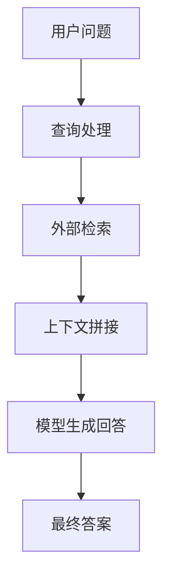
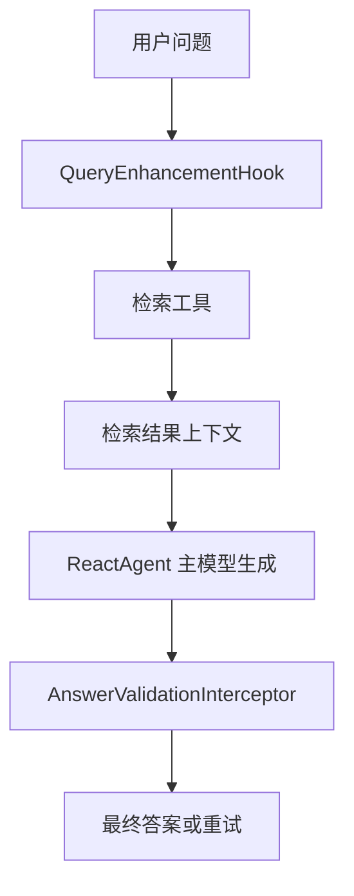
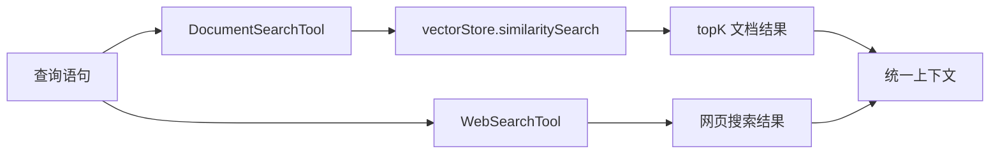
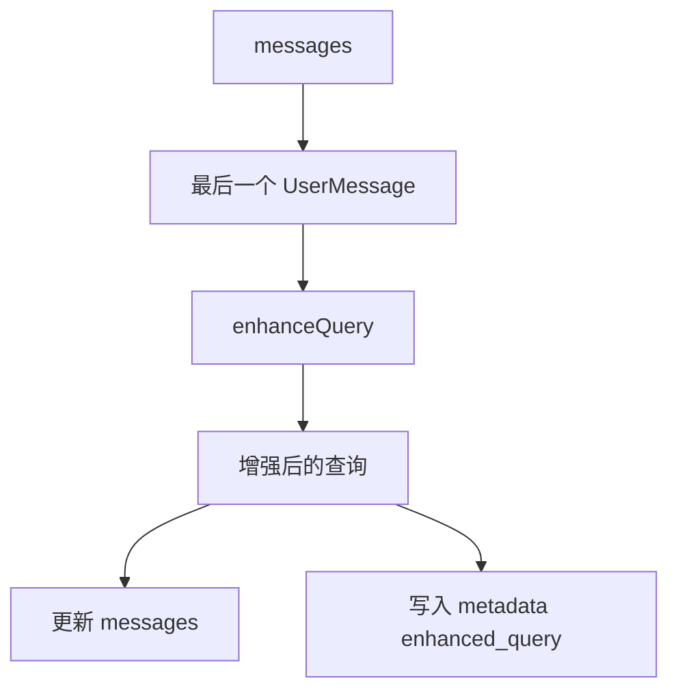
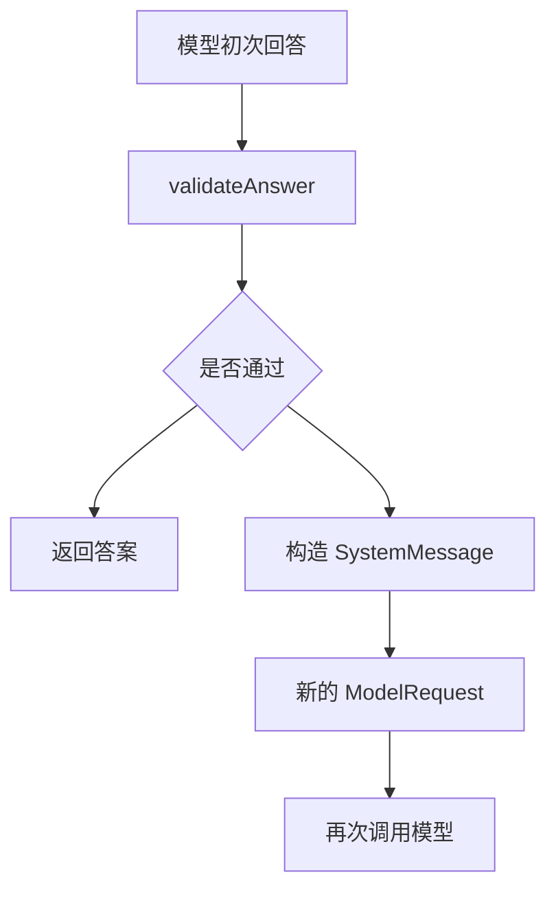
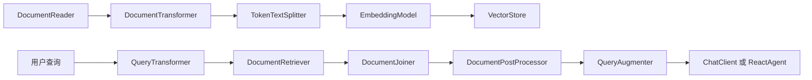

## 概述

大语言模型在真实业务里有两个非常典型的短板：一是上下文窗口有限，不可能把所有知识都直接塞进去；二是模型知识不是实时更新的，面对企业内部文档、数据库数据和最新业务规则时，天然会有盲区。

RAG（Retrieval-Augmented Generation，检索增强生成）就是为了解决这两个问题。它的核心思路并不复杂：先从外部知识源检索相关信息，再把检索结果交给模型生成回答。

Java Agent Framework 在 RAG 能力设计里，不只介绍了基础的两步式 RAG，还进一步给出了 `Agentic RAG` 和 `混合 RAG`。其中最值得实战关注的，就是混合 RAG：它把固定流程的稳定性、Agent 自主决策的灵活性，以及质量校验能力组合到了一起。

本文重点围绕 **混合 RAG** 展开，梳理其架构思路、关键类、Hook / Interceptor 分工和 Spring AI Alibaba 模块化 RAG 组件。

## 1、为什么 RAG 是必选项

页面一开始先指出了 LLM 的两个根本限制：

- 上下文承载有限
- 知识不是实时更新

这两个问题在企业场景里会被进一步放大。因为业务问答经常依赖：

- 内部文档
- 数据库数据
- CRM 或 ERP 系统
- 最新产品说明和组织规则

如果只靠模型本身回答，要么答不出来，要么容易出现幻觉。RAG 的价值就在这里：让模型不只“凭记忆回答”，而是“基于外部资料回答”。

## 2、RAG 不只是检索，而是一整条检索增强链路

很多人第一次接触 RAG，会把它理解成“向量库 + 相似度检索”。这当然是核心一环，但教程给出的视角更完整：RAG 是一条从查询、检索、拼接、生成到验证的完整链路。

页面里提到的知识来源也不止一种：

- 自建知识库：文档加载、切分、向量化、入库
- 复用现有系统：SQL、CRM、内部文档系统接成工具

也就是说，RAG 的核心并不是“必须有一个向量库”，而是让模型在回答前能先接触到外部事实来源。

### RAG 基础流程图



这个流程图是最基础的理解起点。后面无论是两步式、Agentic 还是混合 RAG，都是在这个基础链路上继续增强。

## 3、三种 RAG 架构：两步式、Agentic、混合式

教程把 RAG 结构分成三类：

- 两步式 RAG
- Agentic RAG
- 混合 RAG

如果先不看代码，只看控制方式，可以这样理解：

- 两步式：流程提前定义好
- Agentic：把检索决策交给 Agent
- 混合式：既允许灵活决策，又补上明确的质量控制点

### 3.1 两步式 RAG

两步式的特点是流程固定：先检索，再生成。

页面中提到的相关类包括：

- `QuestionAnswerAdvisor`
- `RetrievalAugmentationAdvisor`
- `MessagesModelHook`
- `ModelInterceptor`
- `AgentHook`

这种方式的优势是：

- 流程清晰
- 结果稳定
- 易于控制和调试

它比较适合：

- FAQ
- 标准知识问答
- 结构固定的企业检索场景

### 3.2 Agentic RAG

Agentic RAG 的核心在于：是否检索、何时检索、调用哪个检索源，都可以由 Agent 自主决定。

页面中提到它可以结合多个工具，例如：

- `web_search`
- `database_query`
- `document_search`

这类模式的优势是更灵活，但复杂度也更高，因为你不再是提前写死流程，而是把决策权交给 Agent。

### 3.3 混合 RAG

混合 RAG 是这页里最值得关注的部分，因为它试图把前两者的优点拼在一起。

页面描述的重点有三点：

- 既吸收两步式的稳定性
- 又保留 Agentic 的灵活性
- 并且增加额外的校验环节

教程明确提到，混合 RAG 会加入几个关键检查点：

- 查询增强
- 检索验证
- 答案验证

并且支持多轮迭代：如果检索结果不够好，可以改写查询后再检索；如果答案质量不够好，可以再生成一次。

从工程角度看，混合式最大的吸引力就在这里：它不是简单把“固定流程”和“自主检索”二选一，而是试图把灵活性放在需要灵活的地方，把约束放在必须约束的地方。

## 4、混合 RAG 的核心价值：把增强放在前，校验放在后

从工程实现上看，混合 RAG 最有价值的一点在于职责划分非常清楚：

- 检索工具负责“查”
- Hook 负责“查之前先改写查询”
- Interceptor 负责“生成后再检查答案质量”

### 混合 RAG 架构图



这个结构比传统两步式 RAG 多了两个非常关键的增强点：

- 在生成前，先让查询更适合检索
- 在生成后，再判断答案是否足够可靠

它特别适合下面这些场景：

- 用户提问本身比较模糊
- 对准确性要求高
- 希望在生成链路中加入兜底验证

如果换一个更偏工程的说法：混合 RAG 的重点不是把所有能力都塞进模型里，而是把“前置增强”“检索执行”“后置校验”拆成三个明确阶段。这样每一层都可以单独优化，也更容易定位问题到底出在查询、召回还是生成。

## 5、混合 RAG 的 Agent 装配方式

教程里给出的混合 RAG 示例，是用 `ReactAgent` 把工具、Hook 和 Interceptor 组装起来。

明确出现的调用链包括：

- `ReactAgent.builder()`
- `.name("hybrid_rag_agent")`
- `.model(chatModel)`
- `.instruction(...)`
- `.tools(documentSearchCallback, webSearchCallback)`
- `.hooks(new QueryEnhancementHook(chatModel))`
- `.interceptors(new AnswerValidationInterceptor(chatModel))`
- `.build()`

调用方式则是：

```java
hybridRAGAgent.call("Spring AI Alibaba支持哪些向量数据库？")
```

这段装配链已经很能说明问题：混合 RAG 不是一个新的单独框架能力，而是基于 `ReactAgent` 的组合式架构，把不同阶段的增强能力串联起来。

这里特别值得注意的是 builder 的分层语义：

- `.tools(...)` 负责给 Agent 外部检索能力
- `.hooks(...)` 负责在 Agent 开始阶段改写输入或状态
- `.interceptors(...)` 负责在模型调用前后做治理和校验

理解这三层边界之后，后面扩展混合 RAG 时就不会把逻辑全堆在某一个类里。

## 6、检索工具：DocumentSearchTool 与 WebSearchTool

混合 RAG 示例里，页面明确给了两个工具类：

- `DocumentSearchTool`
- `WebSearchTool`

它们通过 `FunctionToolCallback` 注册为工具。

相关 API 包括：

- `FunctionToolCallback.builder(...)`
- `.description(...)`
- `.inputType(...)`
- `.build()`

其中 `DocumentSearchTool` 内部最关键的调用是：

- `vectorStore.similaritySearch(...)`
- `SearchRequest.builder().query(request.query()).topK(5).build()`

### 检索工具结构图



这里很重要的一点是：混合 RAG 不是只依赖一个知识源，而是允许 Agent 在多个来源之间做检索和组合。这也是它比传统单一向量检索更灵活的地方。

如果再往工程里走一步，所谓“检索验证”通常也会落在这一层展开，例如控制 `topK`、做相似度阈值过滤、结果去重、来源优先级判断，或者在多路结果之间增加重排逻辑。教程示例没有把这一层完全展开，但混合 RAG 的设计已经明显为这类质量控制预留了位置。

## 7、QueryEnhancementHook：在检索前先改写查询

教程里查询增强的实现类是：

- `QueryEnhancementHook extends AgentHook`

并且明确使用了：

- `@HookPositions({HookPosition.BEFORE_AGENT})`

这说明查询增强不是在每一轮推理里反复执行，而是在 Agent 执行开始阶段先做一次。这是一个很实用的性能设计点。

页面中出现的关键成员和方法包括：

- `private final ChatModel chatModel`
- `private static final String ENHANCED_QUERY_KEY = "enhanced_query"`
- `beforeAgent(OverAllState state, RunnableConfig config)`
- `enhanceQuery(String query)`

它的核心工作流程是：

- 从 `state.value("messages")` 中取消息
- 找最后一个 `UserMessage`
- 调 `enhanceQuery(...)` 改写查询
- 如果查询变化了，就重建消息列表
- 再通过 `config.metadata().ifPresent(...)` 写入增强后的查询

### QueryEnhancementHook 工作图



这一层的价值非常大，因为很多检索效果不佳，问题并不在向量库本身，而是在用户原始问题不够适合检索。把查询增强独立成 Hook，可以明显提高检索召回质量，同时又不会污染后续主流程。

从职责上看，Hook 很适合做这种“在主流程开始前统一处理一次输入”的工作。它不负责最终答案质量，也不负责工具本身的实现，而是专注在进入检索前，把原始问题改造成更适合召回的查询。

## 8、AnswerValidationInterceptor：答案生成后再做质量校验

混合 RAG 里的另一块核心能力是：

- `AnswerValidationInterceptor extends ModelInterceptor`

页面中明确出现的关键成员和方法包括：

- `private final ChatModel chatModel`
- `private static final double MIN_CONFIDENCE = 0.7`
- `interceptModel(ModelRequest request, ModelCallHandler handler)`
- `validateAnswer(String answer, ModelRequest request)`
- `getName()`

它的处理流程非常清楚：

- 先执行 `handler.call(request)` 让模型生成答案
- 从 `response.getResult().getOutput()` 取 `AssistantMessage`
- 调用 `validateAnswer(...)` 校验答案质量
- 如果不满足条件，则构造新的 `SystemMessage`
- 再通过 `ModelRequest.builder(request).systemMessage(validationPrompt).build()` 重新发起一次调用

### 答案校验流程图



页面也特别说明了，示例里的校验逻辑是简化版，主要按答案长度做判断，它的重点不是给出完整生产规则，而是演示“生成之后还能再加一道质量控制”。

这个思路在真实项目里非常实用，因为很多问答系统最大的问题不是检索不到，而是“检索到了，但最终答案组织得不够好”。Interceptor 正好适合做这一层的后置治理。

如果和前面的 Hook 对比来看，差异就更清楚了：

- Hook 解决的是“进检索之前的问题质量”
- Interceptor 解决的是“生成之后的答案质量”

前者更偏前置输入优化，后者更偏后置输出治理。这也是混合 RAG 能同时兼顾灵活性和稳定性的关键原因。

## 9、混合 RAG 和普通 RAG 的真正差别

如果把整页内容压缩成一句话，我觉得可以这样理解：

> 普通 RAG 关注“查到什么”，混合 RAG 进一步关注“怎么查得更准、怎么答得更稳”。

它比简单的两步式多了两个关键增强：

- 生成前的查询增强
- 生成后的答案验证

也比纯 Agentic RAG 多了更明确的质量控制边界。

从这个角度看，混合 RAG 更像一个平衡方案：

- 不像纯固定流程那样死板
- 也不像完全自治那样难控
- 适合既想要灵活性、又需要质量兜底的业务系统

## 10、Spring AI Alibaba 的模块化 RAG 组件

页面后半部分还有一个很重要的内容，就是 Spring AI Alibaba 的模块化 RAG 架构。

它把 RAG 拆成了多个标准组件。

### ETL / 基础组件

- `Document`
- `DocumentReader`
- `DocumentTransformer`
- `TokenTextSplitter`
- `VectorStore`
- `EmbeddingModel`
- `EmbeddingRequest`
- `EmbeddingResponse`

### Pre-Retrieval

- `QueryTransformer`
- `RewriteQueryTransformer`
- `CompressionQueryTransformer`
- `TranslationQueryTransformer`
- `QueryExpander`
- `MultiQueryExpander`

### Retrieval

- `DocumentRetriever`
- `VectorStoreDocumentRetriever`
- `DocumentJoiner`
- `ConcatenationDocumentJoiner`

### Post-Retrieval

- `DocumentPostProcessor`

### Generation

- `QueryAugmenter`
- `ContextualQueryAugmenter`

### 模块化 RAG 架构图



这一层的价值在于：RAG 不再是一个黑盒，而是被拆成一系列可替换、可组合的模块。这样你就可以根据业务问题，有针对性地优化查询改写、召回、拼接、压缩和生成环节，而不是把所有问题都归因到“模型不够聪明”。

这套模块化设计还有一个实际价值：当线上效果不佳时，你可以明确定位问题是出在 ETL、查询改写、召回、文档拼接，还是生成增强，而不是只能笼统地说“RAG 不准”。模块拆得越清楚，优化路径就越明确。

## 11、什么时候该选混合 RAG

根据页面的最佳实践建议，可以把选型大致理解成：

- FAQ 或流程固定场景：优先两步式 RAG
- 研究型、复杂任务：更适合 Agentic RAG
- 对准确性要求高、又想保留灵活度：优先混合 RAG

另外，页面还强调了几个优化重点：

- 切分策略
- 嵌入模型选择
- 查询改写和查询扩展
- 控制上下文规模
- 做评估闭环
- 使用缓存、异步检索和批量向量化做性能优化

这些建议其实都说明了一点：RAG 的效果不是某一个点决定的，而是整条链路共同决定的。

## 12、总结

**RAG** 的价值，不只是介绍了“怎么接向量库”，而是把 RAG 从架构层面讲清楚了：

- 两步式 RAG 适合稳定、固定流程
- Agentic RAG 适合更灵活的自主检索
- 混合 RAG 则把查询增强、工具检索和答案验证串成了一条更完整的质量增强链路

对于 Java 开发者来说，这页内容最有启发性的地方，是它展示了如何利用：

- `ReactAgent`
- `FunctionToolCallback`
- `AgentHook`
- `ModelInterceptor`
- Spring AI Alibaba 的模块化 RAG 组件

把一个“只是能查资料”的系统，逐步演进成“会改写查询、会组合多源检索、会校验答案质量”的增强型 RAG 系统。

如果你的业务场景对准确性和稳定性要求比较高，那么混合 RAG 通常会比简单的两步式更有上限，也比完全自治式更容易治理。
