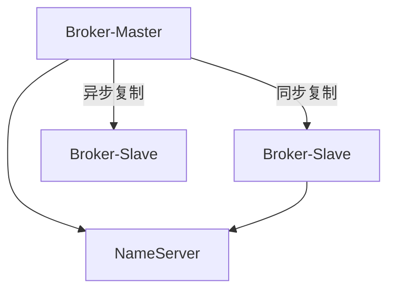
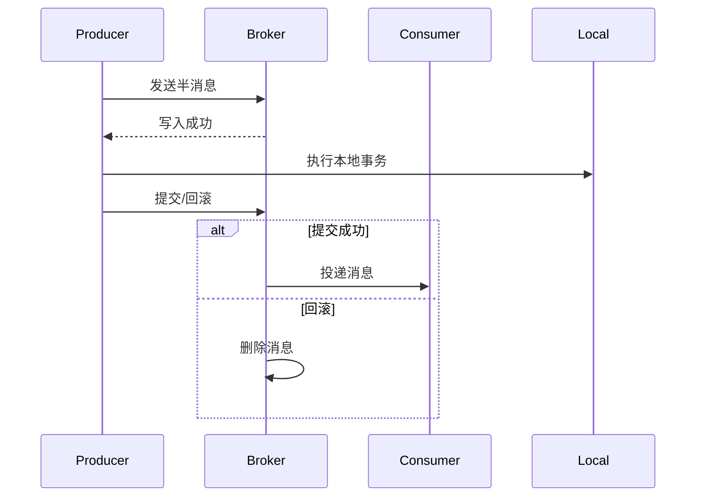

# 深入剖析RocketMQ核心原理与最佳实践

## 一、消息队列的本质价值

### 1.1 从食堂打饭到餐厅点餐
传统同步调用如同食堂打饭场景：
- 用户线程阻塞等待所有操作完成（150ms购票 + 200ms短信 = 350ms总延迟）
- 新增业务导致调用链增长（加邮件服务后550ms）
- 系统耦合度高（修改代码牵一发而动全身）

消息队列的异步模式革新：
```java
// 伪代码示例：异步消息发送
public void purchaseTicket(User user) {
    // 1. 核心购票业务（150ms）
    Order order = ticketService.createOrder(user);
    
    // 2. 异步发送消息（10ms）
    rocketMQTemplate.asyncSend("purchase_notify", order);
}
```

### 1.2 三大核心价值矩阵
| 维度           | 同步模式痛点               | 消息队列解决方案    |
| -------------- | -------------------------- | ------------------- |
| **响应速度**   | 链式延迟叠加               | 关键路径快速响应    |
| **系统扩展**   | 新增服务需修改主流程       | 新消费者订阅即可    |
| **流量管控**   | 突发流量击穿下游           | 消息堆积缓冲削峰    |
| **数据一致性** | 本地事务难以保证分布式一致 | 事务消息+最终一致性 |

## 二、RocketMQ架构深度解析

### 2.1 核心四组件协同机制
**NameServer集群**：
- 轻量级注册中心（对比Zookeeper）
- 30秒心跳检测机制
- 路由信息动态更新原理

**Broker集群**：


### 2.2 消息存储黑科技
**CommitLog设计精髓**：
- 混合型存储结构（所有Topic共享）
- 内存映射文件技术（MappedByteBuffer）
- 1GB固定文件大小（方便快速定位）

**ConsumeQueue创新点**：
- 逻辑队列索引（20字节定长条目）
- 三级存储路径：topic/queue/file
- 实现20万级TPS的关键设计

## 三、生产级问题解决方案

### 3.1 消息幂等保障体系
**重复消费场景分析**：
- 网络波动导致ACK丢失
- 客户端重试机制引发重复

**解决方案矩阵**：
```java
// 基于Redis的幂等校验
public boolean checkIdempotent(String messageId) {
    String key = "msg:" + messageId;
    return redis.setnx(key, "1", 2, TimeUnit.HOURS);
}
```

### 3.2 顺序消息实现之道
**严格顺序保障方案**：
1. 生产端路由策略
```java
public MessageQueue select(List<MessageQueue> mqs, Message msg, Object arg) {
    Long orderId = (Long) arg;
    int index = (int) (orderId % mqs.size());
    return mqs.get(index);
}
```
2. 消费端并发控制
```xml
<!-- 顺序消费监听器配置 -->
<bean id="orderListener" class="OrderMessageListener">
    <property name="consumeMode" value="ORDERLY"/>
</bean>
```

### 3.3 分布式事务终极方案
**事务消息全流程**：


**异常处理机制**：
- 事务状态服务设计
- 回查补偿策略
- 最大努力通知模式

## 四、性能调优实战手册

### 4.1 存储优化三板斧
| 优化手段 | 效果评估           | 配置示例                      |
| -------- | ------------------ | ----------------------------- |
| 异步刷盘 | 吞吐提升300%       | flushDiskType=ASYNC           |
| 内存锁定 | 减少PageCache交换  | transientStorePoolEnable=true |
| 文件预热 | 避免冷启动性能波动 | warmMapedFileEnable=true      |

### 4.2 网络传输优化
**零拷贝技术对比**：
| 技术     | 拷贝次数 | 上下文切换 | 适用场景     |
| -------- | -------- | ---------- | ------------ |
| 传统IO   | 4        | 4          | 小文件传输   |
| mmap     | 3        | 4          | 需要修改数据 |
| sendfile | 2        | 2          | 纯数据传输   |

**RocketMQ实现方案**：
```java
FileChannel fileChannel = new RandomAccessFile(file, "rw").getChannel();
MappedByteBuffer mappedBuffer = fileChannel.map(READ_WRITE, 0, fileSize);
```

## 五、运维监控体系构建

### 5.1 健康检查指标
- 关键指标看板：
  ```bash
  # Broker存储状态
  sh mqadmin brokerStatus -n localhost:9876
  
  # 消费堆积监控
  sh mqadmin consumerProgress -g GROUP_NAME
  ```

### 5.2 告警规则配置
| 告警项         | 阈值建议 | 处理方案              |
| -------------- | -------- | --------------------- |
| 消息堆积量     | >1万条   | 扩容消费者/优化逻辑   |
| 存储磁盘使用率 | >80%     | 清理过期消息/扩容存储 |
| 网络IO延迟     | >100ms   | 检查网络链路/负载均衡 |

## 六、未来演进方向

### 6.1 云原生适配
- Kubernetes Operator部署
- Serverless架构支持
- 弹性伸缩能力增强

### 6.2 生态整合趋势
- 流批一体处理
- 实时数仓对接
- AIOps智能运维

> **最佳实践提示**：生产环境建议采用RocketMQ 5.0+版本，其改进的DLedger模式提供更强的一致性保障，同时建议消息保留周期不超过7天，避免存储无限增长。
